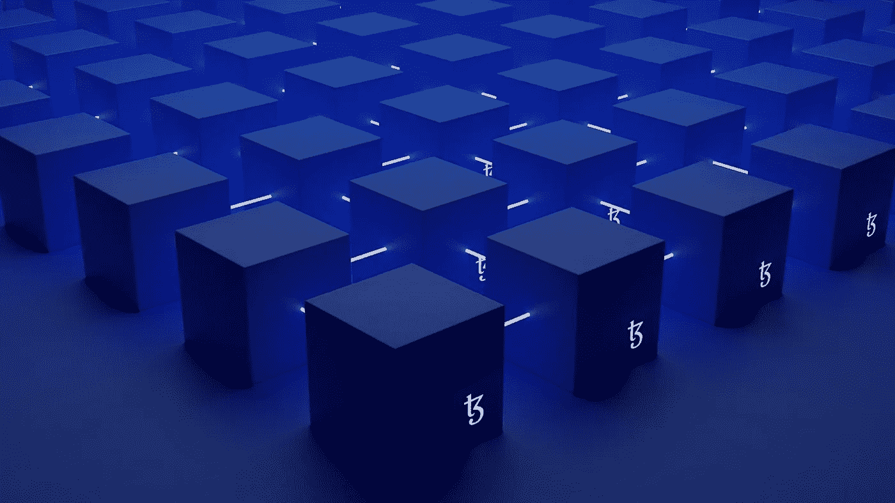

# 要考虑的区块链用例、优势和陷阱

> 原文：<https://medium.com/geekculture/blockchain-use-cases-advantages-and-pitfalls-to-consider-907ec22fdc66?source=collection_archive---------8----------------------->

> “我从不得不向朋友借钱来支付账单变成了一天赚 400 万美元。”—来自英国的画家崔佛·琼斯。

特雷弗与《卫报》分享他的故事时已经 50 多岁了。早在 2019 年，特雷弗就开始制造不可替代令牌(NFTs)，这是一种区块链支持的技术，并迅速积累了财富。

区块链用例扩展到不同的行业，企业可以利用这项技术复制琼斯的成功。许多人已经在这样做了，他们求助于区块链的咨询公司来构建一个合适的解决方案。MarketsandMarkets 预计，到 2026 年，全球区块链市场规模将达到[674 亿美元，在 68.4%的 CAGR 下，将从 2021 年的 49 亿美元跃升。](https://www.marketsandmarkets.com/Market-Reports/blockchain-technology-market-90100890.html)

您是否有兴趣了解更多关于区块链用例的信息，看看该技术是否适合您？然后继续读。这篇文章还解释了你可以依靠的区块链的优点和你需要解决的缺点。我们还提供了一些关于如何开始实施区块链的提示。

# 什么是区块链，它是如何工作的？

从技术上讲，区块链是一个分散的分布式数据库，数据在不同的计算机之间共享，没有一个实体拥有完全的控制权。区块链保留了它包含的数据的整个历史。所以它不可能被伪造或更改而不被其他各方注意到。区块链第一次[出现在 2008 年](https://whatis.techtarget.com/feature/A-timeline-and-history-of-blockchain-technology)，作为比特币交易背后的技术。目前，它在不同领域都有应用，包括金融、医疗保健、保险、体育和公共部门。

德勤[用相对简单的方式解释了区块链的工作方式](https://www2.deloitte.com/ch/en/pages/strategy-operations/articles/blockchain-explained.html):

想象一下，如果你是一个节点，你有一个交易文件存储在你的计算机上，代表一个分类账。几个会计(我们称他们为矿工)，在他们的电脑上有同样的文件，所以它是分布式的。当你进行交易时，你的电脑会通知会计，他们会马上核实你是否负担得起。会计的工资是用比特币支付的。第一个验证您的交易的会计师将通知其他所有人，附上他们的验证逻辑。如果大家都同意，就都更新档案。

你可以从这个由咨询公司发布的简短但内容丰富的视频中获得更多信息。

**区块链有五个特点:**

*   分散化:没有中央权威
*   安全:每个条目都有加密功能保护
*   匿名:每个用户都有一个唯一的字母地址来识别他们，交易发生在这些区块链地址之间
*   不可变:没有人可以篡改数据而不被发现
*   点对点:用户之间的交流不需要任何中介

# 区块链技术的类型

*   公共区块链(无权限):用户可以自由加入，无需许可。这种类型很慢，因为随着参与者数量的增加，共识和数据验证过程需要很长时间。加密货币是公共区块链的用例之一。
*   私人区块链(permissioned):它运行在一个封闭的网络上，规模远小于公共网络。其规模使得私有区块链比前一种类型更快，但也降低了信任，因为一定数量的用户更容易支配和控制交易验证过程。此外，网络所有者有权决定什么是有效的，从而减少信任。
*   混合区块链:允许某些交易的网络，同时保持与公共区块链的连接。这种类型的特点是比私有区块链更安全，因为所有者更难篡改交易。
*   区块链财团类似于私人区块链，但这种类型是由一组用户而不是一个实体控制的。

# 4 大区块链使用案例

# 加密货币

区块链最初是作为比特币背后的技术提出的。现在，区块链不仅限于金融领域，还可以为其他目的服务。但加密货币仍然是区块链最突出的用例之一。一些加密货币，如以太坊，是不稳定的，但也有尝试给市场带来更多的稳定性。例如，Stablecoins 的价格不会频繁波动，因为它与单一货币挂钩，同时保持了加密货币的流动性。

根据最近的一项研究，区块链的采用每年可以为大型银行[节省高达 120 亿美元](https://builtin.com/blockchain/blockchain-applications)。

一个加密货币区块链的例子来自纽约的[双子星](https://builtin.com/company/gemini?ni=6)。该公司促进数字资产的交换、购买和存储。它允许参与者以他们认为合适的方式处理他们的资产，甚至提供 Gemini Earn 计划，使订户能够从他们的钱包中获得高达 7.4%的利息。

# 智能合同

智能合约类似于常规合约，但它们存储在区块链上，并在满足特定条件时自动执行。它们是以 if/then 方式编码的计算机程序，以确保每个参与者都能获得合同规定的利益和惩罚。例如，保险部门可以利用这个区块链用例来自动报销差旅费。如果航班被取消，智能合同会自动向投保人付款，这样人们就不会陷入传统的冗长的索赔审批流程。

智能合约没有中间人，每一方都要承担责任。这种安排降低了成本，消除了人为错误，同时仍然可以处理大量不同的规则。EY 的一个客户报告说，部署智能合同帮助他们将交易处理时间从 45 天缩短到不到一分钟。

# 不可替换的令牌(NFT)

NFT 不同于比特币和其他加密货币单位。这项技术代表了一种数字艺术作品，在艺术领域有[多种应用](https://itrexgroup.com/blog/art-and-technology-changing-how-art-is-made-displayed-sold/)。它可以在照片、视频、甚至模因和推文中表现出来。每一个 NFT 都是独一无二的，就像一张限量版的交易卡。人们购买 NFT 来支持他们喜爱的艺术家，或者拥有拥有该作品的权利，例如在他们的商业广告中播放 NFT 的音频。

NFT 可以以相当高的价格出售/购买。例如，一个 Nyan cat meme 以大约 60 万美元的价格被购买，Twitter 的创始人杰克·多西以 NFT 的形式[出售了他的第一条推文，价格接近 290 万美元](https://www.techtarget.com/searchcio/feature/Todays-blockchain-use-cases-and-industry-applications)。不久前，NBA 的金州勇士队介绍了他们收集的球迷可以购买的 NFT 物品。

*Nyan cat meme 售价 60 万美元*

# 个人身份管理和验证

关于身份盗窃的统计数字很吓人；33%的美国人曾经是身份盗窃的受害者，仅 2020 年一年就损失了 560 亿美元。

区块链的一个用例是个人身份保护。它使用户能够存储他们的信息，包括社会安全号码，出生日期，地址等。在区块链中，给他们更多的控制权来决定他们想与谁分享哪些信息。例如，如果你只需要透露你的年龄，你可以不出示你的驾照(它包含的不仅仅是年龄)。分享包含你出生日期的区块链令牌就足够了。

例如，在政府部门，[伊利诺伊州试验了](https://builtin.com/blockchain/blockchain-applications)分布式区块链来存储死亡和出生证明、选民登记卡等等。

# 区块链的利与弊

# 区块链技术的主要优势

*   消除中介:在区块链，交易直接在用户之间进行，并由用户核实。所以，没有必要为了监督和协调而与中间人打交道。德国旅游公司途易集团是将区块链融入旅游业的先驱之一。他们将酒店住宿记录存储在区块链上，直接提供给消费者，不需要中介来管理信息和设定自己的价格。
*   跟踪以前的操作:区块链技术将对数据字段的每一次更改与时间戳一起存储，使参与者能够查看最新的更新和完整的更改日志。区块链条目是不可变的，不能删除。这将作为审计的证据。
*   防止假冒:公司和个人消费者都会遭受产品造假之苦。国际商会预测，如果不实施变革，2022 年假冒商品[将给全球经济带来 2.3 万亿美元的损失。区块链的优势之一是它存储产品 ID，允许用户追溯物品的所有者和来源。随着物品在供应链中移动，参与者将上传更多关于其状态的信息。所有的数据都有时间戳，不能被篡改。](https://authena.io/anti-counterfeit-blockchain/)

一个区块链的例子来自旧金山的珠宝商 Brilliant Earth，他与英国的 Everledger 合作，创造了区块链提供的 220 万颗钻石的记录。每个方块都包含一颗钻石的 ID、产地、克拉重量和描述它的视频。Everledger 声称，他们的平台提高了消费者愿意为钻石支付的价值和购买速度。

*   增强安全性:记录加密和区块链的分布式特性使它们非常安全。黑客不需要攻破一个集中的实体来访问存储的数据。他们将需要获得不同的密钥来渗透许多位置，导致计算需求呈指数级增长。而且，公司可以划分信息，存储在不同的区块。例如，旅行社可以将航班信息分割成几块，并在各个节点中进行排序。

美国军方转向区块链寻求安全保障。国防高级研究计划局(DARPA)的工程师们正在[研究一种区块链驱动的信息系统](https://builtin.com/blockchain/blockchain-cybersecurity-uses)，用于军队实时共享重要信息，同时防止黑客监听。

*   增加供应链的透明度:区块链的另一个优势是，它有助于消费者熟悉公司的产品和做法。透明度吸引了人们的公平感，因此他们喜欢奖励制造商的道德或可持续努力。在传统的供应链中，信息存在于几乎没有可见性的筒仓中，而区块链使产品所有者能够添加尽可能多的信息。

奢侈时尚品牌 [Fuchsia 部署区块链](https://www.voguebusiness.com/technology/6-ways-blockchain-changing-luxury)来丰富其供应链，提供手工制作该品牌鞋子的巴基斯坦工人的信息。六个月后，该公司的在线转化率提高了 31%，参与度提高了 45%。

*   实现物联网技术:区块链可用于记录不同位置的物联网传感器产生的测量结果。没有任何特定的实体有能力覆盖这些读数，使它们安全可靠。

总部位于加州的 Xage 是第一个由区块链驱动的为物联网公司打造的网络安全平台。它可以同时处理数百万台设备，执行自我诊断，并修复已发现的漏洞。

# 要考虑的区块链问题

*   生态系统中的每个人都必须转向区块链:如果你打算使用区块链，那么你的整个生态系统将被要求投资于这项技术，并放弃其目前的流程。不幸的是，目前，[专家注意到](https://www.techtarget.com/searchcio/feature/Top-10-benefits-of-blockchain-technology-for-business)许多组织不愿意用区块链取代他们现有的系统。
*   可伸缩性:区块链的另一个问题是它相对较慢。例如，其最受欢迎的应用之一比特币每秒只能处理[4.6 笔交易](https://towardsdatascience.com/the-blockchain-scalability-problem-the-race-for-visa-like-transaction-speed-5cce48f9d44)。相比之下，Visa 可以在相同的时间内处理 1700 笔交易。加入网络的节点越多，速度就越慢。然而，在区块链之外进行交易仍然是可能的，并且只能使用该技术来存储和检索信息。
*   实施成本:实施区块链解决方案是一项昂贵的努力。即使许多区块链工具是开源的，你仍然需要雇佣了解这项技术不同方面的开发人员。此外，如果您选择付费的现成解决方案，您将需要维护和支持，并且需要支付许可费。
*   区块链安全问题:安全是区块链的主要优势之一，但也是一个风险因素。2021 年，分散的金融违规事件[占所有注册黑客事件的 76%](https://www.techtarget.com/searchsecurity/tip/Top-blockchain-security-attacks-hacks-and-issues) 。而且它们似乎在上升，因为仅 2021 年第三季度区块链黑客数量就比 2020 年全年多 20%。以下是最常见的区块链安全问题:

⬝ 51%攻击:如果一个实体控制了 51%的节点，它就控制了整个网络，并可以修改信息。

⬝网络钓鱼:这是一种诱饵技术，黑客伪装成权威来源，向钱包密钥所有者发送电子邮件以获取他们的凭据。

⬝密钥破解:黑客可以使用量子算法破解加密区块链条目的密钥。

⬝利用端点漏洞:如果使用外部资源，保护区块链本身是不够的。例如，在交易比特币时，人们可以使用虚拟储蓄账户来临时存储货币。如果此帐户易受攻击，黑客可以在不渗透区块链的情况下访问它。

# 如何从实施区块链开始

# 选择您的区块链用例

[哈佛商业评论建议](https://hbr.org/2017/01/the-truth-about-blockchain)对自己的区块链技能没有信心的公司从单一用途应用开始，以最大限度地降低风险。比如可以添加比特币作为支付方式。当您试验这个简单的区块链用例时，您的不同部门将开始构建区块链功能，您可以在以后扩展到更复杂的应用程序。

另一个选择是将区块链作为管理资产和记录交易的数据库。这对于试图协调多个数据库的组织尤其有用。

如果你雄心勃勃，想要使用变革性的应用程序，比如自动执行的智能合同，那么重新评估你当前的可能性，并首先努力获得人才和技术是有意义的。这些应用程序非常强大，但它们在与创新的商业模式结合时效果最佳。例如，如果一家律师事务所想要部署智能合同，他们将需要区块链编程专业知识，并将不得不重新思考他们的支付模式，并首先进行测试。

# 确定区块链技术是否适合解决您的问题

[EY 建议](https://www.cfo.com/technology/2019/09/5-tests-for-deciding-whether-to-use-blockchain/)回答五个问题，如果你至少勾选了其中三个，那么区块链就是你问题的可行解决方案:

*   您的交易涉及多方吗？
*   拥有防篡改的交易记录是否至关重要？
*   您需要在所有合作伙伴之间实现共享的业务逻辑吗？
*   你在管理有限的资源吗？
*   你的生态系统需要透明吗？

# 仔细选择你的区块链平台

有几款[区块链平台](https://www.techtarget.com/searchcio/feature/Top-9-blockchain-platforms-to-consider)可以根据你的需求选择。比如[以太坊](https://ethereum.org/en/)提供了真正去中心化的网络，支持智能合约，但是速度慢，交易处理成本比较高。EOSIO 还处理智能合约，并声称提供比以太坊更快的交易处理。 [Tezos](https://tezos.com/) 允许你使用新型金融工具，比如 NFTs。[Hyperledger Fabric platform](https://www.hyperledger.org/use/fabric)允许公司创建自己的私人区块链。

# 最后一点

尽管这项技术背后有各种宣传，但重要的是要明白区块链不会改变今天的世界。它不是一项颠覆性技术，因为它可以用高性能的解决方案来攻击传统的商业模式。区块链具有基础性。它将为我们的系统创造基础，并产生巨大的价值，但这需要一段时间，因为采用过程将是渐进的。ABI 研究中心的研究主任 Michela Menting 很好地描述了这种情况，他说:“重要的是要明白，围绕区块链有很多炒作，虽然它在理论上是革命性的，但它不会改变今天的社会。也许 10 到 20 年后会是这样，但这不是一项短期技术。”

即使我们知道区块链只有在未来几十年才能实现其全部潜力，组织也已经开始为那些日子做准备了。做到这一点的一个方法是从小处着手，通过将它合并到您的单一用途区块链用例中来获得区块链的好处。我们会很乐意陪你走完这段旅程。我们的团队可以帮助您将系统与正确的现有区块链平台相集成。我们还可以帮助开发智能合同。

> 你想把区块链纳入你的经营吗？[降 ITRex 一行](https://itrexgroup.com/contact-us/)！他们的团队很乐意帮忙。

*原载于 2022 年 2 月 11 日 https://itrexgroup.com***。**