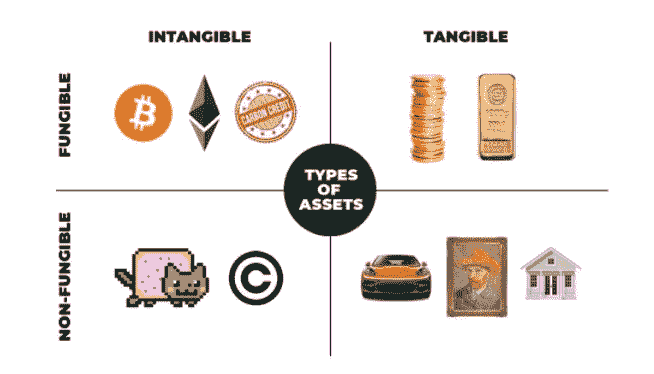
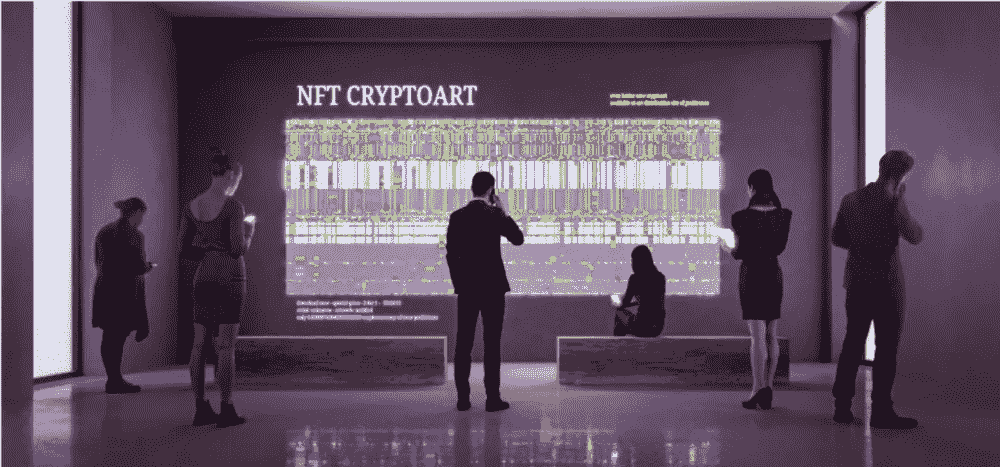
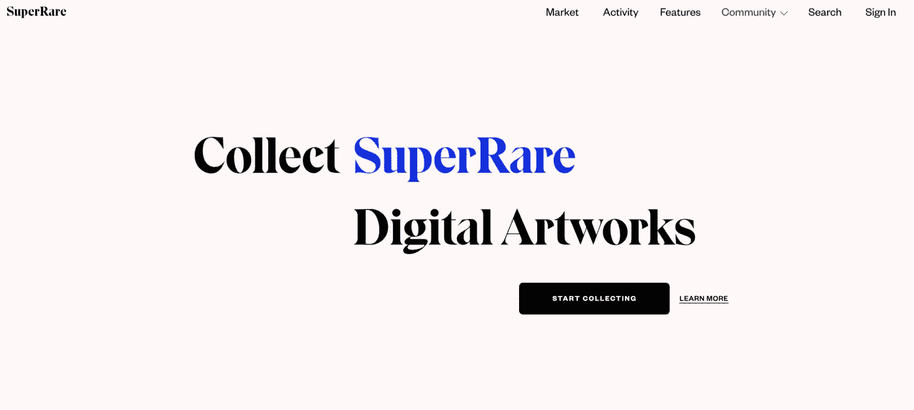
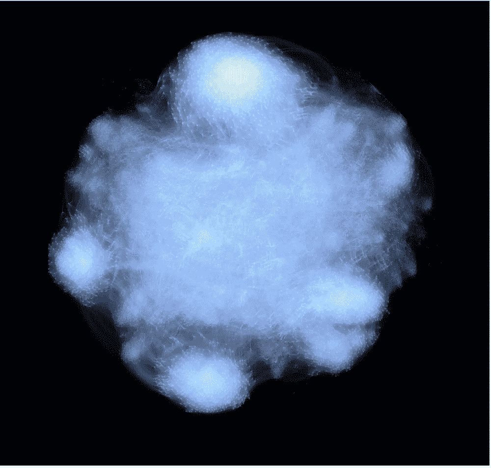
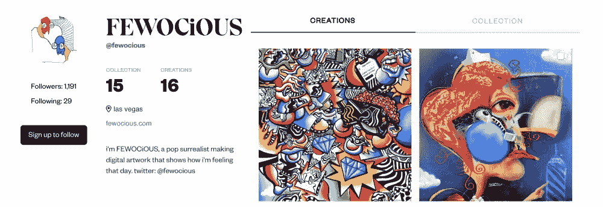
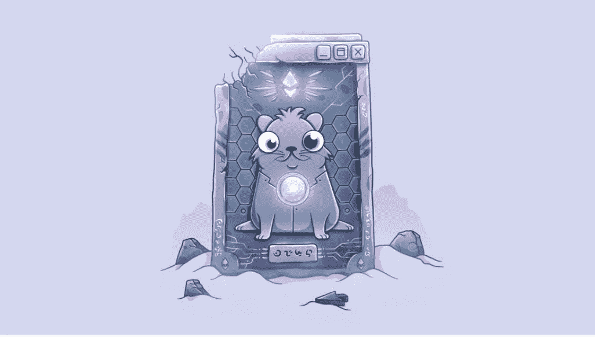

# 区块链 x 艺术家:NFTs、数字艺术和重大范式转变

> 原文：<https://medium.com/geekculture/blockchain-x-artists-nfts-digital-art-and-a-major-paradigm-shift-ef880be2297c?source=collection_archive---------27----------------------->

扎克·杨二访谈

最近的 NFT 热潮已经轰动了全世界。更好的是，这三个字母背后的创新能力是一篇文章无法概括的。因此，我和扎克·杨二坐在一起，他是超级罕见的 T4 T5 公司的业务发展高级副总裁，讨论数字艺术世界的未来

但是首先，让我们回顾一下。

什么是“NFT ”,它们来自哪里？

NFT 代表“**不可替代令牌**”。那到底是什么意思？

想象一下:你和你的伴侣在星巴克的汽车餐厅买咖啡。员工递给你点的东西:两杯大杯豆奶拿铁。你问你的朋友他想要哪一个。

“我不在乎，他们是一样的。”

# 可替代与不可替代

正如上面的例子所解释的，两杯星巴克咖啡可以被认为是可替换的。一个"**可替换的**"资产可以被另一个相同的项目替换。例如，比特币(BTC)是一种可替代的资产；一个比特币与下一个比特币没有重大区别。它们可以互相交换或交易，获得完全相同的价值。

“**非** - **可替代**”资产是区块链上持有的独特的数字项目。不同类型的 NFT 已经出现，包括数字艺术、游戏项目、活动门票、音乐和其他各种形式的 IP。

简而言之，区块链上的 NFT 本质上是可追踪的、唯一的、不可变的和安全的数字收据。这些功能允许在线资产具有可证明的稀缺性和不可操纵的所有权。想象一下，把《蒙娜丽莎》上传为数字文件，并能够跟踪它的一举一动，把它发送到世界各地，收取版税，并在任何给定的时间证明所有权。

有范式转变了吗？ 如果没有，没事，继续读下去我们只是刚刚开始。

每天，我们都会看到一篇关于区块链公司的新文章。一些家喻户晓的名字包括像[币安](https://www.binance.com/en)和[比特币基地](https://www.coinbase.com/)这样的去中心化交易所，像[炼金术](https://www.alchemy.com/)这样的基础设施平台，以及像[比特斯基](https://www.bitski.com/)、 [*NBA Topshot* 、](https://nbatopshot.com/)[奥迪斯](https://audius.co/)、[超级稀有](https://superrare.com/)、[俏皮网关](https://niftygateway.com/)、 [Opus](https://player.opus.audio/main/explore) 以及最近的 [Axie Infinity](https://axieinfinity.com/) 这样的创造者平台。这些平台都在塑造一个我们无法真正想象的更加公平的未来。

让我们来看看扎克对超级稀有和秘密艺术的未来有什么看法。

# 请分享一些你在区块链工作的经历，你是如何被介绍的？你是怎么去超级稀有的？

扎克的背景是市场营销和广告。在 2018 年加入 SuperRare 之前，他在纽约的大型广告公司工作，然后在布鲁克林创办了自己的视频制作公司，为大品牌做了大量的商业工作。近 3 年后的今天，他作为高级副总裁领导着业务发展和艺术顾问团队。

“我第一次接触比特币是在 2016 年年中，然后在 2017 年完全掉进了兔子洞。2018 年左右是我开始越来越了解以太坊的时候。

我参加了区块链的一个研讨会，在那里我有幸看到[Charles Crain](https://www.linkedin.com/in/charles-crain-20a28871/)(super rare CTO)和[Jonathan Perkins](https://www.linkedin.com/in/jonathan-perkins-08057715/)(super rare 首席产品官)展示他们刚刚在以太坊主网上推出的最新项目——super rare。我很快就接受了 NFTs 的概念，并感到非常幸运，因为我立即看到了这对数字创作者来说是一个多么大的机会。

更疯狂的是，第二周我在布鲁克林的绿点遛狗时，看到查尔斯和乔纳森在街上把冲浪板装进一辆货车。长话短说，我介绍了自己，告诉他们我有多爱他们正在做的事情，并提出制作一个视频来帮助营销 SuperRare。几个月后，我加入了这个团队，负责营销。"

# 你认为 SuperRare 一直保持有史以来销量和销量第一的秘诀是什么？

Source: Nonfungible.com

SuperRare 在一段时间内一直主导着加密艺术品市场，并一直位列 NFT 顶级项目名单。目前——2021 年 7 月——super rare 以超过 80，700，000 美元(仅次于 CryptoPunks 和 Meebits)的历史 NFT 销量排名第三。

Image: Superrare homepage

“只能有一个第一——而且是超级罕见的。SuperRare 是第一个允许创作者直接自己铸造 NFT 并以 100%点对点的方式直接出售给收藏家的数字艺术平台。我们发明了艺术家收藏者版税的概念，我认为这为我们赢得了社区的信任。我认为最突出的是，我们非常努力地成为艺术家和收藏家最信任和最真实的平台。出处在链上记录，艺术家自己铸造作品，都是单版。所以，超级。罕见。

也就是说，我相信这个领域的未来不会如此分散。现在，“标签”和画廊控制着艺术的流动和分配，它们之间没有互动，它们实际上是孤立的。我相信我们将会看到的一个重大变化是聚合。收藏者希望他们的艺术作品在一个地方，他们希望能够看到和跟踪累积的艺术家统计数据。我认为 SuperRare 将成为收藏家们交易和收集所有可信平台上的艺术品的地方。"

# NFTs 成为主流的地位如何？

对于那些没有跟踪的人来说，秘密艺术品市场已经急剧增长。**据追踪销售**的网站[**Crypto Art**](https://cryptoart.io/)**统计，从 2018 年 4 月 5 日到 2021 年 4 月 15 日，6158 名艺术家卖出了 191208 件 NFT 艺术品，总价为 541378383 美元。通常，艺术市场是秘密运作的，但随着透明度和可访问性的增加，我们现在可以实时跟踪和了解数字(加密)艺术的流动。**

Image: New York Times Crypto Art Article

事实上，《纽约时报》的团队深入研究了 NFT 艺术市场的生态系统，发现出现了一个有趣的模式:**目前，秘密艺术市场主要由少数几个主要收藏家支持。可以说，他们是 OG 加密的投资者。**

(更多信息请见他们的完整文章[这里](https://www.nytimes.com/2021/05/07/opinion/nft-art-market.html)。)

“我不认为每个人都会拥有 NFTs，但它将是巨大的。目前和不久的将来，它将主要是密码采集器。**现在有很多进入壁垒**；从在电脑上看到艺术品到理解为什么 NFT 有价值以及以太坊是如何工作的，这一飞跃增加了进入主流领域的复杂性。理解技术的需求不会是永久的。未来 5 年，我相信使用 Web3 平台不会比使用 Instagram 和脸书这样的 Web2 平台更复杂。这将支持向主流采用的飞跃。”

Image: Fewocious

# 互操作性和 NFT 的，将走向何方？

Image: CryptoKitty

如果你是许多问 T4 的人之一，“好吧，我有一只隐猫，现在怎么办？”，你不是一个人。

在讨论扎克的回答之前，让我们回溯一下。

从历史上看，通过各种媒介销售任何类型的艺术都是竞争激烈且相对难以接近的，最成功的艺术家是由少数强大的机构选择和控制的。[音乐家、艺术家甚至演员都是如此](https://elevenbstudios.com/how-record-labels-screw-artists/)。对于所有的艺术家来说，后退一步，想象一下能够从任何一个平台上提取你的艺术作品，并在数字世界中展示和出售这些艺术作品的可能性——在任何你愿意的时候，收取版税，任何人都可以访问。

下面是*和*的外观:

想象一下你在一个虚拟世界里拥有土地和房子，比如[分散的土地](https://decentraland.org/)或者[加密的房屋](https://www.cryptovoxels.com/)。那天晚上，你在主持一个虚拟的活动；你邀请你所有的朋友和一些臭名昭著的收藏家来展示和出售你的新 NFT 艺术作品，这些作品可以直接从 SuperRare 操作。更好的是，你决定要展示你所有的作品，所以你从 Nifty Gateway 上扔出一些你的作品。你卖了几件，赚了 12 月的租金，这一切都是在你舒适的沙发上完成的。这可能是一个有点极端和理想化的愿景，但这样的未来可能不会太遥远。为什么不呢，对吗？

现在，以下是扎克对短期的看法。

“在不久的将来，我们将会看到更多的显示解决方案的互操作性。[目前显示解决方案不支持 Web3】。很快，展示解决方案将与 Metamask 和其他钱包集成，允许您需要拥有作品才能展示它的解决方案。”](https://cointelegraph.com/news/focus-on-nfts-and-interoperability-push-icon-icx-ark-and-axie-infinity-higher)

**这有多疯狂？**

> *未来，所有创作者都有能力保护和跟踪他们所有的媒体，并及时有效地收取版税——所有这一切都通过 Web3 解决方案实现。*

# 关于密码艺术和 NFTs 的未来，最让你兴奋的是什么？

“对我来说，真正让我兴奋的是我们过去 3 年所做的工作。它实际上把数字艺术家带到了讨论的前沿。多年来，数字创作者一直被支付几分钱来做委托的小时项目，现在我们看到克里斯蒂和苏富比把重点放在非传统艺术上。

Image: Beeple Art

事实上，世界各地的艺术家正因此改变他们的生活，这真的很有力量。它也将艺术家们联系在一起，并创建了基于对 NFTs 和这项新技术的相互热爱和理解的社区。"

在区块链 x 创造者的世界里有很多有待发现的东西。这些变化每天都在缓慢但肯定地发生。对于艺术家、收藏家或密码爱好者来说，随着技术和艺术在努力有效授权方面的合作，兴奋感与日俱增。我期待着在这个空间报告更多的更新。

***保持最新！免费资源***

[NonFungible.com](https://nonfungible.com/):**跟踪 NFT 的销售和新闻**

[Coindesk](https://www.coindesk.com/) : **加密新闻**

[硬币电报](https://cointelegraph.com/) : **加密新闻**

**在**推特**上关注** [超级罕见](https://twitter.com/SuperRare)和[扎克](https://twitter.com/SuperRareRoses)

**检查**出我的 [**NFT 的**](https://kinestry.io/nfts-and-the-metaverse-guide/) 报告。

跟着 [**我**](https://twitter.com/clairemirran) ！

# 克莱尔·米兰

资深@南加州大学，写作和研究关于区块链，创新和虚拟世界。