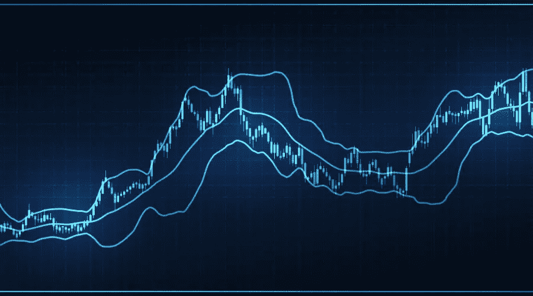

# 布林线-完整指南。

> 原文：<https://medium.com/geekculture/bollinger-bands-the-full-guide-21d4cb421776?source=collection_archive---------8----------------------->

## 这个著名的指示器及其 Python 策略的分步指南。

大布林线是我们在分析时间序列时必须学习的第一件事。这是因为它们有合理的统计推理，被市场参与者广泛采用，并在交易策略中获得成功。但是我们有时不能…