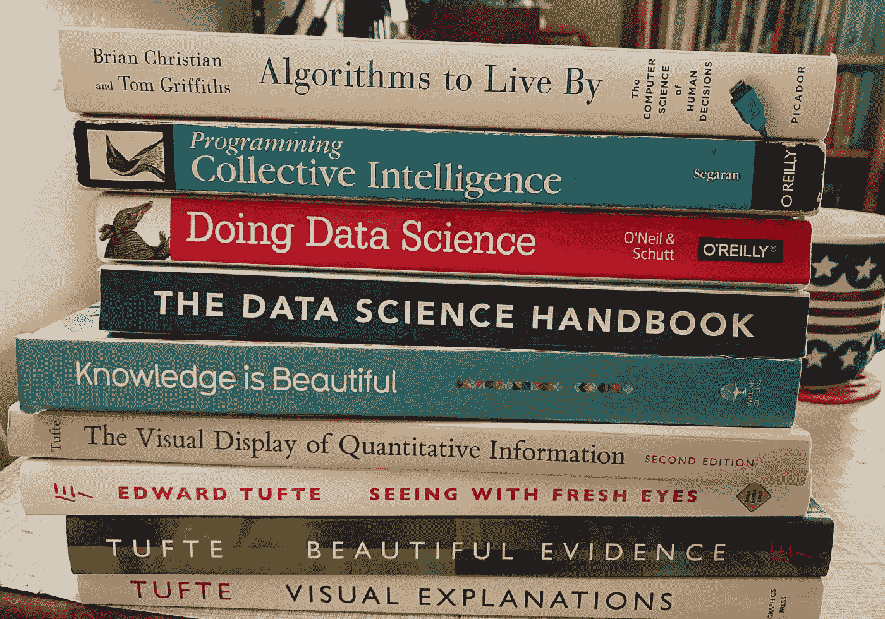

# 给有抱负的数据科学家的书籍推荐

> 原文：<https://medium.com/geekculture/book-recommendations-for-aspiring-data-scientists-d7241e07db0d?source=collection_archive---------55----------------------->

## 包括非技术性和技术性书籍

Photo by author. Stack of books.

在我开始数据科学职业生涯的过程中，我通过阅读书籍来更好地了解这个领域。我推荐一些我读过的书，包括 4 本面向普通读者的书和 2 本面向有抱负的数据科学家的技术书。完全没有专业技能的人可以从阅读开始…