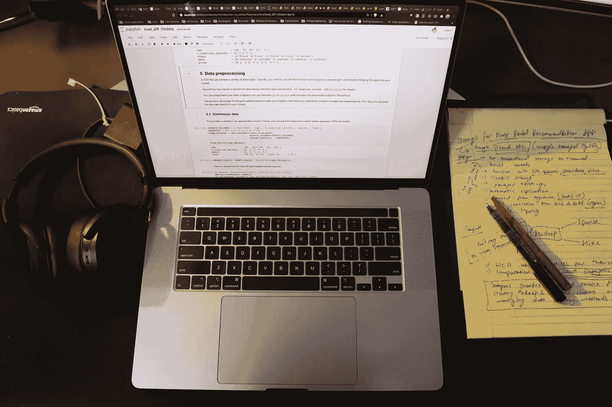

# 关于搜索和构建机器学习系统的书籍推荐

> 原文：<https://medium.com/geekculture/book-recommendations-to-grok-and-build-machine-learning-systems-ab67a099c4d6?source=collection_archive---------17----------------------->

## 涵盖从基础到构建生产就绪的 ML 系统的所有内容

Learning from books, taking down notes, and trying code snippets in colab/jupyter notebooks.

> “好朋友、好书和一颗沉睡的良心:这才是理想的生活。”
> ― ***马克·吐温***

我希望你穿着睡衣阅读这篇博客，期待一个恢复活力和健康的周末。所以…