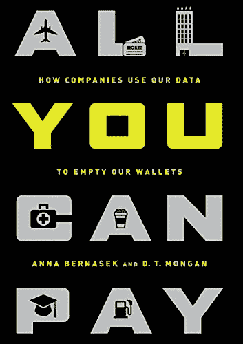

# 书评:你所能支付的一切:公司如何利用我们的数据掏空我们的钱包

> 原文：<https://medium.com/geekculture/book-review-all-you-can-pay-how-companies-use-our-data-to-empty-our-wallets-62730d2417c8?source=collection_archive---------66----------------------->

**All You Can Pay: How Companies Use Our Data to Empty Our Wallets** byAnna Bernasek and D.T. Mongan

[**你能支付的一切:公司如何利用我们的数据掏空我们的钱包**](https://www.amazon.com/gp/product/1568584741/ref=as_li_tl?ie=UTF8&camp=1789&creative=9325&creativeASIN=1568584741&linkCode=as2&tag=noquita-20&linkId=79ba80d76d2b49dc535f911e48329ec4) 解释了大数据公司如何不只是掏空我们的钱包，而是改变我们的世界。作者 Anna Bernasek 和 D.T. Mongan 通过简单易懂的故事和深思熟虑的分析说明了数据的使用如何改变经济。从价格歧视到动态定价和…