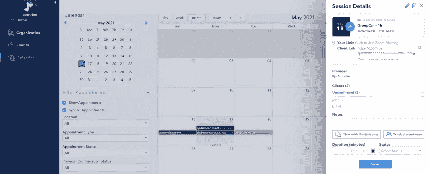
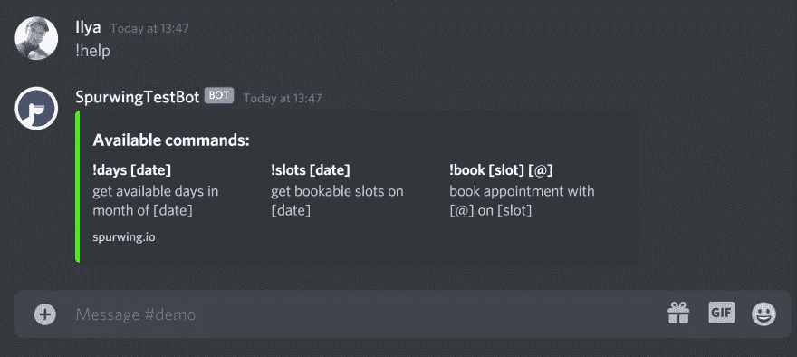
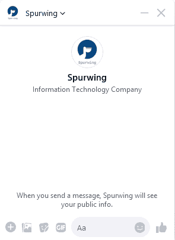
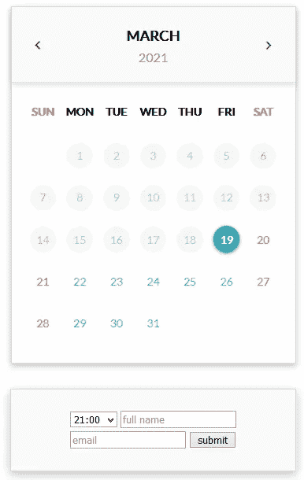
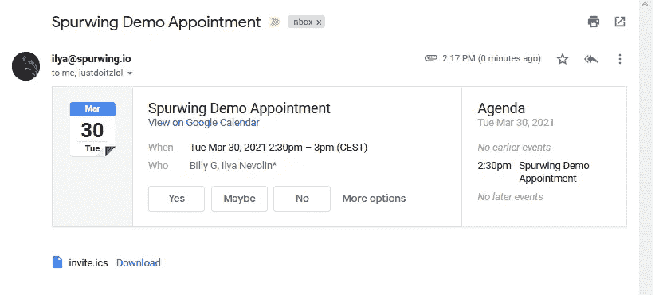

# 团体会议预约 API

> 原文：<https://medium.com/geekculture/booking-api-for-group-meetings-a67742597505?source=collection_archive---------36----------------------->

Spurwing 用于安排 Stripe 用于支付。我们的预约调度 API 使软件团队能够提供更快、更便宜和更好的调度特性。

在本帖中，我们将探索一些最酷的功能和用例，这些功能和用例可能会使用令人振奋的 [**预订 API**](https://www.spurwing.io/) 。


# 计划 SDK

我们已经用 API 中的**组调度特性**更新了我们的 SDK。这些预订功能已经出现在 API 中，但它们还没有在我们的官方 [JavaScript](https://github.com/spurwingio/Spurwing-API-Javascript-Library) 、 [NodeJS](https://github.com/spurwingio/Spurwing-API-NodeJS-Library) 、 [Python](https://github.com/SpurwingIO/Spurwing-API-Python-Library) 和[Java](https://github.com/SpurwingIO/Spurwing-API-Java-Library)SDK 中实现。

群组预约允许我们将多个人添加到一个可预订的位置，下面是一个 NodeJS 片段，演示了如何实现这一点:

```
async function demo() {
    let sp = new Spurwing();
    // let KEY = '' // spurwing private key
    // let PID = '' // spurwing provider id let A = await sp.get_appointment_types(PID)
    let appointment_type_id = A[3].id; // get id of group appointment type // create empty group appointment
    let B = await sp.create_group_appointment(KEY, PID, appointment_type_id, dateTomorrow() + ' 16:00:00')
    let apid = B.data.appointment.id // add john & bill as attendees
    await sp.complete_booking(PID, appointment_type_id, 'john@nevolin.be', 'john', 'Gale', null, null, apid);
    await sp.complete_booking(PID, appointment_type_id, 'bill@nevolin.be', 'bill', 'Hale', null, null, apid); // await sp.delete_appointment(KEY, apid)
}
```

如果我们现在查看我们的仪表板，我们会看到两个与会者的小组约会:



这里记录了完整的 spur wing API，它包含了更多我们还没有添加到 SDK 中的端点。如果您的项目/业务需要这些，请尽快让我们知道。

# 用例

让我们看看我们的 **Marketplace** 上的一些项目，并讨论我们如何通过团体预订功能扩展它们。

# 不和谐和懒散的机器人

我们的 [Discord Bot](https://github.com/Spurwingio/Chat-Bots/tree/main/Discord/NodeJS) 允许一对一调度。我们正在开发的 Slack bot 将具有类似的功能和界面。



预约的基本机制是使用如下命令:

`!book May 18 at 3pm EDT with karen@dev.to`

为了方便多人，我们可以引用像`@john @ana @karen ...`这样的不和谐用户。但是要通知这些用户这个事件，我们也应该能够给他们发一封电子邮件，所以它将被添加到他们的个人日历中。一种方法是手动创建一个映射，并将其存储在供机器人使用的数据库/文件中(Discord API 不会泄露用户的电子邮件地址)。我们也可以完全省略使用电子邮件地址，只需扩展 Discord Bot 来通知/提醒用户应用程序中即将到来的会议(如果用户熟悉并活跃在 Discord 上，这将非常有用)。最后，最基本的(但也是人工密集型的)方法是显式提供电子邮件地址。

# 聊天机器人

聊天机器人，比如我们的 [Facebook Messenger Bot](https://github.com/Spurwingio/Chat-Bots/tree/main/Facebook/NodeJS) 也可以很容易地扩展。



如上面的 gif 所示，我们可以在接收到用户的日期和时间段后添加第三个步骤。这将要求该会议的与会者的电子邮件地址列表。这些人应该都会收到一封确认电子邮件(以及可选的提醒)。

我们有更多的聊天机器人集成正在进行中:WhatsApp、Amazon Lex、Intercom、Skype、Google Chat……如果你想为我们的**开源**项目做贡献，请告诉我们。

# 预订小工具

如下所示，可嵌入的日程安排小部件和页面可以通过允许用户添加更多的参与者(例如:加号/添加按钮)来扩展。这将向所有与会者发送 RSVP 电子邮件。



要一次向多个与会者发送 **RSVP 电子邮件**,我们有两种选择:

1.  使用我们的 [iCalendar](https://github.com/Spurwingio/iCalendar-Integrations) 模块，并对其进行编程，以便为每位与会者单独分派。
2.  扩展我们的 iCalendar 模块以方便多个接收器(在`index.js`内部)。



# 结论

这些开源示例和资源应该会让您在构建任何类型的日程安排或预订解决方案时有一个良好的开端。无论你的项目的规模和堆栈如何，Spurwing [**调度 API**](https://www.spurwing.io/) 都能够处理高压力并集成到复杂的环境中。

欲了解更多信息，请访问我们的网站或安排与我们的工程师进行电话介绍[https://www.spurwing.io/contact](https://www.spurwing.io/contact)