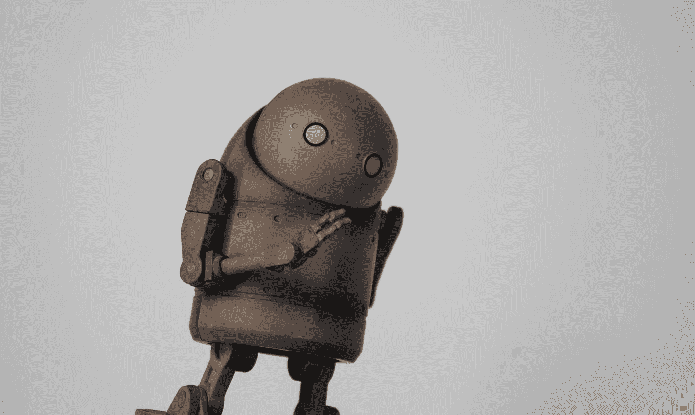

# 助推 UX 设计:5 种网络动画

> 原文：<https://medium.com/geekculture/boost-ux-design-5-types-of-web-animation-4dc67abf2153?source=collection_archive---------17----------------------->

## 学习如何用动画让网站活起来。

Photo by [Anton Maksimov 5642.su](https://unsplash.com/@juvnsky?utm_source=medium&utm_medium=referral) on [Unsplash](https://unsplash.com?utm_source=medium&utm_medium=referral)

网页动画是改善网站用户体验的好方法。它可以帮助增加视觉兴趣，吸引用户，并提供反馈。

正确类型的动画可以让你的网站更吸引人，更具互动性，更易于分享。它也可以帮助你…