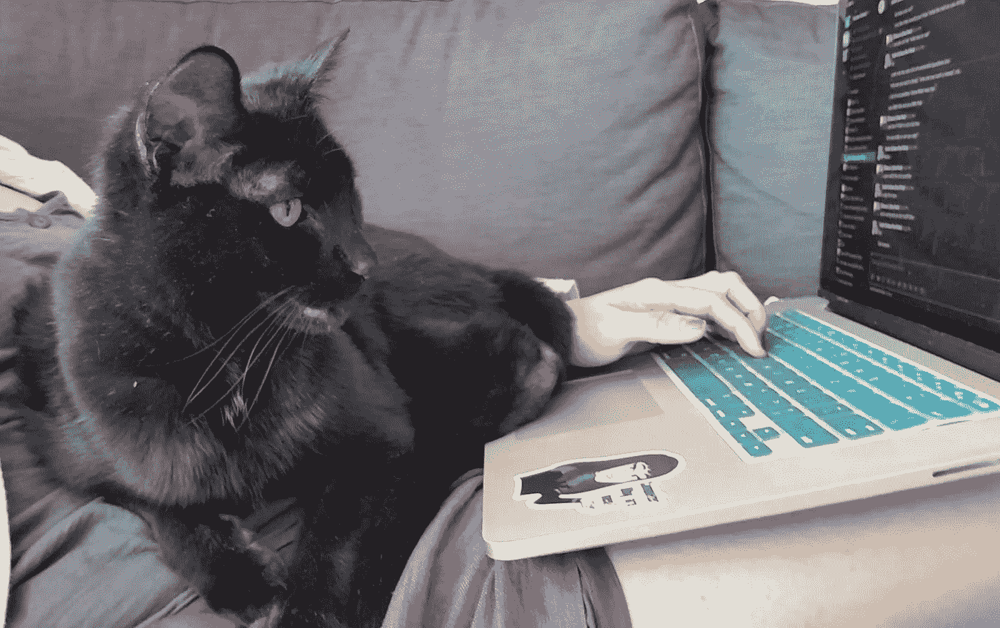

# 给以前的我的训练营建议

> 原文：<https://medium.com/geekculture/bootcamp-advice-for-my-former-self-a0fe74a5ef0d?source=collection_archive---------42----------------------->

*反思 15 周的友情和代码*

Photo by [Garrhet Sampson](https://unsplash.com/@garrhetsampson?utm_source=medium&utm_medium=referral) on [Unsplash](https://unsplash.com?utm_source=medium&utm_medium=referral)

大约一个月前，我完成了熨斗学校的沉浸式软件工程训练营。由于 COVID 限制仍然存在，所有这些都是通过 Zoom 远程进行的。我尽最大努力为自己即将面临的情况做好准备，十几年后重返校园的震惊，以及一段时间没有收入的生活。但是肯定会有我不知道要准备的事情，如果你和我一样，我希望这篇文章能很好地为你服务！

你怎么知道你和我一样？以下是我的一些背景，可以看到它引起的共鸣:

*   35 岁左右的职业改变者(最近一次是过度劳累的非营利专业人士)
*   本科工程背景(化学)
*   在一种有害的压力下长大，想要在学校里出类拔萃
*   设法在较长时间内尽早开始并完成前期工作(奖学金的确定部分基于评审时前期工作的完成情况，因此我很快就完成了开头部分，并且推迟了我的开始日期，以便给我的组织充足的时间来寻找替代者)

基本上，我是一个在压力大的工作环境中呆了一段时间的人，有时间管理技巧(或者缺乏一些应对机制)😅)，他们可能在前期工作阶段做了相对充分的准备(对此我非常非常感激)。我收回那句话:**对于训练营来说，再怎么准备也不为过。**

你可能听说过像“做好准备工作”、“尽量减少分心”或“保持良好的睡眠时间表”这样的建议。但这些对我来说很明显。这里有一些我希望我已经充分考虑并内化的事情。

Photo by [Mārtiņš Zemlickis](https://unsplash.com/@mzemlickis?utm_source=medium&utm_medium=referral) on [Unsplash](https://unsplash.com?utm_source=medium&utm_medium=referral)

## **15 周既不是马拉松，也不是短跑；相应调整速度**

一旦机会变成现实(被接受并得到资助)，我选择离开工作并最终参加训练营的部分原因是，在我生命中的 4 个月里，我做得越来越差——在一份毫无进展的工作中呆得太久，与我可能一开始就不喜欢的人约会，并且通常没有实现我的目标。15 周不算什么！

所以我称之为我的戴安娜-艾桑斯，制定了一个计划，为自己的成功做准备，重塑自我。

我在训练营的第一个月相对轻松。工作繁重而艰难，但我离开工作，感觉像在“度假”，心情非常愉快。我完成了所有的实验。我按照时间表睡觉。我没有买任何外卖或外卖和周末准备的饭菜。我几乎每天都在午餐时间锻炼。我每天晚上拔掉插头，冥想或写日记。我是一个全新的人！

但随后，训练营中期的生活危机来了。我过去糟糕的睡眠时间又回来了(你好，凌晨 3 点)，我利用午休时间看《网飞》和吃油炸圈饼。我心理健康的一些自然起伏，以及不可预见的事件，导致了一些困难。我有一段时间精疲力竭。一旦我不再完美，我就崩溃了，感觉就像停了下来。我认为我的目标是太多的自我提升，这样做*和*实际上做训练营的工作被证明是不可行的。

*建议*:预算并订购送货。暂时放下健身目标。如果你落后了，原谅自己。**找到一条可持续发展的道路。**训练营也许不是成为最好的自己的合适时机，但没关系！

## 成绩没有任何意义，而且无关紧要

虽然有技术上的代码挑战和期末项目要通过，但除此之外，分数并不重要。与传统的学校经历不同(尤其是那些并非所有学生都真的想去的经历)，重要的不是成绩单，而是学习材料。完成实验和/或让交付物开始工作可能是确保您了解材料的好方法吗？是啊。摇滚一个代码挑战拿个满分还满足吗？当然可以。但实际上，你从犯错误和从导师那里得到反馈中学到了更多。

我的第一次实际编码反馈是在程序开始一个月之后(关于在我写的函数中考虑边缘情况的评论)，这是一股新鲜空气。事实证明，人的因素正是我所缺少的。我专注于我对学校的先入之见——获得完美的成绩和做作业。但是对于编码来说，解决一个问题有太多的方法，在测试中取得好成绩并不能帮助你学到很多东西。从你的编码缺点中学习是你真正成长的地方。

*忠告*:不要混淆手段和目的。抛出等级的概念。如果你想的话，可以要求老师给你一些关注，这样你就可以最大限度地利用 15 周的时间。如果有的话，至少偶尔失败是目标，所以你可以从过程中学习。

## 与项目合作伙伴合作很困难。句号。

结对编程和与他人一起工作可能是有价值的、充实的、激励的，甚至是一大堆乐趣！但是，尽管有这些好处，它不可避免地会在许多方面比你自己做更多的工作。没关系！

我知道来到这个训练营，我已经很久没有练习过团队合作了，而且我心里的压力也很大。作为一个基线，我有很多社交焦虑，处理人际关系和一个大项目不是我所期待的。每当我遇到冲突时，无论多么轻微，如果我不能与我的项目合作伙伴完美相处，我都会认为这是自己的失败，特别是如果他们是一个随和、友好的人。(剧透一下，实际上我想我会说，我团队中的每个人都符合这一描述。)

但是，承认连续两周独立工作，却不得不被某个饮食/睡眠/编程/所有事情都不同的人束缚，这并不可耻，这需要一点努力。克服不可避免的冲突只是一种需要练习的技能。

*建议*:接受你不能和你的项目伙伴成为最好的朋友，每天每分钟都要无缝配对。休息一下，设定界限。也许甚至在最终产品之上，关注你能从对方身上学到什么，确保你们都有一个充实的经历，无论这对你意味着什么。

## **实时远程学习可能是有史以来最好的环境(对我来说)**

如果让我在面对面的沉浸式学习和自定进度的在线学习之间瞬间做出决定，我会选择后者。不是一个困难的选择。通勤和必须与人相处不是我最喜欢的事情！

但经过更多的思考，我知道沉浸式项目会让我更有条理，更有动力，在毕业时提供一个即时的网络，我会更快地完成。

另外，我发现奖学金只适用于面对面的项目。

所以，谢谢 COVID，给我这个绝佳的中间机会！

所有的社区和摄影师，但没有一个人在迟到的高峰时间去上课，害怕在休息时间闲聊。我已经知道我喜欢远离以前工作的远程工作——方便上厕所和吃零食，偶尔有只猫在我腿上，不需要耳机，这样的例子不胜枚举。但是除了这些额外的好处，我直到太晚才意识到我真的可以让学校的经历服从我的意志。

我可以倾向于我更烦躁的倾向，在讲课时准备饭菜或做伸展运动，这样我可以更好地集中注意力。我可以大声唱歌，这有时有助于我解决问题。为了更大的利益而小睡片刻也是可能的。我只是在训练营进行到一半的时候才明白这一点，但这让一切都变得不同了。

*建议*:如果这是你第一次进入任何你将要进入的学习环境，尤其是在长时间休息之后，把你的期望抛在脑后！不要认为这是在玩弄系统(至少是以一种糟糕的方式)，而是最好地定制你的体验。

Sqkrz was great at helping me keep up with Slack messages

## **认真点，学会原谅自己**

这个对我来说并不陌生(我想我之前提到过)，但它是我们很多人在生活的各个领域都能不断提醒自己的东西。我基本上是准备原谅自己停下来写代码，或者没有完成作业，但是这里有一些我不得不“原谅”自己的例子(引用是因为原谅可能是不必要的):

*   没有及时检查时差来帮助有问题的人
*   没有精力(在一整天之后)去做更多的独立学习
*   几天不运动
*   不吃更多的植物性食物
*   不是每次我跟别人说话的时候都让他们笑
*   说了太多我的感受
*   没有充分谈论我的感受
*   对我有任何影响

建议:让你的朋友检查一下(说真的，给他们一份时间表)，让他们向你保证你做得很好。还有你是人类。因为别人这么说的时候你会听的。

我可以继续写几页关于我对训练营的感受(我甚至没有进入爱之队列！)以及我每周在编程之外学到的东西，但我现在已经沉迷够了。如果您有任何问题或想进一步交谈，请随时告诉我！