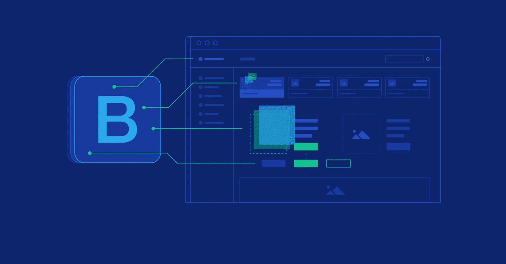
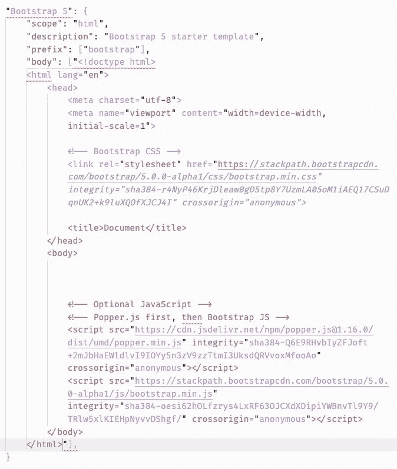
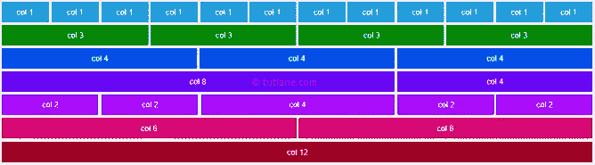
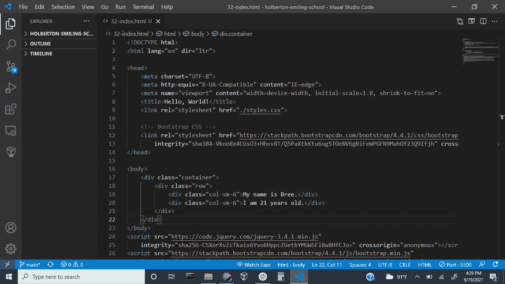
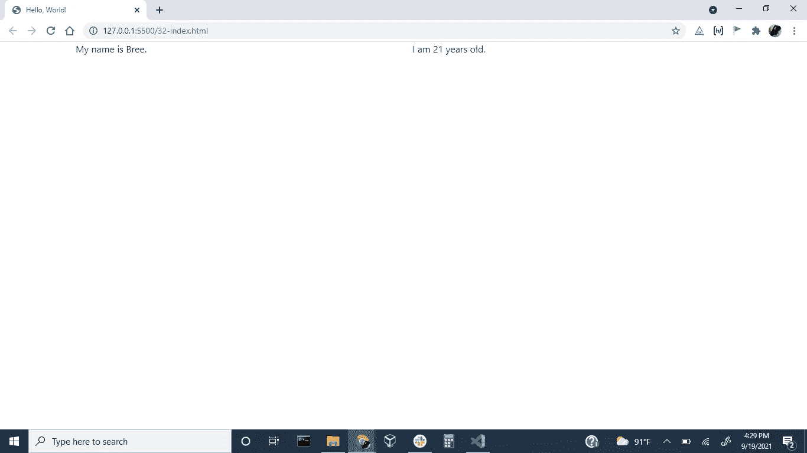

# 自举 4:我们知道什么？

> 原文：<https://medium.com/geekculture/bootstrap-4-what-do-we-know-2eebc2d3a302?source=collection_archive---------35----------------------->



你好！在以前的博客文章中，我们讨论了一种创建 web 内容结构的标记语言。它显示我们希望用户看到的任何和所有文本。下一步要做的是学习所有关于样式表语言 CSS 的知识，然而，现在有了更新、更流行的框架，使得向我们的网页添加样式变得更加容易。Bootstrap 就是其中之一。bootstrap 的最新版本是 v5。最近，在[霍尔伯顿学校](https://www.holbertonschool.com/)，我们一直在研究和学习 v4，所以这就是我将要写的版本。

# **什么事？**

Bootstrap 是一个帮助你创建响应性网站的框架。响应式是指当窗口或屏幕的大小改变时，网站的布局仍然看起来很好。要将 bootstrap 整合到您的应用程序中，我们有很多方法。Codecademy 轻松探究所有这些细节，所以请点击[这里](https://www.codecademy.com/articles/bootstrap-deprecated-ii)查看。今天，我们将引导程序导入到我们的代码中。

# **链接到 CDN**

CDN 是内容传递网络的缩写。内容交付网络是一组地理上分布的服务器，它们通过使 web 内容更接近用户来加速 web 内容的交付。全球的数据中心都使用缓存，这是一个临时存储文件副本的过程，因此您可以通过附近的服务器更快地从支持 web 的设备或浏览器访问互联网内容。使用 CDN 是设置 bootstrap 的最快方式。

**快速启动:**

*   这个样式表链接在任何其他样式表之前进入我们的标签，以便加载我们的 CSS。

```
<link rel="stylesheet" href="https://maxcdn.bootstrapcdn.com/bootstrap/4.0.0/css/bootstrap.min.css" integrity="sha384-Gn5384xqQ1aoWXA+058RXPxPg6fy4IWvTNh0E263XmFcJlSAwiGgFAW/dAiS6JXm" crossorigin="anonymous">
```

许多框架的组件需要使用 JavaScript 才能运行，甚至有些组件需要专门为该框架创建的特殊插件。因此，我们将接下来的几个

```
<script src="https://code.jquery.com/jquery-3.2.1.slim.min.js" integrity="sha384-KJ3o2DKtIkvYIK3UENzmM7KCkRr/rE9/Qpg6aAZGJwFDMVNA/GpGFF93hXpG5KkN" crossorigin="anonymous"></script>
<script src="https://cdnjs.cloudflare.com/ajax/libs/popper.js/1.12.9/umd/popper.min.js" integrity="sha384-ApNbgh9B+Y1QKtv3Rn7W3mgPxhU9K/ScQsAP7hUibX39j7fakFPskvXusvfa0b4Q" crossorigin="anonymous"></script>
<script src="https://maxcdn.bootstrapcdn.com/bootstrap/4.0.0/js/bootstrap.min.js" integrity="sha384-JZR6Spejh4U02d8jOt6vLEHfe/JQGiRRSQQxSfFWpi1MquVdAyjUar5+76PVCmYl" crossorigin="anonymous"></script>
```

最终入门模板:



HTML5 doctype, with viewport meta tag for responsive behaviors

Bootstrap 被指定为*移动优先*技术，它首先为移动设备优化代码，然后根据需要使用 CSS 媒体查询扩展组件。使这个框架具有响应性的是它的 12 列网格。

# **电网系统**



网页分为行和列。每行分为 12 列，一个元素可以占据任意数量的列。元素包括:段落、图片、标题等。一行中最多可以有 12 个元素，或者更少，这取决于您的需要。特别的是，无论屏幕大小如何，它总是保持 12 列不变。我们为这些尺寸屏幕上的每个元素指定所需的列数:

*   超小型(xs)→小于 576 像素
*   小型(sm)→576 像素及以上
*   中型(md) →768px 及以上
*   大型(lg) →992px 及以上
*   特大号(XL)→1200 像素及以上

这些断点是可自定义的宽度，决定了您的响应布局在 Bootstrap 中跨设备或视口大小的行为。

# **集装箱**

bootstrap 4 中最基本的布局组件是容器。它们包装和“包含”我们的内容，提供基本的填充和边距，并帮助我们将内容放在页面的中心。容器可以是流动的，也可以是固定的。

**流体:**始终为其周围容器视口宽度的 100%。

**固定:**有一个最大宽度，根据断点或视口而变化；随着屏幕越来越小，最大宽度也越来越小；随着屏幕越来越大，最大宽度也越来越大。

> > > > > >示例代码时间！！！



需要注意的是，这些行必须放在容器内部。查看下方的标签。这里，我们在我们的行中定义了两个类元素，相应的文本将在屏幕上为用户显示。`col-sm-6`代表为小尺寸和更大尺寸屏幕制作的单独列，占据 6 行空间。因为我们有两个完全相同的元素，所以文本的两个部分都应该水平占据页面的一半。如下图。



我将链接一个惊人的 YouTube 教程，详细介绍关于 Bootstrap 4 的所有知识的“速成课程”。开始工作时，将会有更多的互动和乐趣。

YouTube 视频自举 4:[https://www.youtube.com/watch?v=hnCmSXCZEpU](https://www.youtube.com/watch?v=hnCmSXCZEpU)

这是我为你创建的一个键，当你正在稳步学习 bootstrap，并且仍然在实现你想要的东西的过程中，你可以参考它。

> 初学者密钥:
> 
> 背景
> 
> P=填充
> 
> Col=列
> 
> Order=控制内容的视觉顺序
> 
> Offset=将列向右移动；增加左边距
> 
> 文本-白色=白色文本
> 
> 文本居中=文本居中
> 
> row = bootstrap 中的预定义类
> 
> Justify-content=在代码中添加标志来定义内容之间和周围的空间
> 
> Border-bottom=样式边框
> 
> Mb=页边距底部
> 
> List-group=用于显示一系列内容
> 
> Align-items=更改横轴对齐方式
> 
> 折叠=用于显示/隐藏内容的插件
> 
> D-flex=使用 flexbox 创建水平/垂直元素
> 
> d-MD-none = MD 屏幕上没有显示属性
> 
> D-none=没有显示属性

感谢您的阅读！