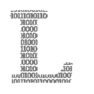

# 厌倦了 Python？尼姆来救你了

> 原文：<https://medium.com/geekculture/bored-of-python-nim-is-coming-to-your-rescue-8fd7c12240eb?source=collection_archive---------1----------------------->

## 它非常小众，非常棒，也非常被低估

Nim beats Python in terms of speed, and has many interesting features.

  L   azy 的程序员喜欢写简短而甜蜜的代码，然后离开计算机去解释他们可能表达的意思。换句话说，它们用编程工作代替了计算工作。

我就是这样的程序员。我是那种希望电脑做我想做的事情的人