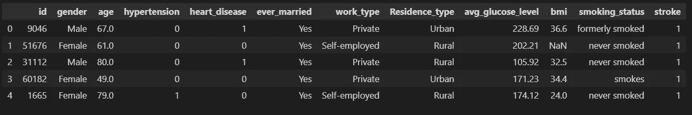
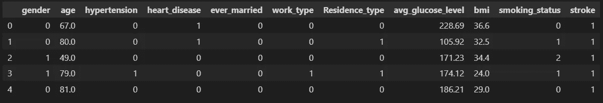
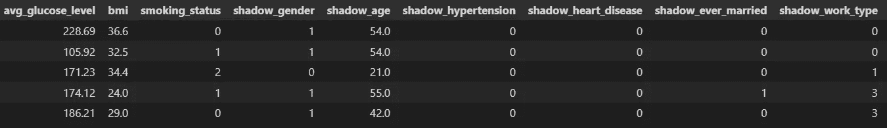
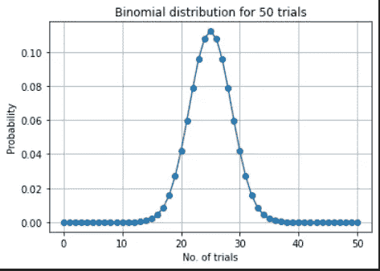
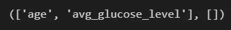

# 用 Python 解释 Boruta 特征选择

> 原文：<https://medium.com/geekculture/boruta-feature-selection-explained-in-python-7ae8bf4aa1e7?source=collection_archive---------3----------------------->

## 从头开始实现和解释


本文旨在解释，非常流行的，Boruta 特征选择算法。Boruta 自动执行要素选择过程，因为它会自动确定任何阈值并返回数据集中最有意义的要素。Boruta 基于“所有相关”原则工作，因为它为您提供了与您的机器学习问题相关的所有功能。

## 需要功能选择？

数据集可能包含与您的问题完全无关的要素。这些特征增加了数据集的大小，增加了人工智能模型的复杂性，并且对输出没有影响，或者使结果恶化。在进入训练阶段之前，识别这些特征并去除它们是很重要的。

您可以在下面的[文章](https://writersbyte.com/featured-post/feature-selection-algorithms-for-machine-learning/)中找到更多关于特性选择的细节。

[](https://writersbyte.com/featured-post/feature-selection-algorithms-for-machine-learning/) [## 机器学习的特征选择算法

### 对于机器学习模型，特征选择是一个可选但重要的预处理步骤。这是一个常见的…

writersbyte.com](https://writersbyte.com/featured-post/feature-selection-algorithms-for-machine-learning/) 

## 博鲁塔算法

该算法最初是作为 r 的一个包引入的，它包括以下步骤:

通过随机洗牌创建原始特征的副本(阴影特征)。

1.  将这些阴影要素连接到原始数据集。

2.使用随机森林分类器训练这个新数据集。

3.检查评分最高的阴影特征的特征重要性。

4.所有比 ***最重要的阴影特征*** 更重要的原始特征都是我们想要保留的。

5.对一些迭代重复 3 和 4(20 是一个合理的数字),并跟踪在每次迭代中显得重要的特性。

6.使用二项式分布来最终确定哪些功能具有足够的可信度，可以保留在最终列表中。

在继续之前，如果你觉得这篇文章有帮助，请考虑在 Ko-Fi 上支持我。

[](https://ko-fi.com/moosaali9906)

## 履行

您可以在资源库中找到完整的代码: [Boruta 特性选择](https://github.com/Moosa-Ali/Boruta-Feature-Selection-Implementation/blob/main/Boruta-feature-selection-implementation.ipynb)

在任何算法之前，我们显然需要某种数据来执行特征选择。为此，我们将使用我们在上一篇关于[特性选择](https://writersbyte.com/featured-post/feature-selection-algorithms-for-machine-learning/?swcfpc=1)的文章中使用的相同数据集。

该数据集可在 [Kaggle](https://www.kaggle.com/datasets/fedesoriano/stroke-prediction-dataset?rvi=1) 的以下链接中找到。

## 加载和处理数据

```
# important librariesimport pandas as pd
import numpy as np
from tqdm.notebook import tqdm
import scipy as sp
from sklearn.ensemble import RandomForestClassifier
import matplotlib.pyplot as plt
from sklearn.utils import shuffle
```

我们将使用上述所有的库。

```
data =  pd.read_csv("healthcare-dataset-stroke-data.csv")
data.head()
```



Heart Stroke Dataset

很多没用的数据，没有我们没见过的。

是时候大扫除了。有关数据清理和处理的高级课程，请参考下面的[帖子](https://writersbyte.com/featured-post/applied-data-science-with-python-and-pandas/?swcfpc=1)。

[](https://writersbyte.com/featured-post/applied-data-science-with-python-and-pandas/?swcfpc=1) [## Python 和熊猫的应用数据科学

### 数据科学是一项非常重要的技能，已经成为 21 世纪的必备技能。随着数据的增加…

writersbyte.com](https://writersbyte.com/featured-post/applied-data-science-with-python-and-pandas/?swcfpc=1) 

```
# converting to numericdata["gender"] = pd.factorize(data["gender"])[0]
data["ever_married"] = pd.factorize(data["ever_married"])[0]
data["work_type"] = pd.factorize(data["work_type"])[0]
data["Residence_type"] = pd.factorize(data["Residence_type"])[0]
data["smoking_status"] = pd.factorize(data["smoking_status"])[0]# additional cleaningdata.dropna(inplace =True)
data.drop("id", axis =1, inplace = True)
data.reset_index(inplace=True, drop=True)
data.head()
```



Cleaned data for feature selection

一切都焕然一新。

```
# seperate input and output variablesX = data.drop("stroke", axis = 1)
y = data["stroke"]
```

分离输入和输出。

1.  创建阴影特征

为此，我们只需调整原始要素，并将它们连接到原始数据集。

```
for col in X.columns:
    X[f"shadow_{col}"] = X[col].sample(frac=1).reset_index(drop=True)
```



Shadow features concatenated

2.计算重要性

```
def get_important_features(X, y):# Initiliaze Random Forest CLassifier
rf = RandomForestClassifier(max_depth=20)# Fit Random Forest on provided data
rf.fit(X,y)# Create dictionary of feature importances
importances = {feature_name: f_importance for feature_name, f_importance in zip(X.columns, rf.feature_importances_)}# Isolate importances of Shadow features
only_shadow_feat_importance = {key:value for key,value in importances.items() if "shadow" in key}# get importance level of most important shadow feature
highest_shadow_feature = list(dict(sorted(only_shadow_feat_importance.items(), key=lambda item: item[1], reverse=True)).values())[0]# get original feature which fulfill boruta selection criteria
selected_features = [key for key, value in importances.items() if value > highest_shadow_feature]return selected_features
```

这个函数在我们的心脏病数据集上训练一个**随机森林分类器**。分类器返回它在变量“feature_importances_”中分配给每个特征的重要性。

然后，我们为每个特征及其重要性创建一个字典，并挑选出最重要的阴影特征。

最后，它返回包含所有原始特征的字典，这些特征的重要性分数大于选出的阴影特征。

既然一次试验是不够的，我们需要进行多次试验以确保我们得到满意的结果。

## 多次试验

```
TRIALS = 50feature_hits = {i:0 for i in data.columns}for _ in tqdm(range(TRIALS)): imp_features = get_important_features(X, y) for key, _ in feature_hits.items(): if key in imp_features: feature_hits[key] += 1print(feature_hits)
```

我们 50 次运行的结果如下

```
{'gender': 0,  'age': 50,  'hypertension': 0,  'heart_disease': 0,  'ever_married': 0,  'work_type': 0,  'Residence_type': 0,  'avg_glucose_level': 50,  'bmi': 1,  'smoking_status': 0,  'stroke': 0}
```

年龄和平均葡萄糖水平同等重要，50 倍，身体质量指数在 1 次试验中表现重要。现在，为了证明身体质量指数在一次试验中的重要性，我们将使用二项分布。

## 二项分布

下面一行代码根据二项式分布返回概率。

```
# Calculate the probability mass function
pmf = [sp.stats.binom.pmf(x, TRIALS, .5) for x in range(TRIALS + 1)]
```

概率为 0.5 的二项式分布有一个钟形曲线，总概率的 5%在尾部。

首先，我们需要一个函数，给出形成尾部的迭代次数。

```
# trails_in_green_zonedef get_tail_items(pmf):
   total = 0
       for i, x in enumerate(pmf):
           total += x
           if total >= 0.05:
               breakreturn i
```

规则很简单。如果迭代的数量落在右边，我们称之为绿色区域(必须保留的特性)。如果它位于钟形之间，我们称之为蓝区(可以玩的功能)，如果它们位于右尾，我们称之为红区(应该放弃的功能)。

让我们想象一下我们创建的分布。

```
# plot the binomial distributionplt.plot([i for i in range(TRIALS + 1)], pmf,"-o")
plt.title(f"Binomial distribution for {TRIALS} trials")
plt.xlabel("No. of trials")
plt.ylabel("Probability")
plt.grid(True)
```



Binomial distribution for 50 trials

## 最终选择

现在我们只需要编写我们上面讨论的规则，决定哪些特征属于绿色、蓝色和红色区域。

```
# select features from n number of trialsdef choose_features(feature_hits, TRIALS, thresh): #define boundries
    green_zone_thresh = TRIALS - thresh
    blue_zone_upper = green_zone_thresh
    blue_zone_lower = thresh green_zone = [key for key, value in feature_hits.items() if    value >= green_zone_thresh] blue_zone = [key for key, value in feature_hits.items() if (value >= blue_zone_lower and value < blue_zone_upper)] return green_zone, blue_zone
```

现在按以下顺序运行上述函数

```
thresh = get_tail_items(pmf)
green, blue = choose_features(feature_hits, TRIALS, thresh)green,blue
```



Important Features according to our Boruta Algorithm

正如我们所看到的，这些正是我们在另一篇文章的[中用 Boruta 运行 Python 实现时得到的特性。](https://writersbyte.com/featured-post/feature-selection-algorithms-for-machine-learning/)

如果你喜欢这篇文章，请访问我的其他博客:

www.writersbyte.com

还有，别忘了给我买杯科菲。

[](http://ko-fi.com/moosaali9906)