# 波士顿 Airbnb 价格预测

> 原文：<https://medium.com/geekculture/boston-airbnb-price-prediction-67f65aa54768?source=collection_archive---------17----------------------->

## 数据挖掘-具有超参数调整的机器学习模型

Source: https://unsplash.com/photos/mIgsuhokVio

# 介绍

自成立以来，Airbnb 一直是解决低成本住宿问题的关键市场驱动力，它调查了负担不起公寓租金的居民的辅助收入来源。Airbnb 现在为临时住房和住宿市场的供求关系提供了一个坚实的中间公共框架。随着 Airbnb 越来越受欢迎，我们希望探索波士顿市内各种房产列表背后的潜在事实，并尝试回答可能有助于 Airbnb 和潜在所有者的具体问题。

我们计划从一个独特的角度进行调查，看看我们能做些什么来帮助业主决定是否为他们的房子做广告，以及我们能做些什么来帮助他们获得最高价格，这对房东和 Airbnb 都有好处。这个项目旨在解决这个问题，通过使用机器学习和数据挖掘技术来预测波士顿房产的基价。如果你感兴趣，可以在我的 GitHub Repo 中找到这个项目。

> **数据描述**

本项目使用的数据集可在“insideairbnb.com”上获得。

数据集由 74 列和大约 3146 行组成。

数据集名称:listings.csv

几个重要变量:

容纳:租赁可以容纳的客人数量。

卧室:租金中包含的卧室数量。

浴室:租金中包含的浴室数量。

价格:租金的每夜价格。

首次审查:首次审查的日期。

上次审核:最近一次审核的日期。

点评评分:客人可以从 1 星到 5 星对酒店进行总体评分。

# 数据处理

> **数据探索**

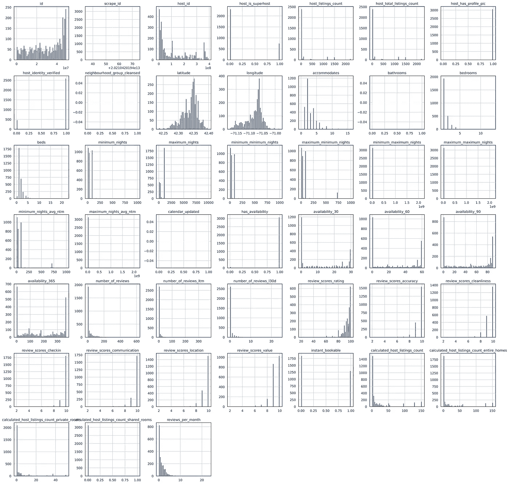

Fig 1: Boolean and Categorical variables plot

第一项任务是检查布尔和分类特性在每个类别中是否包含足够多的实例，以使它们值得包含在内。可以看出，几个列只包含一个类别，在预处理时可以删除。

“计算主机列表数共享房间”、“查看分数位置”、“日历更新”等列中的值很少。这些列将在预处理过程中被删除(图 1)。

Fig 2: Missing values ratio

这些是文本列，其中的描述对预测没有用处。此外，像“neighbourhood _ group _ cleansed”、“浴室”、“calendar_updated”这样的几列的缺失值超过 75%(图 2)。

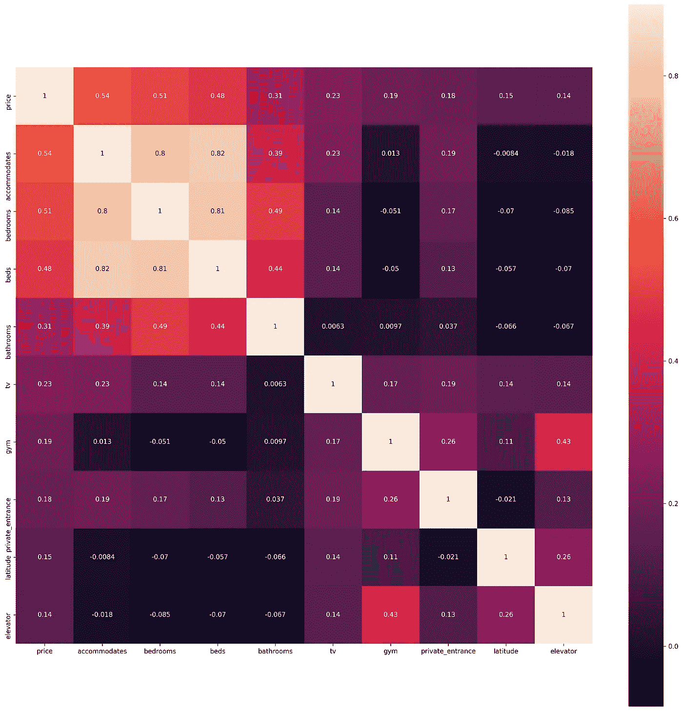

Fig 3: Top 10 High Correlated Features with Target Feature ‘Price’

特征“容纳”、“卧室”和“床”与目标变量“价格”高度相关。因此，在预处理过程中，我们只能保留其中的一列(图 3)。

从图 4 中，可以观察到“Dorchester”附近有最多的列表。我们还可以说，波士顿在中心区拥有最多的房源，因为像市中心、南端、后湾、南波士顿这样的社区是房源最多的前十个社区。

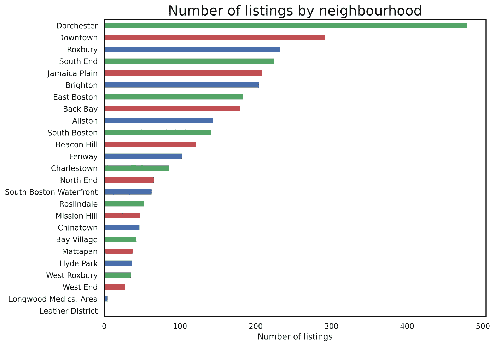

Fig 4: Number of listings by neighborhood

在图 5 中，我们认为“主机加入 Airbnb”的高峰大约在 2020 年末，可能是在放松 covid 限制之后。同样的道理，我们可以看到，获得初审的上市数量显著增加。

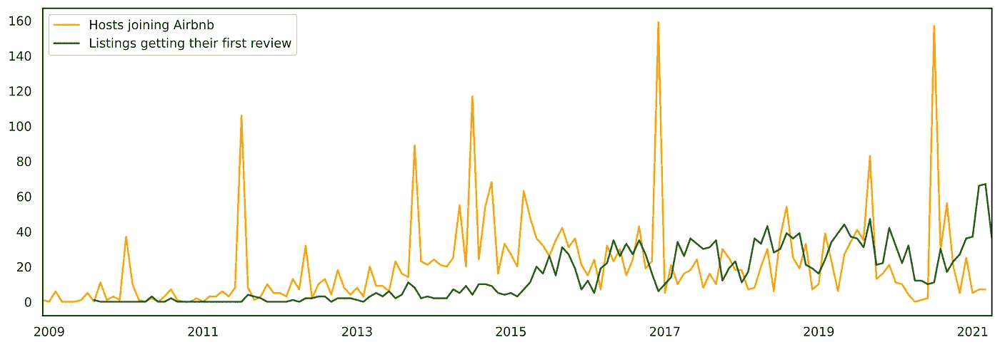

Fig 5: Time Series comparing Host Joining & First Review

> **数据预处理**

我们在这里执行的第一个任务是找出数据集中缺失值的数量，然后输入它们。然后我们估算每一列中缺失值的百分比，并决定去掉缺失值超过 70%的列。

NLP 将不用于初始模型的创建(尽管它们可以在以后用于增强模型，例如，通过情感分析)。因此，现在将删除自由文本列，以及对预测价格无用的其他列(例如，URL、主机名和其他与资产无关的主机相关功能)。

' host_listings_count '和' host_total_listings_count '在除 78 种情况外的所有情况下都相同。这些情况是值为 NaN 的情况。因此，可以删除这些列中的一列。将这些属性分成不同类型的其他列也将被删除，因为它们高度相关(一个列是其他列的总和)。

财产位置有多个列，包括最初收集数据的站点试图清理邻近位置。可以删除其中的一些列。因为所有的列表都在波士顿，所以可以删除与城市和国家相关的列。该地区的一栏将保持“邻里清洁”。

最短和最长住宿时间有多列，但将使用两个主要列，因为 minimum_nights 和 minimum_minimum_nights 之间几乎没有区别。后者大概是指一年中最短/最长住宿时间可能会有所不同。将使用默认(即最常应用的)最小/最大住宿值。

“Host Since”是一个日期时间列，将被转换为主机在平台上的天数，从数据擦除日期(2021 年 4 月 30 日)开始计算。此处删除了“主机自”列。

在“首次审核”和“上次审核”中，约有四分之一的列表没有为其编写审核。这在数据集中所占的比例太大，不能删除，删除列会丢失很多有用的信息——评论在人们决定预订以及定价时非常重要。

这在数据集中所占的比例也太大，不能简单地用中值/平均值来代替，因为这会使分布发生很大的倾斜。此外，这里的缺失值并不是真正的缺失值，就像它们是 nan 这一事实是有意义的——它告诉我们，这些是新的或以前未预订的列表，还没有评论。为了使最终的模型能够预测任何 Airbnb 房源的价格，包括全新的房源，实际上有利于留住它们。因此，这些将被保留为“未知”类别，并且该特征将被视为分类的(因此是一个热编码的)而不是数字的。

> **数据转换**

在属性类型中，需要对属性类型进行一些清理，因为有许多类别只有很少的列表。将使用“公寓”、“房屋”和“其他”类别，因为大多数房产可以分为公寓或房屋。

在便利设施中，有些便利设施比其他设施更重要(例如，阳台比传真机更容易涨价)，有些便利设施可能不常见(例如，“电动仿形床”)。根据之前在 Airbnb 物业管理行业的工作经验，以及对客人认为哪些设施更重要的调查，我们将挑选出一些更重要的设施。例如，如果事实证明几乎所有的房产都有/没有特定的舒适设施，那么这个特征对于解释价格差异就没有多大用处。

对于 Host_response_rate，大约三分之一的值为空。在将其他值分组到有意义的组中之后(即，将其转换为分类特征，而不是数字特征)，这也将被保留为其自己的类别。因为大约 70%的主机在 100%的时间内做出响应，所以这将被保留为其自己的类别，其他值将被分组到箱中。

> **编码和转换**

对所有分类变量使用一次性编码，以便它们可以在以后用于建模。

由于数值差异具有尺度差异，应用标准化对于模型性能是必要的。我们选择标准化而不是规范化，因为标准化不受离群值的影响。

# 模型和性能评估

> **列车试裂**

我们使用坚持法进行训练测试分割，70%作为训练数据，30%作为测试数据。

> **KNN**

通过超参数调整，调整了邻居、度量和权重等参数。我们在 1 到 21 的范围内改变邻居，在欧几里得和曼哈顿之间改变度量，在均匀和距离之间改变权重。

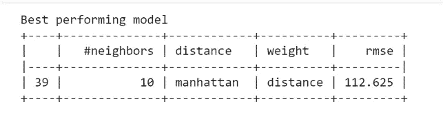

Fig 6: KNN — Best Performing Model

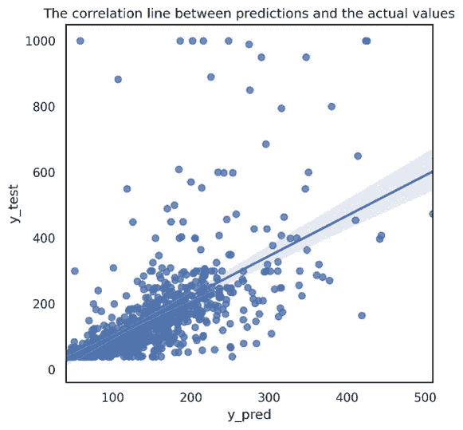

Fig 7: KNN — Correlation line between Predicted and Actual Values

使用超参数调整的 KNN 模型，性能最好的模型是邻居为 10，距离为曼哈顿，权重为距离。最佳性能模型的 RMSE 为 112.625，平均寿命为 52.70。

> **决策树**

在决策树中，像 max_depth 和 criterion 这样的参数被调整以找到最佳执行模型。最大深度范围从 1 到 31，分裂质量的标准在 mse、friedman_mse 和 mae 之间是不同的。

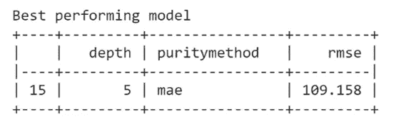

Fig 8: Decision Tree — Best Performing Model

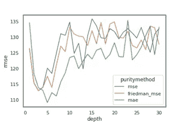

Fig 9: Decision Tree — Purity Method Plot

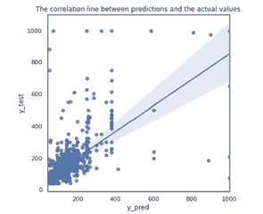

Fig 10: Decision Tree — Correlation Plot

使用超参数调整决策树，性能最好的模型是深度为 5，纯度方法为 MAE，RMSE 为 109.158

从图 9 中，我们可以看到，与 MSE 和 Friedman_ MSE 相比，纯度方法 MAE 具有最小的 RMSE 值。

图 12 示出了实际值和预测值之间的相关线图。

> **随机森林**

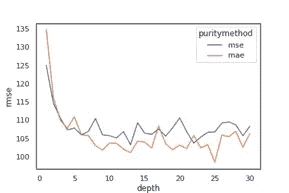

Fig 11: Random Forest — Purity Method Plot

对于随机森林，我们调整了 max_depth、criterion 和 n_estimators 等参数。参数 max_depth 在 1 到 31 的范围内进行了调整，这是数据分割质量 mse 和 mae 的标准。

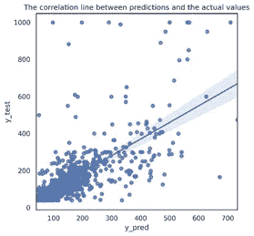

Fig 12: Random Forest — Correlation Plot

最佳模型深度为 25，纯度方法为 MAE，RMSE 为 98.5266

> **XGB**

对于 XGB，我们调整了学习率、最大深度、最小儿童体重、子样本、按树分类的列样本、嵌套模拟和目标等参数。

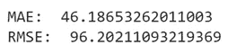

Fig 13: XGB — MAE and RMSE

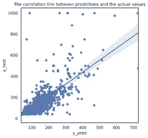

Fig 14: XGB — Correlation Plot

XGB 是表现最好的型号，RMSE 为 96.2021

> **结果**

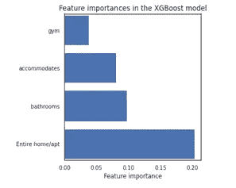

Fig 15: Important Features-XGB model

波士顿 Airbnb 住宿价格的最重要特征是整个公寓/住宅是否可用、浴室数量、可容纳的人数，特征权重分别为 0.20、0.09、0.08 和 0.03。

使用 XGB 模型，我们能够预测 RMSE 为 96 的价格。

其他几个重要的特征是停车位的可用性、Airbnb 可用的天数以及预测价格的主机响应。

查看我们想问的不同问题的结果，我们发现，在波士顿，提及整个公寓的可用性、浴室数量、可容纳的公寓数量和锻炼设施等特征或设施肯定会影响该物业的价格。停车位、收视率和便利设施当然也会有影响。因此，使用功能关联模型和规则将使房源脱颖而出，并帮助房东和 Airbnb 预测波士顿任何房产的最佳价格范围。

> **GitHub**

 [## GitHub-chaurevishwajit/AirBnb-价格-预测

### 自成立以来，Airbnb 一直是解决低成本住宿问题的关键市场驱动力，通过调查…

github.com](https://github.com/chaurevishwajit/AirBnb-Price-Prediction) 

> **参考文献**

https://towardsdatascience . com/predicting-Airbnb-prices-with-machine-learning-and-location-data-5c1e 033 d0a 5a # fb28

 [## Python 中的数据清理:Airbnb 数据清理示例

### Python 中如何处理杂乱的位置和文本数据

towardsdatascience.com](https://towardsdatascience.com/predicting-airbnb-prices-with-deep-learning-part-1-how-to-clean-up-airbnb-data-a5d58e299f6c) 

https://www . ka ggle . com/HRB zkm 9898/西雅图-Airbnb-数据-预处理