# 波士顿 Airbnb 的数据分析

> 原文：<https://medium.com/geekculture/boston-airbnbs-data-analysis-6d9971dfdf2?source=collection_archive---------22----------------------->

## Udacity 数据科学纳米学位计划项目

# **简介**

欢迎来到我关于数据科学的第一篇文章！

在这篇文章中，我将分析 Kaggle 上的波士顿 Airbnb 房源，链接如下。

为了具体指导这一分析，将回答以下三个问题:

1.  波士顿哪些街区最贵？
2.  有可能创建波士顿 Airbnb 的集群吗？
3.  影响波士顿 Airbnb 价格的因素有哪些？

分析将从数据理解部分开始，然后是数据准备部分，最后回答每个问题。

本文的方法是用一种非技术性的方法来分享关于数据的问题和见解。更多技术细节，可以在这里查阅 GitHub 库[。](https://github.com/FranciscaAlliende/AirbnbBoston)

# 数据理解

该分析基于包含 95 列和 3585 行的列表数据库，对应于波士顿市 Airbnb 上发布的住宿信息。

有几个不相关的栏目需要回答这些问题，因此，作为第一步，我只选择了相关的信息，并进行了基本的数据清理，比如删除不需要的符号($、%)，以便获得更多的可读信息。

现在，我们可以继续数据探索过程。

## 感兴趣的变量:每间房的价格

一个重要的分析变量是价格或其版本。价格本身是一个变量，有很多方差和异常值，如图 1 左侧所示。既然已经有了足够的信息，我就来看看每个容纳变量的价格，它的直方图在图 1 的右侧。

我做这个练习是因为使用一个变量，如每间房的价格或每平方米的价格，似乎比单独使用价格更直观，因为后者可以代表非常多种多样的属性，可以用简单的方法缩小范围。

图一中的直方图都来自可变价格/住宿。左边是整个范围，右边是同样的数据，上限是 300。对于这第一个数字，可以得出结论，价格有一个右偏分布，我们在离群值的存在。

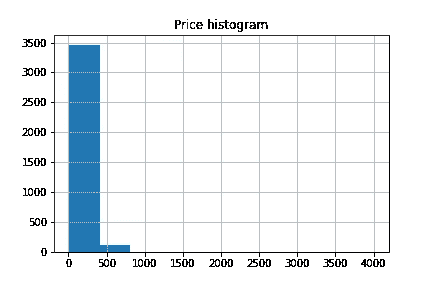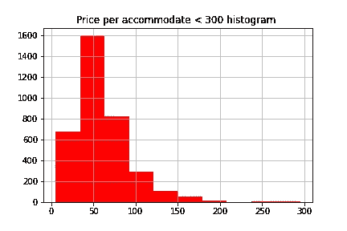

Fig. 1\. Price and price per accommodate histograms

## 数字特征

除了住宿价格，还有 15 个其他的数字特征，它们的直方图可以在图 2 中看到。

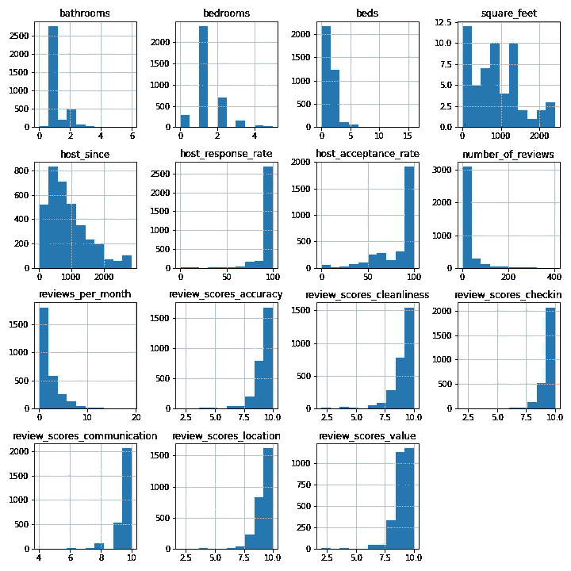

Fig. 2\. Histograms numerical features

我们必须注意的另一个要点是每个数字特征中 null 值的数量。从图 3 中可以看出，在大多数情况下，每一列中的空值百分比都很低，除了 square _ feet 中 98%以上的数据点都是空值。

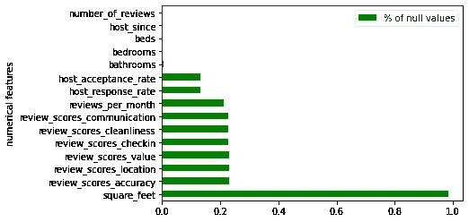

Fig. 3\. Null value distribution in numerical variables

## 分类特征

该数据集中的分类特征如下:

*   邻里——25 类
*   property_type — 13 个类别
*   房间类型— 3 个类别
*   bed_type — 5 个类别
*   取消 _ 政策— 4 个类别
*   主机响应类型— 4 个类别
*   host_is_superhost —布尔值
*   host _ identity _ verified 布尔值

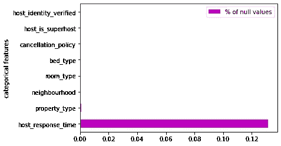

Fig. 4\. Null values distribution in categorical features

分类变量中的空值在几乎每个变量中都接近于零，除了 host_response_type，它们表示不到 15%,如图 4 所示。

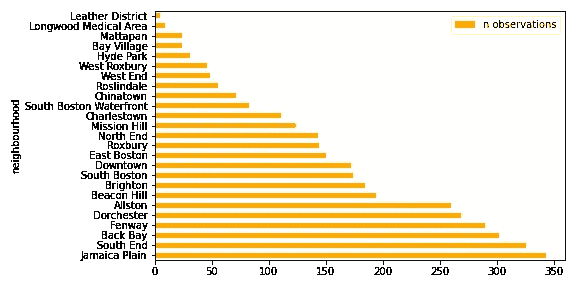

Fig. 5\. Number of observations per neighbourhood

在这个探索性分析中要考虑的另一个要点是每个类别中数据点的数量。在图 5 中，可以估计每一类邻域特征中的观察数量。

这很重要，因为结果的稳健性将取决于可用数据的数量和种类。

其他 7 个特性的类似图表可以在上面提到的 GitHub 库中找到。

最后，有 43 种便利设施，对应于 Airbnb 的不同特征，在图 6 中，可以评估具有每种便利设施的物业的比例。

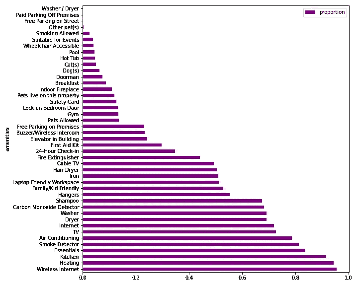

Fig. 6\. Percentage of properties that offer the amenities

# 数据准备

在数据探索之后，很容易理解我们必须解决的挑战，以便为分析准备数据。我们要解决的三个主要问题是空值、分类变量和异常值的处理。

为了处理空值，我采用了以下措施:

*   移除 square _ feet，因为其 95%以上为空值。
*   用数字特征中的中值填充空值
*   用分类特征中的模式填充空值。

在处理空值时，最传统的方法是用平均值、中值或众数来填充缺失值。对于数值变量，我选择了中位数，因为在这种情况下，变量不接近钟形分布，在这些情况下，中位数是比平均值更好的中心度量。对于分类变量，模式似乎是该数据集更有代表性的值。

对于分类变量的处理，我使用了 one-hot 编码，因为要回答问题 2 和 3，必须使用机器学习算法，该算法不能识别原始的分类变量。

对分类变量进行编码的另一个可用选项是整数编码，但是这个选项增加了失真，因为它赋予一个类别比另一个类别更大的权重，这在本例中是不正确的。这就是为什么我决定对上面提到的所有分类特征使用虚拟变量。

最后，我需要处理离群值。移除它们是一项艰巨的任务，我们不希望异常扭曲分析，但我们也不想过多地清理数据集，以至于我们以过度拟合的模型结束。

现在，我将使用隔离林来检测和删除离群值。从广义上讲，这种算法是一种集成方法，类似于随机森林，它明确地识别异常，而不是描绘正常行为，这是最传统的方法。

在实践中，我应用了 sklearn 实现，检测并删除了 180 个异常值，这代表了不到 5%的数据。

# 波士顿哪些街区最贵？

对于第一个问题，你不需要复杂的分析就能获得第一手的见解。这个问题的答案可以用图 7 来回答。这里是每个街区的价格，按中位数排序。

有可能看到所有街区都有异常值，但也有一个明显的趋势，大多数数据点集中在中间线附近，并对不同街区进行排序，从最便宜的 West Roxbury 到最贵的皮革区。

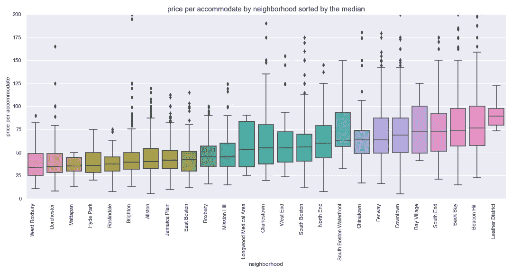

Fig. 7\. Price per accommodate by neighbourhood

很多时候，一幅图像确实比一千个单词更有价值，对于第一种方法，图 7 是这个问题的一个好的、快速而简单的答案。为了更深入，一个选择是进行方差分析测试，以获得更具体的定量结果，但我将把分析留到这里，为了这篇文章。

# 有可能创建波士顿 Airbnb 的集群吗？

这个问题的精神是要找出是否有可能将 Airbnb 上列出的房产分成组，或者集群。可能的情况是，在属性之间没有显著的差异，但是如果有，它可能是一个有用的工具，向所有者推荐行动以改进他们的广告，或者查看是否有可能将一群属性与一群最终客户相匹配，等等。

为了回答这个问题，我决定使用 k-means，这是一种无监督算法，旨在将 *n* 个观察值划分为 *k* 个聚类，其中每个观察值都属于具有最近均值的聚类

Fig. 8\. Elbow method

第一步是将数字变量标准化，以避免失真并促进学习过程。

第二步是找到模型的超参数 k 的最优值。为了找到 *k* ，我使用了图 8 所示的肘法。

该方法包括绘制解释的变化作为聚类数的函数，并选择曲线的弯头作为要使用的聚类数，在本例中，我使用了 *k = 3* 。

在运行 k-means 之后，结果，我们有 3 个聚类: *c0* 有 1297 个数据点， *c1* 有 1163 个数据点， *c2* 有 945 个数据点。到目前为止，一切顺利，但是对不同集群的解释并不简单。我们有 116 个不同的变量，在其中的许多变量中，三个集群的行为并没有像我预期的那样不同。

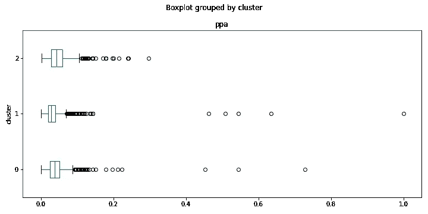

Fig. 9\. Price per accommodate per cluster

为了解释这些结果，我为数字变量创建了箱线图，按集群划分，如图 9 所示。

正如我们在图 9 中看到的，每个集群的价格变化不大。其他数字变量也会发生类似的情况，它们的箱线图可以在 GitHub 存储库中找到。

为了比较分类变量，我创建了一个分数。该分数对应于属于特定类别和聚类的数据点的数量除以数据集中的观察总数。

在图 10 中，可以看到组之间的一些差异。与群组 1 和群组 2 相比，群组 1 具有更多的房屋，私人房间也出现了相同的现象，但是总体而言，群组之间没有重大差异。

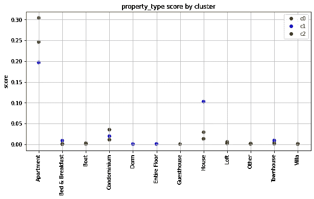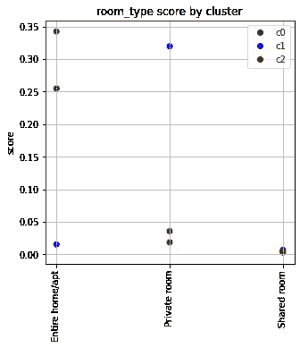

Fig. 10\. Score per cluster in categorical variables

现在，让我们来看看便利设施。我使用了与分类变量相同的分数。在图 11 中画出了娱乐设施总数中的 15 个。这里可以看出一些不同之处。例如，群组 0 提供 24 小时入住的比例高于其他两个群组，但总体而言，趋势是所有三个群组都提供相同的便利设施，没有显示出群组之间的明显差异。

Fig. 11\. Score per cluster of offered amenities

出于本文的目的，我们将把分析留到这里，但我的结论是，这个问题还没有得到回答，还有更多的问题需要探索。

说不可能把 Airbnb 房源分成集群是一个草率的结论。作为可能的下一步，我将探索不同的聚类技术并执行特征选择，以便获得更多可解释的结果。

# 影响波士顿 Airbnb 价格的因素有哪些？

要回答这个问题，有无数种方法可供选择。我选择使用随机森林和特征重要性的解释，因为这是我最熟悉的技术。

这种方法可以分为两个主要部分。首先，我们需要利用随机森林算法为每个房间的价格创建一个预测模型，然后解释该模型的特性重要性。

重要的是要记住，如果预测模型很弱，那么对特征重要性的解释也会很弱，这就是为什么在任何机器学习练习中，我们必须测量模型的预测能力，作为我们正在捕捉数据背后的真实分布的信号。

在数据准备部分，我们已经做了必要的数据预处理，以便能够创建预测模型。接下来，我们需要将数据分为响应向量和解释矩阵，在本例中，响应向量是每间客房的价格，在本例中，解释矩阵是所有剩余的 115 个特性。然后，我们分成训练集和测试集，用训练集来训练算法，最后，我们预测测试集的响应并进行评估。

作为一个评估指标，使用 RMSE，这是一个回归任务中的传统指标。RMSE 代表预测值和观测值之间的差异的第二个样本矩的平方根或这些差异的二次均值。一般来说，这个值越小越好，考虑到在 *RMSE = 0* 的情况下，我们可能会非常疲劳。

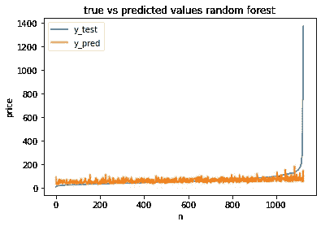

Fig. 12\. Random Forest results price per accommodate

在执行的第一个模型中，我在测试集中获得了 62.53 的 RMSE 结果，在训练集中获得了 23.03，这对我来说似乎很大。为了仔细观察，我制作了图 12 中的图表，其中真实的响应用蓝色表示，模型的预测用橙色表示。

在这里，我们可以清楚地看到，该模型并不擅长预测高价格，但我们也可以得出结论，之前对异常值的清理似乎还不够。

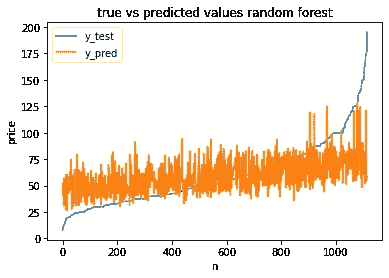

Fig. 13\. Random Forest results price per accommodate < 200

对于模型的第二次迭代，我使用了一个非常简单的方法，我将每人的价格上限定为 200 英镑。该模型的结果是测试集上的 RMSE 为 24.46，训练集上的为 16.62。

在图 13 中，我们可以分析结果，清楚地看到模型没有很好地预测低价或高价。

为了改进这个模型，我们可以做成千上万的事情，其中一些是超参数调整，通过更仔细地处理异常值和进行特征选择来改进数据预处理，利用更适合这个数据集的其他算法，等等。

现在，我们将认为，为了回答这个问题，第二个模型已经足够好了，我们将继续解释特征的重要性。

在这里回顾的随机森林的实现中，是 sklearn 实现，其中属性 feature_importances_ 对应于基于杂质的特征重要性，现在，只需要知道特征越高越重要。一个特征的重要性被计算为由该特征带来的标准的归一化总缩减，它也被称为基尼重要性。

在图 14 中，有 20 个特征具有最高的特征重要性，因此我们可以得出结论，这 20 个特征是对价格影响最大的变量。

请注意，在这些最具影响力的变量中会出现几个邻域，这可能是邻域非常重要的指示符，记住，由于我们使用了虚拟变量，每个邻域在数据集中都会显示为不同的要素，但实际上，这意味着要素邻域对于确定价格非常重要。

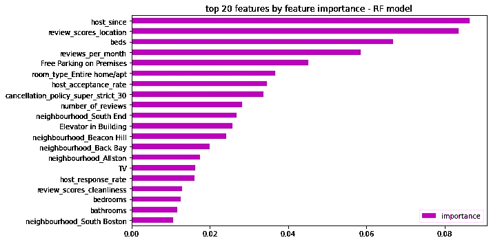

Fig. 14\. Top 20 features by feature importances

# 结论

作为数据集的第一步，这个练习非常有趣。正如我们在每个问题中看到的那样，还可以做更多的事情，根据我在数据科学方面的短暂经验，我看到总是有可能改进分析并走得更远。

在投入的时间和结果的质量之间有一个自然的平衡，必须时刻记住，有时做得比完美更好。很多时候，一个简单的情节就足以达到目的并回答一个问题。简单更好，但永远记住要透明，并在结果的解释中突出你能发现的所有问题，并诚实地说明其真正的意义。

实践总是很重要的，这就是为什么我鼓励你重做这个练习，问一些你感兴趣的问题。这是一种有趣的方式来组织工作，并在成为数据科学家的道路上前进。祝你好运！