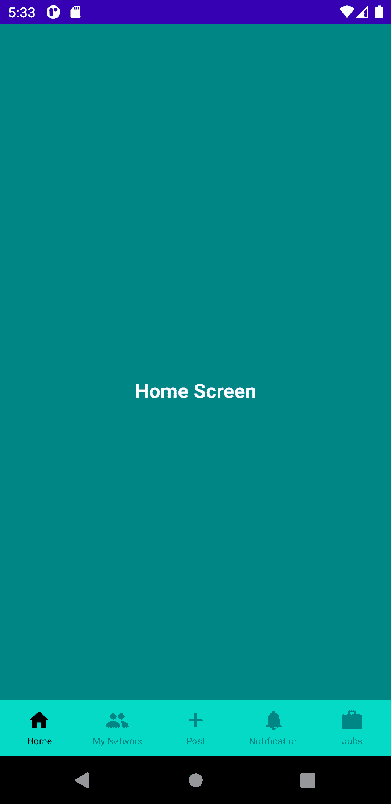

# Jetpack Compose Android 中的底部导航

> 原文：<https://medium.com/geekculture/bottom-navigation-in-jetpack-compose-android-9cd232a8b16?source=collection_archive---------0----------------------->


src: [https://learn.vonage.com/blog/2021/06/15/a-better-way-of-creating-android-views-with-jetpackcompose/](https://learn.vonage.com/blog/2021/06/15/a-better-way-of-creating-android-views-with-jetpackcompose/)

在这篇文章中，我将向你展示如何使用导航组件(导航控制器和导航主机)在 jetpack compose 中设计底部导航栏。

对于这篇文章，我设计了底部导航栏，就像 LinkedIn 一样。在 jetpack compose 中，您不需要在导航目录下定义导航并创建其导航图。jetpack compose 中的导航不同于 xml 导航，在 XML 导航中我们需要定义片段和图形。在你的应用程序级梯度文件中添加下面的依赖项，并重新构建你的应用程序。

```
implementation "androidx.navigation:navigation-compose:2.4.0-beta02"
```

重新构建应用程序后，为底部导航相关文件创建一个单独的目录。现在创建名为 BottomNavItem 的密封类，带有底部导航项目标题、项目图标和项目路径，我们稍后将使用它们在屏幕之间导航，如下所示:

在 jetpack 组合导航中，我们不使用片段，因此您需要定义屏幕内容，因此创建一个名为 BottomNavContentScreens.kt 的新文件，并在其中添加以下代码:

我只添加了一个带有路线名称的文本，这样您就可以看到导航的运行。

现在我们需要创建 BottomNavActivity 并复制下面的可组合函数来处理导航图:

现在，您需要创建新的函数来定义底部导航，它的项目，处理底部导航 backstack 和定义开始目的地。

现在您需要使用 Scaffold()创建新的可组合函数，以便您可以定义底部导航栏的位置，请参见 blow:

```
@Composable
fun MainScreenView(){
    val navController = *rememberNavController*()
    *Scaffold*(
        bottomBar = **{** *BottomNavigation*(navController = navController) **}** ) **{** *NavigationGraph*(navController = navController)
    **}** }
```

现在终于完成了，只需从活动的 oncreate 方法中调用 MainScreenView()函数:

```
override fun onCreate(savedInstanceState: Bundle?) {
    super.onCreate(savedInstanceState)
    *setContent* **{** *MainScreenView*()
    **}** }
```

最后是输出:



您可以在这个存储库中查看底层导航源代码:

[](https://github.com/DaaniDev/jetpack_compose_animations) [## GitHub-DaaniDev/jetpack _ compose _ animations

### 此存储库包含在 jetpack compose with animations 中设计自定义视图的源代码。你只需要…

github.com](https://github.com/DaaniDev/jetpack_compose_animations)