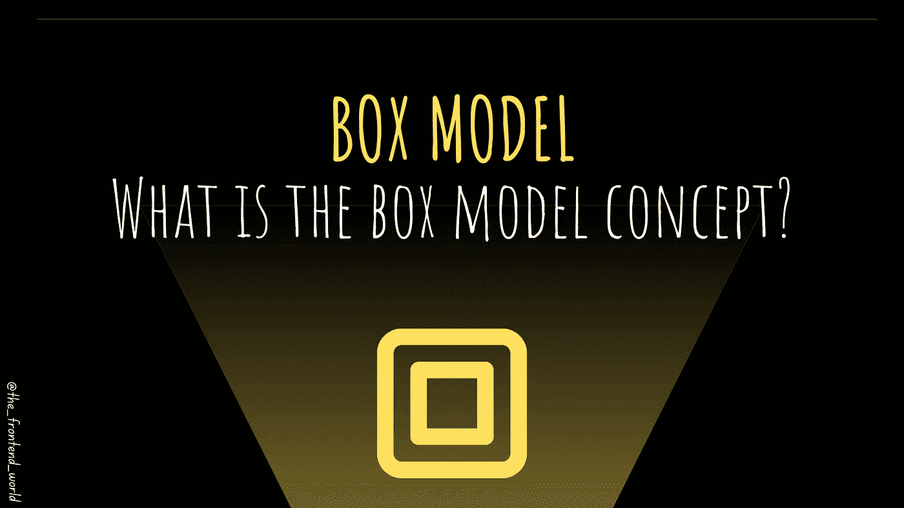

# 箱式模型

> 原文：<https://medium.com/geekculture/box-model-b67b40bb8930?source=collection_archive---------13----------------------->

## 盒子模型概念是什么？

By FAM

在上一篇文章中，您学习了如何使用标记和组合符来选择 HTML 元素。现在，你可以选择他们，你可以做令人兴奋的事情。

# 每个 HTML 元素样式的起点…

HTML 样式的故事从一个简单的想法开始！每个 HTML 元素都可以看作一个盒子。在 CSS 中…