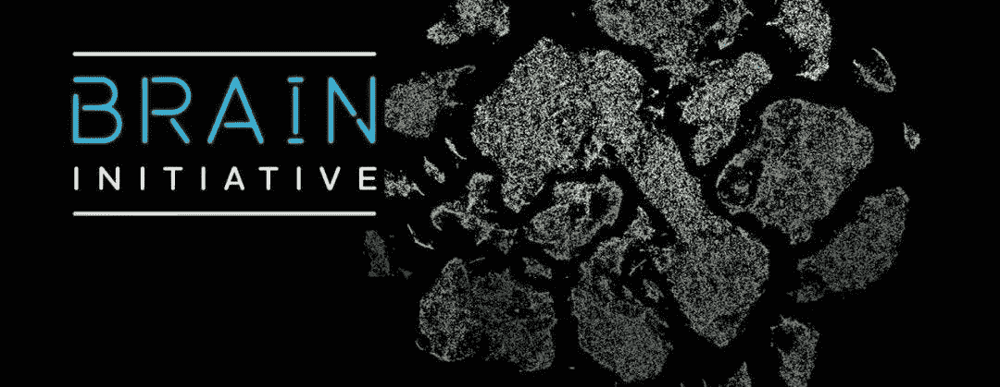

# 大脑倡议 2.0！投入 5 亿美元绘制史上最全面的人脑图谱

> 原文：<https://medium.com/geekculture/brain-initiative-2-0-c8360d937eb2?source=collection_archive---------10----------------------->

今天，脑科学项目宣布启动“细胞图谱网络计划”，旨在绘制世界上最全面的人类脑细胞图谱。这一雄心可与人类基因组计划相媲美。今天，美国国立卫生研究院(NIH)宣布了两项创新的…