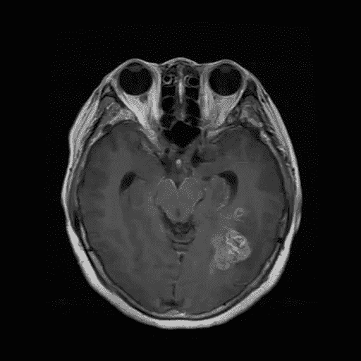

# 使用深度学习的脑肿瘤分类

> 原文：<https://medium.com/geekculture/brain-tumour-classification-using-convolutional-neural-networks-4feb2e5a7979?source=collection_archive---------15----------------------->

医学的新时代

Image provided by the author of a brain MRI of a glioma.

## 脑瘤

脑瘤是每个病人最可怕的噩梦——头痛、头晕、视力模糊、癫痫发作、判断力下降和情绪波动都可能意味着脑瘤，但也可能什么都不意味着。在疑病症患者妄下结论或忙碌的病人宣称“没什么”之前…