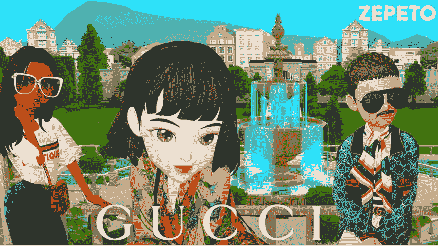

# 元宇宙的品牌……只是另一个营销噱头？

> 原文：<https://medium.com/geekculture/brands-in-the-metaverse-just-another-marketing-gimmick-e9f1af9ac42d?source=collection_archive---------11----------------------->

也许你对[游戏](/geekculture/can-play-to-earn-make-you-rich-learn-how-p2e-is-revolutionizing-games-87dc52980e38?source=user_profile---------29----------------------------)和[虚拟现实](/datadriveninvestor/the-roles-of-vr-ar-and-mr-on-the-metaverse-593569cfb686?source=user_profile---------22----------------------------)从来不感兴趣，所以你认为你和你的品牌**与[元宇宙](https://www.udemy.com/course/metaverse-masterclass-learn-everything-about-the-metaverse/?referralCode=4795AA478A4B496F3BC5)毫无关系。但是……真的是这样吗？**

在看到许多**大品牌**将他们的 [**业务(至少部分)转移到元宇宙**](https://www.udemy.com/course/metaverse-for-businesses-how-to-benefit-from-the-metaverse/?referralCode=4B3DF285FE8F0CDC8143) 后，也许你应该重新考虑你的方法。我们从过去了解到，大多数主要趋势都会影响业务…