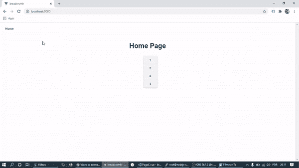

# 带有 Vue 路由器参数的面包屑 Vue 化

> 原文：<https://medium.com/geekculture/breadcrumbs-with-vue-router-params-vuetify-22d71ebc104a?source=collection_archive---------0----------------------->

我正在寻找一个好的解决方案来构建一个面包屑组件，但是，我不想安装任何包来做这件事。也许，你可以使用 [Vue-2-breadcrumbs](https://www.npmjs.com/package/vue-2-breadcrumbs) 。但是等等，如果你想创建自己的解决方案，看看这个，它比你想象的要简单。

这是我们将要建造的:



# 战略

我们将要使用的来自 Vuetify 的组件是 [this](https://vuetifyjs.com/en/components/breadcrumbs/) 。

阅读文档时，您会注意到这个组件接收了一个这样的对象:

```
items: [
        {
          text: 'Dashboard',
          disabled: false,
          href: 'breadcrumbs_dashboard',
        },
        {
          text: 'Link 1',
          disabled: false,
          href: 'breadcrumbs_link_1',
        },
        {
          text: 'Link 2',
          disabled: true,
          href: 'breadcrumbs_link_2',
        },
      ],
    }),
  }
```

所以，让我们用著名的 Vue 路由器把这个对象给组件。这是主要策略。

# 让我们现在就做吧！


Photo by [Goran Ivos](https://unsplash.com/@goran_ivos?utm_source=medium&utm_medium=referral) on [Unsplash](https://unsplash.com?utm_source=medium&utm_medium=referral)

我猜你已经知道如何创建一个 Vue 项目，以及如何向它添加 Vue 化。

我们将有几个视图组件:Home.vue、PageB.vue、PageC.vue 和主要组件:BreadCrumb.vue。

首先，我们来配置一下路由器，正如你之前读到的，路由器在这个项目中起着重要的作用。

## 索引. ts(路由器)

我们使用 Vue 路由器中的“meta”参数，并在其中创建一个名为“breadCrumb”的属性，返回一个对象数组。

但是当我们需要从路由器接收参数时，我们可以定义一个函数来返回它。

该数组将被注入到 v-breadcrumb 组件中。

现在是时候创建我们的视图了:

> 将这些文件放在视图文件夹中

## 回家。Vue，PageB.vue，PageC.vue

我们使用命名的路由，在属性中是这样的:从 v-buttons 中有一个对象来导航组件，有时传递参数。

## 面包屑组件

> 将此文件放在组件文件夹中

计算属性“breadCrumbs”执行工作，然后将 meta.breadCrumb 属性返回给 v-breadcrumb。

## 最后是 App.vue

## 结束了

现在你可以运行它，并看到你的面包屑工作良好。

如果这个故事对你有用，给我一个小小的掌声=)

如果你想查看整个项目，你可以在 Git Hub 上找到它。

[https://github . com/ViniciusSilveiraAlves/vue-bread crumb-vue tify](https://github.com/ViniciusSilveiraAlves/vue-breadcrumb-vuetify)

想了解我更多，你可以访问我的个人网站:[https://vinibr.com](https://vinibr.com?utm_source=medium&utm_medium=breadcrumb-vue-vuetify)