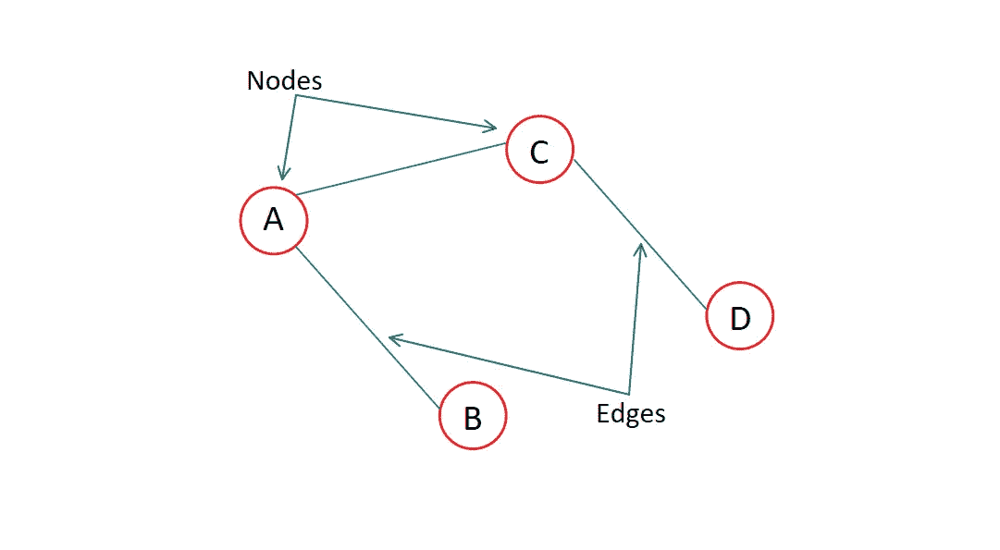
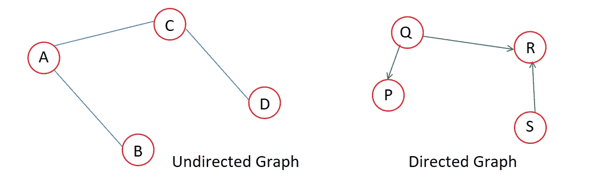
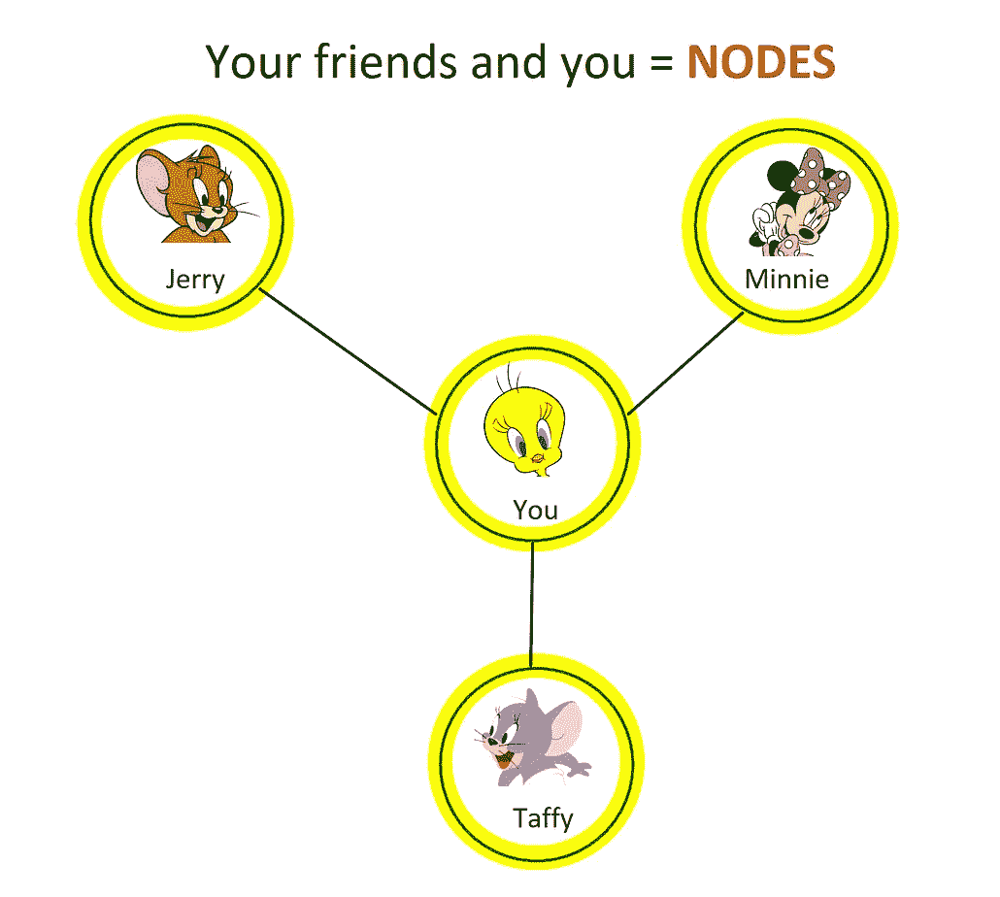
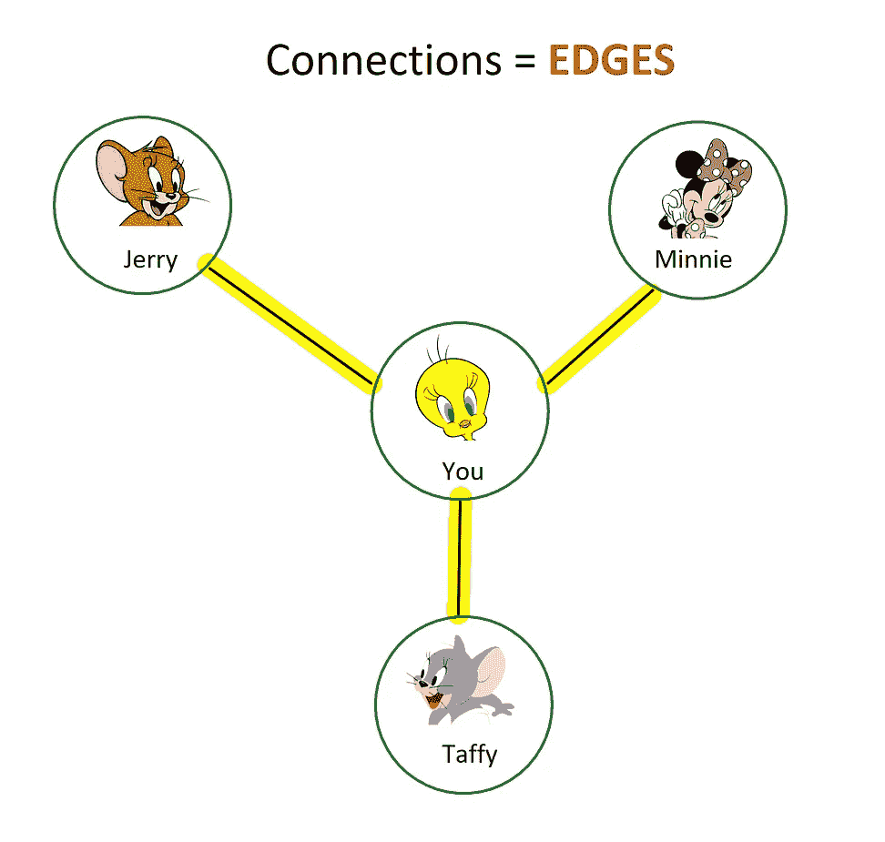
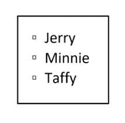
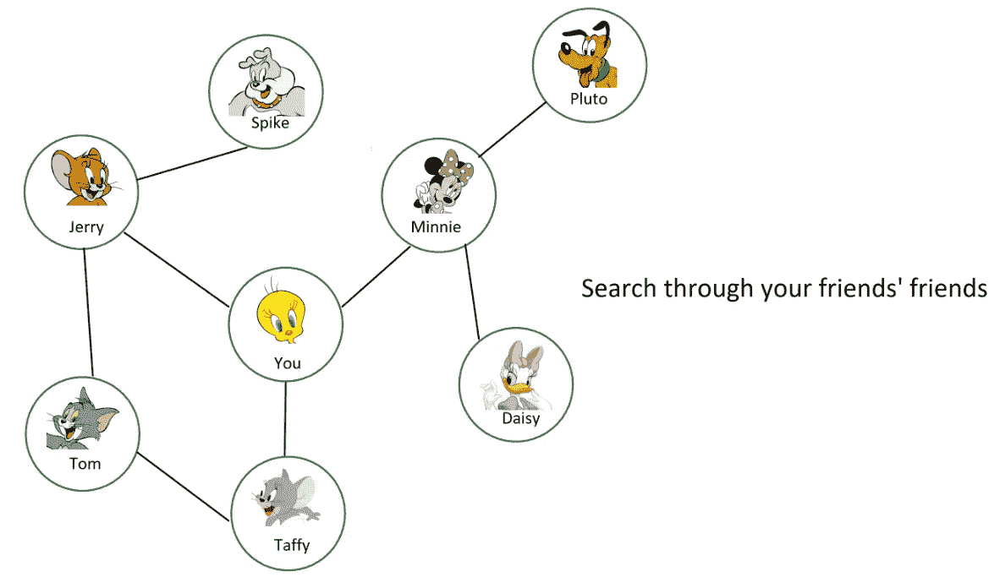
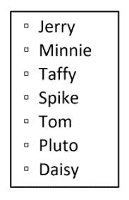
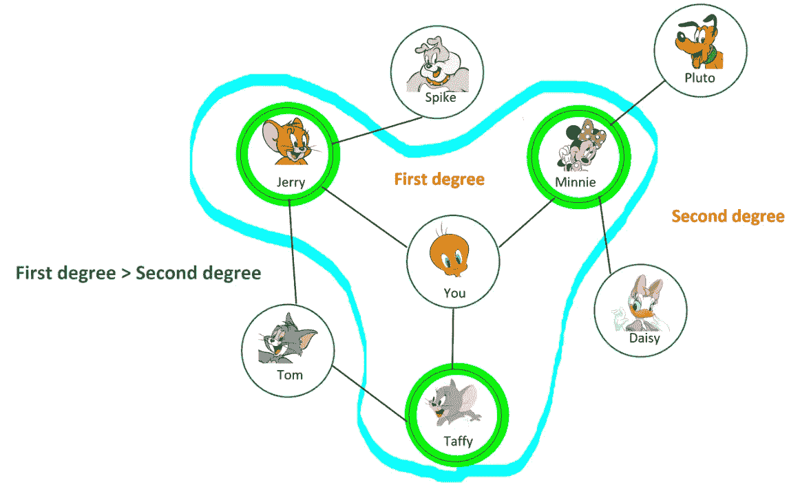
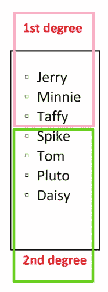

# 广度优先搜索:一个简单的解释

> 原文：<https://medium.com/geekculture/breadth-first-search-a-simple-explanation-d7c323960d35?source=collection_archive---------8----------------------->

图是一组连接的模型，是一种不可避免的数据结构。从你的社交媒体连接到地图上的城市，你会发现到处都是图表，伴随着图表而来的是*图表遍历*方法。访问图中每个节点的过程称为图遍历。**广度优先搜索**或 **BFS** 就是这样一种图遍历算法，你可能已经在日常生活中使用它了。一个常见的例子是当你想找到一个目的地的方向。你会检查是否有一条路可以到达你的目的地，并且经常试图找到最短的路径。本文采用了一种更技术性但更简单的方法来解释这个算法。我制作了一个视频[来解释这个算法。这个例子的灵感来自 Aditya Bhargava 的书*Grokking Algorithms:a illustrated guide for programmers and other quicking people*(查看详细而有趣的算法方法)*。*](https://youtu.be/HpY8f30e_OQ)

# 图形结构

图由有限的节点(或顶点)和连接两个节点的边组成。

A Graph

图可以是有向的，也可以是无向的。无向图的边没有方向。有向图有指向一个方向的边。

# BFS 是如何工作的？

广度优先搜索回答了两个主要问题:

类型 1: **两个节点之间有路径吗？**

类型二:**两个节点之间的最短路径是什么？**

让我们举一个简单的例子来看看 BFS 是如何回答这些问题的。

假设你拥有一个西瓜农场，你正在寻找一个卖西瓜的人。你去脸书很容易找到卖家。你和你的脸书朋友形成了一个网络，可以用图表的形式来表示。

List of friends

第一步是**创建一个好友列表**。现在你一个接一个地拜访名单上的每个名字。你需要回答一个简单的是非问题，“你的朋友卖西瓜吗？”，如果**是**，你就找到了你的卖家。如果你的答案是**否**，那么你从列表中划掉这个朋友的名字**并转到下一个名字**。

现在假设你的朋友都不卖西瓜。所以，你的下一步是搜索你朋友的朋友。每次你把某人从列表中删除，你就把他的朋友添加到了列表中。

Graph showing your friends and their friends

现在你不仅在寻找你的朋友，也在寻找他们的朋友。你的目标是在网络中找到一个卖西瓜的人。所以，如果你的朋友不是卖西瓜的，你也可以把他们的朋友加入名单。你继续寻找，直到你找到一个卖西瓜的人，或者你把所有的名字都从列表中删除(在这种情况下，你的网络中没有卖西瓜的人)。如果你的两个朋友有一个共同的朋友(除了你之外)，你将只写一次共同朋友的名字。这种算法被称为广度优先搜索。

谈到 BFS 回答的两个主要问题

1.  在两个节点之间存在路径吗——对于我们的例子，这可以被重新定义为*“在你的网络中存在卖西瓜的吗？”。*
2.  两个节点之间的最短路径是什么——这个可以重新架构为*“谁是最近的卖西瓜的？”*

我们已经看到了第一个问题是如何回答的。再来看第二个问题。

First and second-degree connections

你的朋友是你的一级人脉，他们的朋友是你的二级人脉。比起二级关系，你总是更喜欢一级关系。因此，你不会在搜索第一级关系之前搜索第二级关系，这将有助于你找到最近的西瓜卖家。BFS 已经这样做了。搜索*从源节点*辐射出去(这里源节点就是你)。一级关系在二级关系之前被添加到列表中，因此它们会首先被检查，只要您按照添加顺序搜索人员。所以，如果你在你的人脉中找到一个卖西瓜的，他们也会是和你最亲近的卖家。

# 一、实施

首先，我们必须制作一个图表。在 python 中，为了容易地实现图形，我们使用字典。这个字典中的一个键代表一个节点，值在数组的帮助下被映射。为了简单起见，我们在这里使用一个有向图。

为了维护这个列表，我们可以使用队列，因为我们需要 FIFO 结构(首先检查最先出现的名字)。这里我将使用 deque 来维护这个列表。

还记得共同好友的案例吗？汤姆是杰里和太妃糖的朋友。所以他可以被列入名单两次。为了避免这种问题，我们将保留一个数组，记录我们已经访问过的所有节点。如果一个人是卖西瓜的，我们就完成了，如果不是，我们继续搜索，直到我们找到一个卖家或访问所有节点。这方面的代码是:

我们最不需要的是一个函数来确定一个人是不是卖西瓜的(对*的定义是 _seller()* )。我在这里提出的条件是，这个人的名字以*‘T’*开头。所以这个案例的答案是*太妃糖*。这个函数可以被任何条件代替，以找到*目的地*节点。所以最后的代码是:

# 执行时间

因为你是在搜索一个卖西瓜的人，所以你会沿着所有的边(连接)走。最起码运行时间是 O(边数)。如果边数是 E，我们得到 O(E)。

您还需要为这个算法保留一个队列。将一个元素推入队列需要常数(O(1))的时间。对所有节点或顶点执行此操作将花费 O(节点数)时间。如果图中有 N 个节点，则需要 O(N)时间。

所以总的来说，广度优先搜索耗时 O(节点数+边数)或 **O(N + E)** 。

# BFS 的应用

就像我之前提到的，你已经在日常生活中使用了广度优先搜索算法。这是一个非常简单的算法，这也是它被应用于许多现实生活场景的原因。下面列出了一些应用:

1.  GPS 导航
2.  未加权的图遍历(最短路径和最小生成树)
3.  搜索引擎爬虫
4.  网络广播

# **参考资料和资源**

这篇文章试图对 BFS 做一个简单的解释。关于 BFS 还有很多需要了解的。查看以下链接了解更多信息:

1.  [广度优先搜索视频](https://youtu.be/HpY8f30e_OQ)
2.  [搜索算法](https://www.amazon.in/Grokking-Algorithms-illustrated-programmers-curious/dp/1617292230)
3.  [图形数据结构和算法](https://www.geeksforgeeks.org/graph-data-structure-and-algorithms/)
4.  [有向和无向图](https://www.mathworks.com/help/matlab/math/directed-and-undirected-graphs.html#:~:text=Undirected%20graphs%20have%20edges%20that,be%20traversed%20in%20both%20directions.&text=Directed%20graphs%20have%20edges%20with,traversed%20in%20a%20single%20direction.)
5.  [图形的应用](https://www.geeksforgeeks.org/applications-of-breadth-first-traversal/)