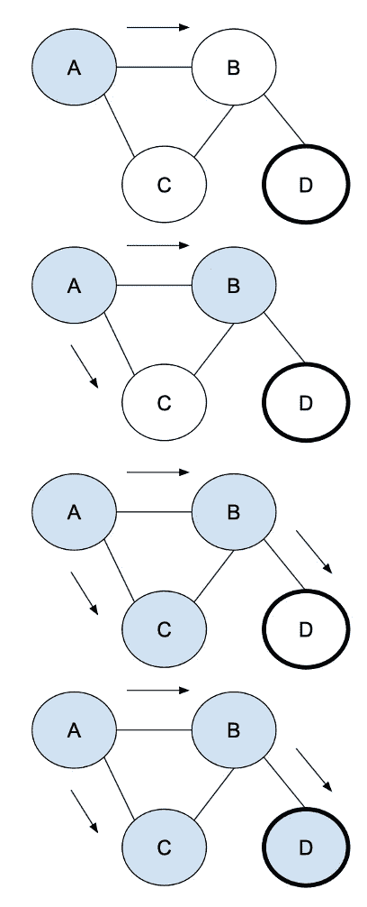

# 广度优先搜索(BFS)

> 原文：<https://medium.com/geekculture/breadth-first-search-bfs-e7dd75de4146?source=collection_archive---------10----------------------->

## 顾名思义，我们首先是屏息或广泛地搜索，一层一层地检查所有节点。

使用队列存储节点将有助于我们在访问子节点之前访问所有节点的兄弟节点。

代码如下: