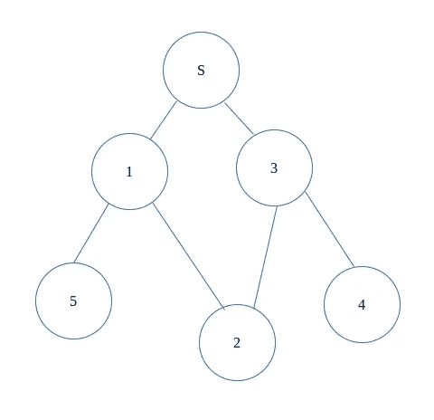
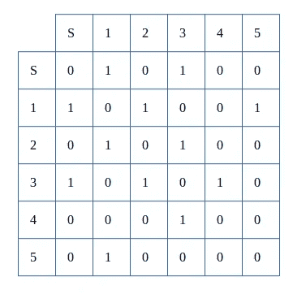
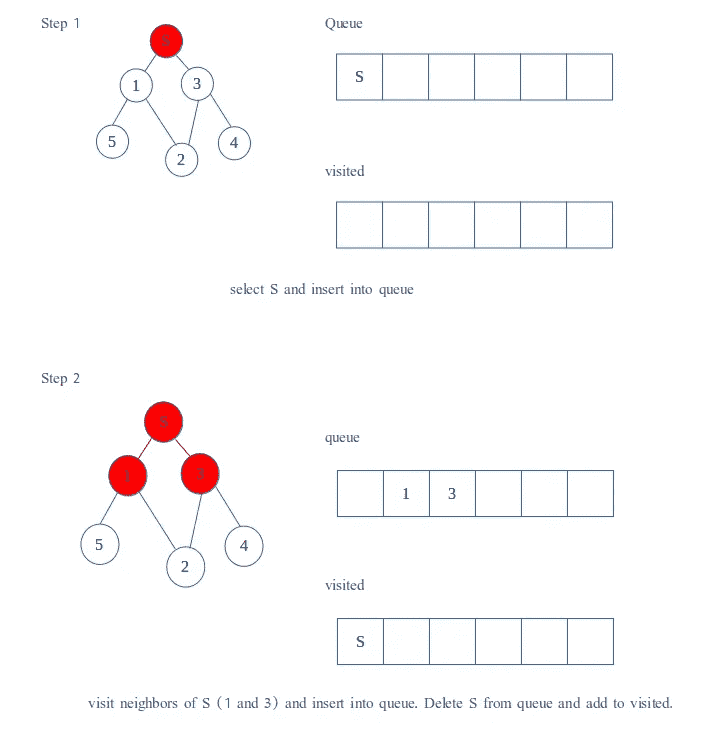
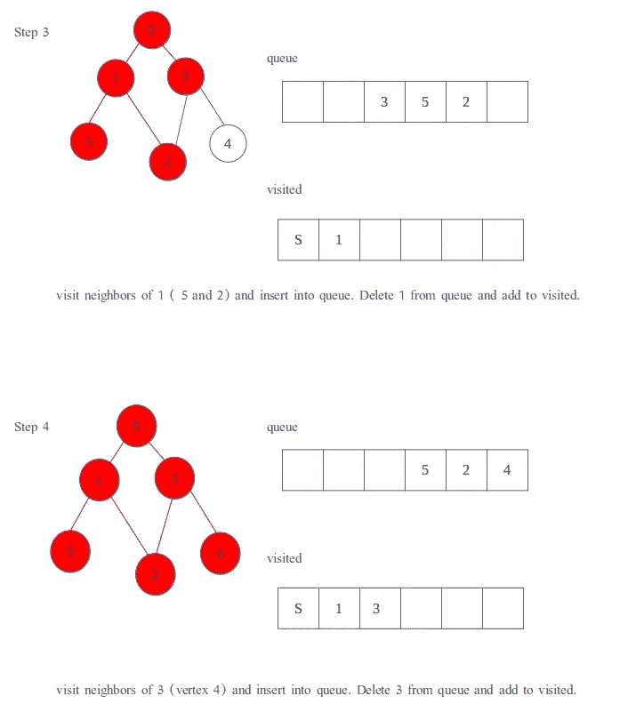
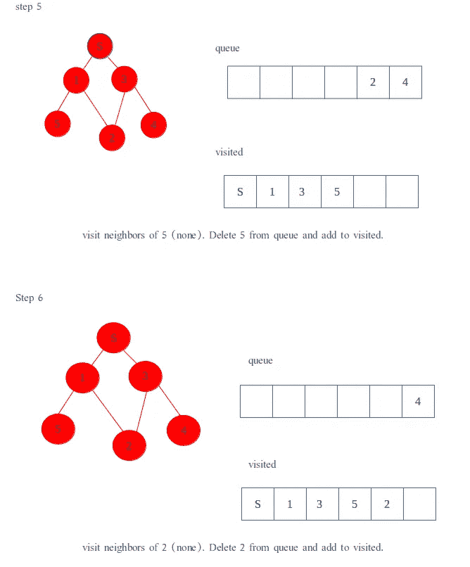
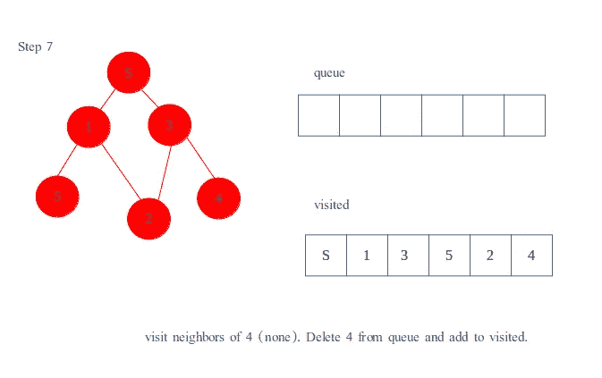

# 广度优先搜索(java 语言)

> 原文：<https://medium.com/geekculture/breadth-first-search-in-java-d32d29f6bb9e?source=collection_archive---------3----------------------->

BFS 是一个经典的图搜索算法。这里是 [wiki](https://en.wikipedia.org/wiki/Breadth-first_search) 提供的定义

> **广度优先搜索** ( **BFS** )是一种[算法](https://en.wikipedia.org/wiki/Algorithm)，用于在[树](https://en.wikipedia.org/wiki/Tree_(data_structure))数据结构中搜索满足给定属性的节点。它从[树根](https://en.wikipedia.org/wiki/Tree_(data_structure)#Terminology)开始，在移动到下一个深度级别的节点之前，探索当前[深度](https://en.wikipedia.org/wiki/Tree_(data_structure)#Terminology)的所有节点。需要额外的内存，通常是一个[队列](https://en.wikipedia.org/wiki/Queue_(data_structure))，来跟踪已经遇到但还没有探索的子节点。
> 
> 例如，在[国际象棋残局](https://en.wikipedia.org/wiki/Chess_endgame)中，[国际象棋引擎](https://en.wikipedia.org/wiki/Chess_engine)可以通过应用所有可能的移动从当前位置构建[博弈树](https://en.wikipedia.org/wiki/Game_tree)，并使用广度优先搜索为白棋找到获胜位置。隐式树(如博弈树或其他解决问题的树)的大小可能是无限的；广度优先搜索保证找到一个解节点[【1】](https://en.wikipedia.org/wiki/Breadth-first_search#cite_note-1)(如果存在的话)。

BFS 是一种解决图论问题的算法，下面是一些应用:

1.求未加权图中两个节点间的最短路径。通过扩展，我们可以发现图中的两个节点之间是否存在路径，以及从一个特定节点可以到达的所有节点。

2.计算流量网络中的最大流量(福特-富尔克森算法)。我们也可以使用深度优先搜索，但是 BFS 降低了最坏情况的复杂度。

3.GPS 使用 BFS 查找邻近位置

4.社交网络。就像培根数的经典例子一样，我和蕾哈娜相差 n 度。n 趋向于无穷大。

5.网络广播使用 BFS 到达所有节点

6.快速解魔方

7.网络爬虫使用 BFS 建立相关页面的索引

8.对等网络使用 BFS 来寻找最近的邻居节点

9.垃圾收集(使用切尼算法)

该算法的时间复杂度为 O(v + e)

v —图形中顶点的数量

e —图中的边数

也就是说，遍历该图所需的时间取决于该图中顶点和边的数量。不能说我没想到会这样。

**伪代码**看起来像这样:

1.  初始化未访问节点的队列
2.  挑选一个节点并将其添加到队列中
3.  从队列前面取出第一个节点，并将其添加到已访问节点列表中
4.  仅当刚刚访问过的节点的所有相邻节点尚未被访问时，才将它们添加到队列中
5.  重复 3 和 4，直到队列为空

为了防止一次又一次地处理同一个节点，我们使用一个布尔数组来标记被访问过的节点。我们使用一个队列来存储节点，并将它们标记为“已访问”,直到它的所有邻居都被标记。就像厨房一样，队列遵循先进先出(FIFO)的方法，所以邻居是按照插入的顺序被访问的。



graph

好吧，看看这个图表。虽然这是一个看起来很悲伤的图表，但它必须用于教育目的。

我们将添加一个**父数组**，它将引用哪个顶点是由哪个其他顶点引入的。

所以我们从 S 开始，我们将它标记为-1，因为它是源。

节点 1 和 3 是由 S 引入的，所以我们将它们标记为 0，因为它们是由源引入的。

节点 5 由节点 1 引入

节点 2 是由 1 和 3 引入的，但为了方便起见，我们称它是由节点 3 引入的

节点 4 由节点 3 引入


parent array of graph

现在我们有了整个图形的分层表示。你可能会问，这有什么用？现在它告诉我们任意节点间的最短路径。假设你想找出从节点 4 到节点 s 的最短路径。

节点 4 的值是 3，我们去节点 3。

节点 3 的值是 0，我们我们去源。

因此，从节点 4 到源的路径是 4 → 3 → S

这显然是一个简单的例子，但是同样的基本思想可以扩展到你想要运行它的任何图形上。

我们还将为计算机创建一个**邻接表**,以了解哪个节点通过一条边链接到哪个其他节点。为此，我们将使用一个链表数组。1 表示有边，0 表示没有边。

这使我们可以将图形作为一个数组来查看，并确定一条边是否是共享的。一旦我们知道了这一点，我们就可以将此信息记录到父阵列，并移动到队列中的下一个节点。



adjacency list of graph

队列**的功能类似于**



好，让我们看看所有这些部分是如何编码在一起的:

```
import java.util.LinkedList;
import java.util.Queue;
import java.util.Scanner;public class Graph {
    private LinkedList<Integer> adjacencyList[]; public Graph (int vertex) {
        adjacencyList = new LinkedList[vertex];
        for (int i = 0; i < vertex; i++) {
            adjacencyList[i] = new LinkedList<Integer>();
        }
    } public void addEdge(int start, int finish) {
        adjacencyList[start].add(finish);
        adjacencyList[finish].add(start);
    } // minimum distance between start and finish nodes using BFS
    public int BFS(int start, int finish) { // array to hold vertices already visited
        boolean[] visited = new boolean[adjacencyList.length]; //parent array holds value of vertex which introduced this vertex
        int[] parent = new int[adjacencyList.length];
        Queue<Integer> q = new LinkedList<>();        q.add(start);
        parent[start] = -1;
        visited[start] = true; while (!q.isEmpty()) {
            // pull out the first vertex in the queue
            int current = q.poll(); // if the vertex pulled is the last one, break loop
            if (current == finish) break; for (int neighbour: adjacencyList[current]) {
                // if neighbour hasn't been visited
                if(!visited[neighbour]) {
                    visited[neighbour] = true;
                    // add to the queue
                    q.add(neighbour);
                    // since current vertex introduced us
                    parent[neighbour] = current;
                }
            }
        } //traverse through the parent array
        int current = finish;
        int distance = 0;
        while (parent[current] != -1) {
            System.out.print(current + "-> ");
            current = parent[current];
            distance++;
        }
        System.out.print(start); return distance;
    }public static void main(String[] args) {
        Scanner sc = new Scanner(System.in);
        System.out.println("Enter number of vertices and edges");
        int vertices = sc.nextInt();
        int edges = sc.nextInt(); // define graph
        Graph graph = new Graph(vertices); // input edges and initialize graph
        System.out.printf("Enter %d edges: ", edges);
        for (int i = 0; i < edges; i++) {
            int start = sc.nextInt();
            int finish = sc.nextInt();
            graph.addEdge(start, finish);
        } System.out.println("Enter start and end vertex");
        int start = sc.nextInt();
        int finish = sc.nextInt(); int distance = graph.BFS(start, finish);
        System.out.println("\nMinimum distance between " + start + "           & " + finish + " is " + distance);
    }
}
```

这一次到此为止。随着我了解更多，我会进一步优化这一点。但是现在，这已经足够了👋👋