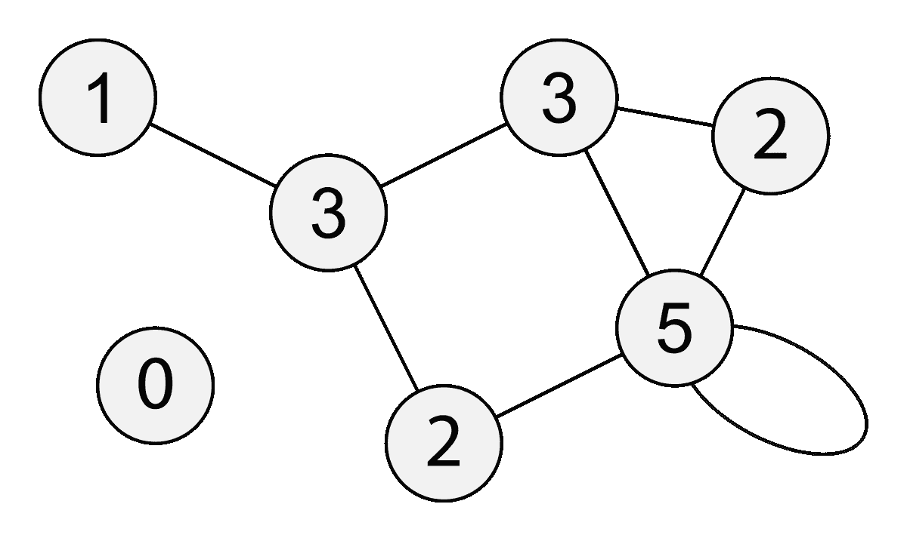

# Python 中的广度优先搜索

> 原文：<https://medium.com/geekculture/breadth-first-search-in-python-822fb97e0775?source=collection_archive---------6----------------------->

[https://en.wikipedia.org/wiki/Degree_(graph_theory)](https://en.wikipedia.org/wiki/Degree_(graph_theory))

**广度优先搜索**(简称 BFS)是一种图遍历算法。在 BFS 中，我们在移动到下一深度的节点之前，访问当前深度的所有相邻节点。

# 广度优先搜索含义

广度优先搜索最好通过与它的对立面(即深度优先搜索)进行比较来解释。假设我们有下图。