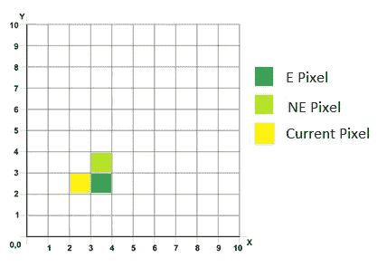
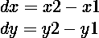
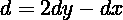
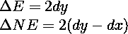
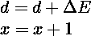
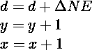
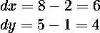
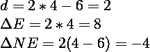
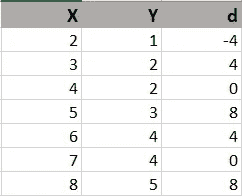

# 布雷森汉姆画线算法

> 原文：<https://medium.com/geekculture/bresenhams-line-drawing-algorithm-2e0e953901b3?source=collection_archive---------4----------------------->

## Bresenham 画线算法举例说明

我们在[上一篇文章](https://aihalapathirana.medium.com/dda-line-drawing-algorithm-be9f069921cf)中谈到了计算机图形学中的线条画基础和 DDA 线条画算法。在这篇文章中，我将解释另一种流行的扫描转换线算法，Bresenham 的画线算法。

如果你想了解更多关于扫描转换一行的信息，请阅读我的[前一篇文章](https://aihalapathirana.medium.com/dda-line-drawing-algorithm-be9f069921cf)。

# 在 Bresenham 算法中寻找下一个像素

类似于 DDA 算法，我们需要两个端点 P 和 Q，使用 Bresengham 算法画一条线。

Bresenham 的算法只使用整数值、整数比较和加法。这使得 Bresenham 的算法比 DDA 算法更有效、更快速、更容易计算。

一旦我们选择了一个像素，我们有两个可能的像素来选择作为下一个像素。

1.  右侧像素(东—东)
2.  右上角像素(东北—东北)

假设当前像素坐标为***【x，y】***

选择 E 作为下一个像素—仅增加 X 值 1 - ***(x+1，y)***

选择 NE 作为下一个像素—X 和 Y 值都增加 1 - ***(x+1，y+1)***

为了选择下一个像素，我们使用基于斜率误差的决策参数。如果斜率误差大于 0.5，实际线在 ne 附近。当斜率误差小于 0.5 时，直线更接近 E。

在每一步，我们需要根据像素的选择，通过增加△E 或△NE 来递增计算决策变量。

让我们试着更好地理解算法。

# 布雷森汉姆算法

假设起点是 ***(x1，y1)*** ，终点是 ***(x2，y2)***

***场景:x1<x2*T27**0<斜率<1****

首先我们需要计算 ***dx*** 和 ***dy***

我们用 ***dx*** 和 ***dy*** 的值来计算初始决策变量(**)*。决策变量的值在每一步都是变化的。*

**

*同样，我们需要计算 ***△E*** 和 ***△NE*** 的值。首次启动后，这些值不会改变。*

**

*现在我们要决定接下来要选择的最佳像素是什么， ***NE*** 还是 ***E*** 。我们使用决策参数的符号来做出决策。*

****情况 1: d ≤ 0****

*如果决策变量为负或零，我们将选择像素 E。在这个场景中，我们只将 ***x*** 值增加 1，并使用 ***△E*** 计算新的决策变量。*记住保持* ***y*** *值不变*。*

**

****案例 2: d > 0****

*当决策变量为正时，选择 NE 作为下一个像素。除了计算新的决策变量并增加 x 值*外，还需要增加 y 值*1。***

******

***继续直到 x = x2***

***让我们用一个例子来试试这个算法。***

## ***例子***

***我将采用我在 DDA 算法教程[中使用的同一个例子](/geekculture/dda-line-drawing-algorithm-be9f069921cf)，以便我们可以比较结果。***

***假设***x1<x2*T45**和 *0 <斜率<1********

**从(2，1)到(8，5)画一条线**

***X1* = 2， *X2 =* 8 *，Y1 =* 1 *和 *Y2 =* 5***

*在计算决策变量之前，我们需要找到 X 和 Y 坐标值的差值， ***dx*** 和 ***dy*** 。*

**

*现在我们可以利用*△E、 和 *△NE* 的值，利用 ***dx*** 和 ***dy。*****

****

**按照 ***情况 1*** 和 ***情况 2*** 为该线寻找下一个最佳像素。**

********

**如果您将这些结果与 DDA 算法的结果进行比较，您可以看到我们得到了与 DDA 算法相同的结果。**

**正如我之前提到的，Bresenham 的算法涉及简单的计算，这使得该算法比 DDA 算法更高效、更快。**

**由于涉及整数算术计算，Bresenham 算法提供了比 DDA 算法更精确的结果。**

**到目前为止我们只讲了这个算法的一般场景，其中 ***x1 < x2*** 和 ***0 <斜率< 1*** 。我们还需要考虑另外三种情况。**

*****案例 1: x1 > x2*****

**在这种情况下，我们应该从左向右画线。以 ***(X2，Y2)*** 为起点，以 ***(X1，Y1)*** 为终点，然后继续 Bresenham 算法。**

*****案例二:斜率< 0*****

**在斜率为负的情况下，我们可以通过绕 X 轴反射原直线，得到斜率为正的直线。我们对具有正斜率的线执行 Bresenham 算法，并绕 X 轴反射回来以获得像素。**

*****例题*****

**从 ***(x1，y1)*** 到 ***(x2，y2)*** 画一条线。在这种情况下，我们假设斜率为负。**

**现在不使用 Bresenham 从 ***(x1，y1)*** 到 ***(x2，y2)*** ，而是使用 ***(x1，-y1)*** 到 ***(x2，-y2)*** 上的算法。在计算完从 ***(x1，-y1)*** 到 ***(x2，-y2)*** 的所有像素后，我们改变所有像素的*y 值的符号来获得原始行的像素。***

******案例三:坡度> 1******

**在斜率大于 1 的情况下，我们可以通过交换 ***x*** 和 ***y*** 的值来使用 Bresenham 算法。计算结束后，将 ***x*** 和 ***y*** 的值交换回来，得到要显示在该行上的像素。**

****例子*例子*例子****

**从 ***(x1，y1)*** 到 ***(x2，y2)*** 画一条线。假设斜率大于 1。**

**对 ***(y1，x1)*** 到 ***(y2，x2)*** 使用 Bresenham 算法。像前面一样计算直线的像素。然后通过交换 ***x*** 和 ***y*** 值将所有像素转换回来。**

**GitHub 链接到 Bresenham 的算法—[https://GitHub . com/anushaihalapathrana/Bresenham-line-drawing-algorithm](https://github.com/anushaihalapathirana/Bresenham-line-drawing-algorithm)**

**Bresenham 线算法的 npm 包—【https://www.npmjs.com/package/bresenham-line-algorithm **