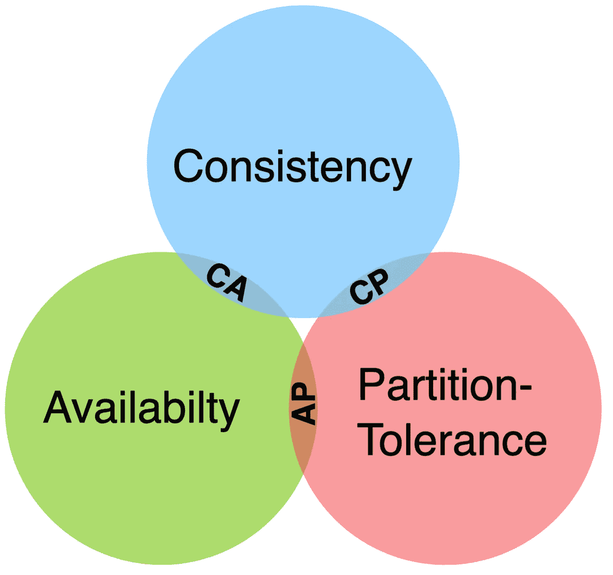

# 简单的布鲁尔帽定理

> 原文：<https://medium.com/geekculture/brewers-cap-theorem-in-simple-words-889dbb886773?source=collection_archive---------18----------------------->

## “规则”是如何随着时间的推移而改变的&它仍然相关吗？

[https://commons.wikimedia.org/wiki/File:CAP_Theorem.svg](https://commons.wikimedia.org/wiki/File:CAP_Theorem.svg)

# CAP 定理到底是什么？

CAP 定理，又称**布鲁尔定理**，是分布式系统领域的一个基本概念。它说*不可能*让一个分布式系统同时提供以下三种保证:

*   **一致性:**系统中的所有节点同时看到相同的数据。
*   **可用性:**每个请求都会收到一个响应，即使它可能不是最新的。
*   **分区容错:**即使某些节点无法相互通信，系统也能继续运行。

换句话说，分布式系统在任何给定时间只能提供三种保证中的两种。这种权衡对于分布式系统的设计有着重要的意义。

例如，当分区发生时，优先考虑一致性和可用性的分布式系统可能遭受性能降低。另一方面，优先考虑可用性和分区容忍度的分布式系统在面对网络分区时可能会牺牲一致性。

# 今天它仍然相关吗？

CAP 定理是分布式系统领域中一个被广泛争论的话题。尽管该定理在 20 世纪 90 年代末首次提出，但它仍然是理解分布式系统行为的一个重要概念。

一些人认为该定理过于简单，没有考虑到现实世界系统的细微差别。其他人认为这是设计分布式系统时必须考虑的一个基本概念。

尽管存在争议，CAP 定理仍然是分布式系统领域中的一个关键概念。它提醒我们，在分布式系统的设计中存在权衡，仔细考虑系统提供的保证是很重要的。

# CAP 定理适用的一些现实系统可以是什么？

1.  一个**分布式数据库系统**用于一个大型电子商务网站，该网站在不同地区拥有多个数据中心。系统必须平衡数据的一致性和可用性，因此实现最终的一致性，其中数据的更新可能不会立即反映在所有数据中心。
2.  用于社交网络平台的**分布式消息系统**，必须处理大量并发用户和消息。该系统实现了一种分区容错策略，在网络分区期间，消息可能会暂时丢失或延迟，但整个系统仍然可用并正常工作。
3.  一个**分布式文件存储系统**，面向必须处理大量数据并为用户提供高可用性的云计算提供商。该系统实现了一致性优先的方法，其中数据在所有节点上总是一致的，但是为了保持这种一致性，可能会牺牲一些可用性。
4.  一个**分布式缓存系统**，用于处理高流量并提供快速数据访问的 web 应用程序。该系统实现了可用性优先的方法，在这种方法中，数据在所有节点上可能不总是一致的，但是系统保持可用并响应用户请求。

# 结论

当我们构建系统时，CAP 定理对于理解是有价值的。这个定理的证明看起来不可靠，但是实践告诉我们，不存在同时一致、可用和分区容忍的分布式系统。在我看来，数据工程师应该意识到他们的系统引入的权衡。

我希望，这篇短文对你有用。感谢您的阅读！

▶️ *请在下面的评论中提出任何问题/疑问或分享任何建议。*

▶️ *如果你喜欢这篇文章，那么请考虑关注我&把它分享给你的朋友吧:)*

▶️ *你可以联系我在—*[*LinkedIn*](https://www.linkedin.com/in/garvitarya/)*|*[*Twitter*](https://twitter.com/garvitishere)*|*[*github*](https://github.com/GarvitArya/)*|*[*insta gram*](https://www.instagram.com/garvitarya/)*|*[*Facebook*](https://www.facebook.com/garvitishere)