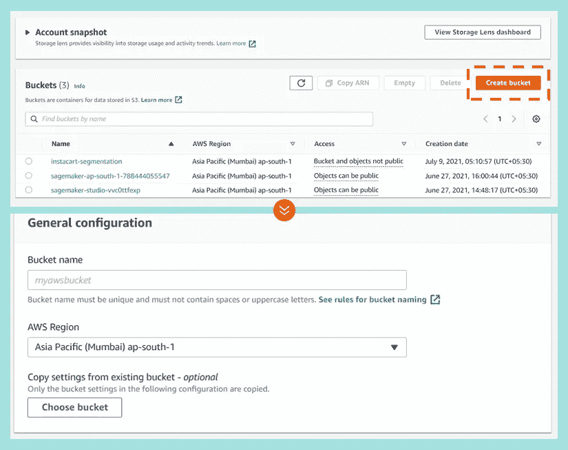
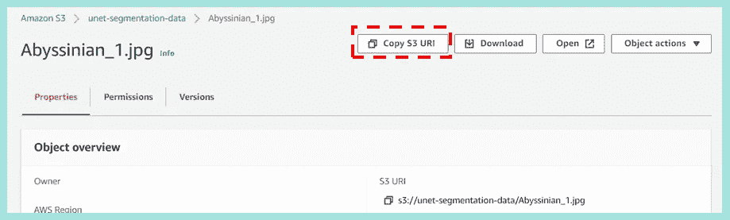
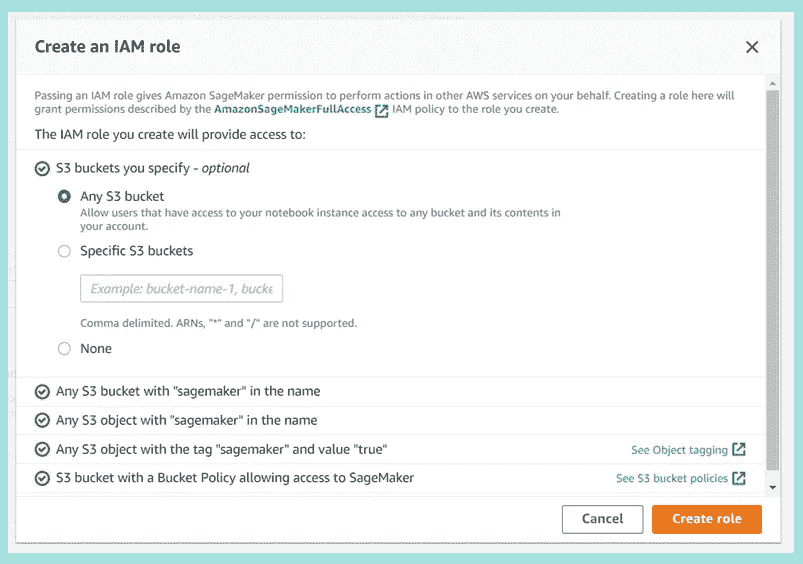

# 将您自己的代码带到 AWS SageMaker

> 原文：<https://medium.com/geekculture/bring-your-own-code-to-aws-sagemaker-74e1f98c326d?source=collection_archive---------14----------------------->

## 逐步演练

## *通过 7 个简单的步骤训练和部署您的模型*


Photo by [Charles Deluvio](https://unsplash.com/@charlesdeluvio?utm_source=medium&utm_medium=referral) on [Unsplash](https://unsplash.com?utm_source=medium&utm_medium=referral)

开始一个新的平台可能会令人望而生畏！一个简单的方法是利用你已经知道的东西来使转换更容易。我在这里，以同样的方式帮助您启动 AWS。如果你已经使用过 AWS，你可以跳过这个 7 步指南的前 3 步。

> 这个博客将帮助你重用预先编写的代码来**训练和部署 SageMaker 中的模型**

出于本文的目的，我将使用一个用 TensorFlow 创建的 U-Net 模型——你可以在我的前一篇博客[上了解更多。](/geekculture/u-net-implementation-from-scratch-using-tensorflow-b4342266e406)

[](/geekculture/u-net-implementation-from-scratch-using-tensorflow-b4342266e406) [## 使用 TensorFlow 从头开始实现 U-NET

### 基础概念和逐步 Python 代码解释

medium.com](/geekculture/u-net-implementation-from-scratch-using-tensorflow-b4342266e406) 

# 博客的内容

1.  核对先决条件
2.  在亚马逊 S3 加载您的数据
3.  设置 SageMaker 环境
4.  创建评估者
5.  训练模型
6.  部署模型
7.  预测！

# 1.核对先决条件

在我们开始之前，你需要两件东西:

*   用于培训/部署的预写代码
*   一个激活的 AWS 账户([更多信息请点击](https://aws.amazon.com/premiumsupport/knowledge-center/create-and-activate-aws-account/)打开一个**免费**账户)

# 2.在亚马逊 S3 加载您的数据

一旦你登录到你的账户，第一步将是上传所需的数据，这可以通过亚马逊的简单存储服务(S3)轻松完成。S3 是一种云存储驱动器，允许用户保存任何格式的大量数据，许多公司都使用它来安全地存储客户数据。在免费层中，5GB 存储、前 20k 个 GET 请求和 2K 个 PUT 请求都不需要付费。

*   打开 AWS 管理控制台，在“服务”下(左上角)查找“S3”(存储部分)
*   打开 S3 管理控制台后，点击右上角的“创建存储桶”按钮。您应该看到一个弹出的表单，如下图所示。

> S3 桶类似于文件夹，用于模块化和存储 AWS 云中的数据。用户可以自定义每个存储桶的设置，例如给予不同的访问权限。



Fig-1: Creating an S3 bucket

*   表单(如上所示)将提示您为您的存储桶写一个名称，并选择一个“AWS 区域”。一个经验法则是选择一个离你当前位置更近的区域来减少延迟。

> AWS 区域是世界各地的一个物理位置，由多个隔离的可用性区域(AZ)组成，每个 AZ 都有一个数据中心集群。在此阅读更多关于选择“正确”AWS 区域的价值以及如何选择一个[的信息。](https://www.concurrencylabs.com/blog/choose-your-aws-region-wisely/)

*   此外，您可以通过定制访问、版本控制、加密等，为您的用例选择理想的存储桶配置。如果你是新来的，只是尝试 S3 的个人项目，我建议使用默认设置。
*   滚动到屏幕的末端，点击那个橙色的按钮。你们都完了！
*   既然 bucket 已经准备好了，我们只需点击 upload 按钮就可以开始上传文件或文件夹了。

上传后，您可以通过单击文件名并查找 URI 来检查文件的位置(如下所示)。



Fig-2: The location copied from the S3 URI would be used in SageMaker to load the data

# 3.设置 SageMaker 环境

> A mazon SageMaker 帮助数据科学家和开发人员快速准备、构建、训练和部署高质量的机器学习模型。~官方网站

既然我们已经设置好了数据，现在我们将集中精力设置一个笔记本，我们可以用它来访问数据，然后训练我们的模型。

*   打开 AWS 管理控制台，在服务(左上角)下查找“Amazon SageMaker”(机器学习部分)
*   从左侧菜单栏中，选择笔记本>>笔记本实例(图-3)

> 亚马逊 SageMaker **笔记本实例**是运行 Jupyter 笔记本应用的 ML 计算实例。SageMaker 还提供了[示例笔记本](https://docs.aws.amazon.com/sagemaker/latest/dg/howitworks-nbexamples.html)，可用于演示 SageMaker 的功能。

*   一旦新的屏幕打开，您将看到一个您以前创建的实例的列表，以及一个创建新实例的选项(图 3)


Fig-3: Creating a new notebook instance

*   在创建笔记本实例时，您需要填写以下内容:

    **Name**:看起来很直接！

    **类型**:实例类型决定了您笔记本的内存和处理能力。最初，只有选择性类型可供您使用，您可以请求 AWS 支持来访问更多类型。

    **权限**:笔记本需要访问所有必要的资源(如 S3 桶)，这可以通过 IAM 角色授予。您可以使用现有角色，也可以创建一个新角色，并允许访问相关资源(图 4)。

    **网络**:此可选功能可让您将笔记本电脑实例放在虚拟私有云(VPC)中，以获得额外的安全性。

    **Git 存储库**:您可以直接将文件从 AWS JupyterLab 的 UI 推送到 GitHub 存储库。这可以通过克隆或创建新的回购来实现。

> 在[官方文档](https://docs.aws.amazon.com/sagemaker/latest/dg/howitworks-create-ws.html)中阅读更多关于笔记本实例的信息。



Fig-4: Creating a new IAM role for Notebook Instance

现在我们准备编码了！


Photo by [J E W E L M I T CH E L L](https://unsplash.com/@preciousjfm?utm_source=medium&utm_medium=referral) on [Unsplash](https://unsplash.com?utm_source=medium&utm_medium=referral)

# 4.创建评估者

SageMaker 的开源库提供了内置的评估器，可用于训练模型，同时利用分配的资源编排 ML 生命周期。您可以创建这些估计器来访问内置的[算法](https://docs.aws.amazon.com/sagemaker/latest/dg/algos.html)、[框架](https://sagemaker.readthedocs.io/en/stable/frameworks/index.html)或用于训练提供的算法的通用估计器。

> 对于被考虑的 [U-Net 用例](/geekculture/u-net-implementation-from-scratch-using-tensorflow-b4342266e406)，我们将创建一个 TensorFlow 估算器。

estimator 将入口点(您想要运行的源代码)、访问资源的角色信息、您想要运行的实例类型(可以不同于步骤 3 中定义的实例类型)、python 版本、框架版本以及关于我们想要运行的脚本的一些其他细节作为参数。您也可以从估计器调用中编辑超参数。

```
import sagemaker
from sagemaker.tensorflow import TensorFlow
from sagemaker import get_execution_rolesagemaker_session = sagemaker.Session()
role = get_execution_role()tf_estimator = TensorFlow(**entry_point = 'unet_from_scratch.py'**, 
                          role = role,
                          instance_count = 1, 
                          instance_type  = 'ml.m5.xlarge',
                          py_version = 'py37',
                          framework_version = '2.3.1',
                          script_mode = True,
                          output_path = output_path,
                          sagemaker_session = sagemaker.Session(),
                          metric_definitions = MetricDefinitions)
```

# 5.训练模型

一旦定义了估计量，我们就向 estimator.fit 函数提供 S3 桶位置。您还可以使用 job_name 为培训作业指定一个自定义名称。

```
dataset_uri = 's3://vidushiprojects'
job_name = f'tensorflow-single-gpu-**{**time.strftime("%Y-%m-**%d**-%H-%M-%S", time.gmtime())**}**'tf_estimator.fit(dataset_uri, job_name = job_name)
```

> 另一种训练模型的方法是将输入和验证数据作为参数提供给 estimator.fit，而不是 S3 URI。在这里阅读更多关于方法[信息。](https://docs.aws.amazon.com/sagemaker/latest/dg/ex1-train-model.html)

# 6.部署模型

estimator.delpoy 函数将定义的估计器模型部署到 AWS 端点。这将允许您使用 Amazon EC2 托管模型。在调用该函数时，您必须定义 EC2 实例的数量和类型。

```
predictor = tf_estimator.deploy(
    initial_instance_count=1,
    instance_type='ml.m5.xlarge'    
)# check the end point name 
name = predictor.endpoint_name
```

> 除非被用户删除，否则端点在 ML 实例中保持活动状态，并可用于在任何时候进行即时预测。

# 7.预测！

使用上面创建的端点，我们现在可以通过调用 predict 函数来预测新数据。

```
data = {"instances": X.tolist()}
out = predictor.predict(data)
```

# 结论

将您自己的代码引入 AWS 是试验该平台的一种简单方法。我希望这篇文章能帮助你开始你的 AWS 之旅。我很乐意帮助解决你的任何问题，其中一些问题也可以通过[源代码](https://github.com/VidushiBhatia/Bring-your-own-TensorFlow-code-to-SageMaker)解决。你也可以在官方[文档](https://docs.aws.amazon.com/)中阅读更多关于这个[主题](https://sagemaker.readthedocs.io/en/stable/frameworks/tensorflow/using_tf.html#train-a-model-with-tensorflow)和其他 AWS 应用的信息。

> **专业提示**:如果你不想在月底收到 AWS 的长发票→那么在你完成你的申请后删除端点、模型和 S3 桶！


Photo by [Sebastian Herrmann](https://unsplash.com/@officestock?utm_source=medium&utm_medium=referral) on [Unsplash](https://unsplash.com?utm_source=medium&utm_medium=referral)