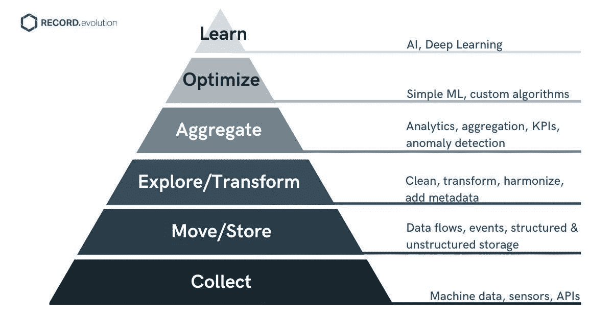

# 将 AIoT 引入一个平台:为什么这很重要？

> 原文：<https://medium.com/geekculture/bringing-aiot-to-a-platform-why-is-this-important-e8ebb847a833?source=collection_archive---------33----------------------->

*什么是 AIoT，或者说是物的人工智能？AIoT 是物联网(IoT)和人工智能(AI)的交叉点，是最近才出现的术语*。*它描述了物联网和人工智能系统的融合，其共同目标是生成有用的物联网数据，并基于这些数据的洞察力。物联网和人工智能一起在一个开发平台上，可能性是无限的。*

# 流行语之外的事实

物联网和人工智能结合的影响已经开始显现。[最近的一项全球研究](https://www.sas.com/content/dam/SAS/documents/marketing-whitepapers-ebooks/third-party-whitepapers/en/aiot-how-iot-leaders-are-breaking-away-110944.pdf)发现，大多数领导者认为 AIoT 将帮助他们变得更具竞争力。研究中的受访者不仅同意 AIoT 正在产生结果，而且还表示，如果没有 AI，他们将无法有效竞争。这项研究发现，92%的 AIoT 采用者表示，物联网和人工智能的结合超出了他们的预期。外卖？

> *结合 AI 和 IoT 的公司比只使用 IoT 的公司更有竞争力。*

# 为什么 AIoT 如此有益？

*   **边缘到云的连续性。**AIoT 方法为您提供了从边缘到云的无缝物联网流程和透明度。你从联网物联网设备和物联网数据收集开始。然后，您可以继续进行云中的高级分析。
*   **两全其美的方法。**借助 AIoT，您可以将计算转移到离数据源更近的地方。一方面，人工智能就在物联网的边缘。另一方面，您可以从云更广泛的分析能力中受益。
*   **掌控您的数据。**AIoT 方法有助于您在每个阶段完全控制理解数据的过程。

如下图所示，AIoT 允许您覆盖整个数据之旅，确保连续性和可见性:

**Image 1\.** *The hierarchy of data: How AIoT stretches from the edge to the cloud*

这一数据之旅的构建模块可以用它们与物联网架构中四个主要层的关系来描述。

*   **第一层。设备。**这是从边缘设备、传感器、机器和 API 收集物联网数据的起点。
*   **第二层。网关。**这是您执行初始聚合任务、聚合数据的地方，甚至可以进行一些基本的异常检测。在移动和存储阶段，您减少了大量的数据流，并将数据移动到价值链的更上游，以便存储起来供长期使用。
*   **第三层。数据管理。这是您清理、转换和协调数据的地方。**
*   **第四层。云/数据中心。**尽管您可以在边缘构建一些简单的 ML 模型和定制算法，但在这里，您可以将数据与其他来源的数据相结合，进行高级分析、人工智能和深度学习。

我在文章“[IIoT 架构:如何挖掘其全部潜力”中更详细地讨论了物联网架构层？](https://www.record-evolution.de/en/the-iiot-architecture-design-an-overview/)”:

# 为什么人工智能对物联网计划的成功如此重要？

传统方法不再适用于物联网部署，在这种部署中，会以前所未有的速度生成海量的物联网数据。拥有人工智能能力意味着能够通过从中学习并在此过程中尽可能自动化来充分利用这些数据。物联网系统越复杂，它需要的人工智能能力就越强。只有在与强大的人工智能相结合时，收集的物联网数据的真正价值才会显现出来。

如上图所示，人工智能存在于物联网系统的两个位置:中心和边缘。传统上，在中心的人工智能部署会产生预测分析或异常检测。到目前为止，人工智能部署主要是为了减少流向云的数据量。靠近设备节点的 AI 可以增强安全性，并有助于减少延迟和带宽。我在文章《[未来是分散的:物联网边缘计算是关键](https://www.record-evolution.de/en/the-future-is-decentralized-iot-edge-computing-as-key-to-high-speed-iot-development/)》中描述了这一点。但是今天，您可以在边缘执行额外的分析，甚至拥有简单的 ML 模型。

拥有人工智能能力意味着能够通过从中学习并在此过程中尽可能自动化来充分利用这些数据。

利用 AIoT 是推动公司长期价值的关键。这有助于他们超越孤立的实施和概念验证，不断提高自动化流程的采用率。在人工智能的帮助下获得的见解的民主化也发挥了作用，因为这些结果必须可供业务分析师、决策者和其他非专家使用。

根据上面提到的研究,发展了 AIoT 能力的公司在各种关键组织目标上表现出更强的结果。他们加快运营速度和引入新的数字服务的能力发生了变化。您还会看到员工生产率和成本降低等方面的优势。该研究指出，那些结合物联网和人工智能的人与那些只使用物联网的人之间存在两位数的百分比差异。

# 将 AIoT 带到一个平台

然而，当你更进一步，将人工智能 AIoT 带到一个平台时，会发生什么？这样的一个姿态揭示了巨大的潜力，因为它从根本上简化了对 AIoT 支持基础设施的访问，并使各种规模的公司，无论其资源如何，都有可能开发自己的 AIoT 解决方案。

将您的物联网计划引入物联网平台，可以缩小物联网边缘设备和业务应用之间的差距。物联网平台不仅充当连接这两个领域的中间件，而且[还向硬件和应用层](https://www2.deloitte.com/de/de/blog/internet-of-things-blog/2020/aiot-and-iot-platforms-for-asset-maintenance.html)添加功能。一旦您使用边缘数据处理能力和高级分析来增强物联网平台，您就可以使它们成为 AIoT 平台。

那么你从中获得了什么呢？

# 规模化运作

将物联网和人工智能的组合功能引入平台，使您可以立即启动物联网计划，充分利用您的运营基础设施，并受益于平台的内置安全性。理想情况下，您的基础架构由公共云或虚拟私有云组成，并向现场物联网边缘设备延伸。

# 更快的采用时间

在结合物联网和人工智能功能的平台上进行开发，可以让您的物联网计划取得快速进展。当所有构建模块都包含在一个产品中，并且从一开始就消除了沉重的技术挑战时，您可以真正专注于最重要的事情，即从您的物联网数据中获取价值。具有人工智能功能的物联网平台已经解决了物联网采用中一些更常见的挑战，并提前解决了一些众所周知的障碍。

# 跨多个行业的采用

跨行业采用是 AIoT 平台模式的另一个优势。通常情况下，您可以跨用例转移方法和工具，并将适用于一个行业的解决方案应用到另一个行业。这是写得很大的物联网协作。现在，公司甚至整个行业都将被鼓励交流想法和方法。最终，这将导致建立跨行业的最佳实践和推进创新。