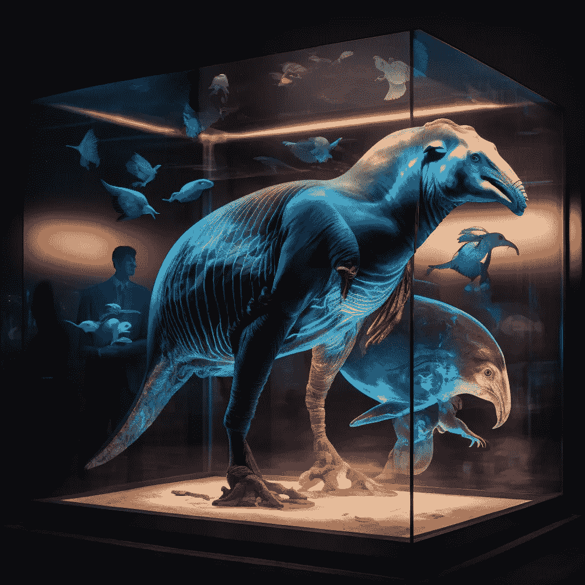

# 用人工智能让灭绝的物种复活

> 原文：<https://medium.com/geekculture/bringing-extinct-species-back-to-life-using-ai-92b28be746b9?source=collection_archive---------4----------------------->

## 人工智能从灭绝物种的描述中创造图像

Image by the author via Midjourney

人工智能可以做很多事情。它可以很好地勾勒出一个概念，它可以很好地概括文本，它还可以将文字转化为图像。