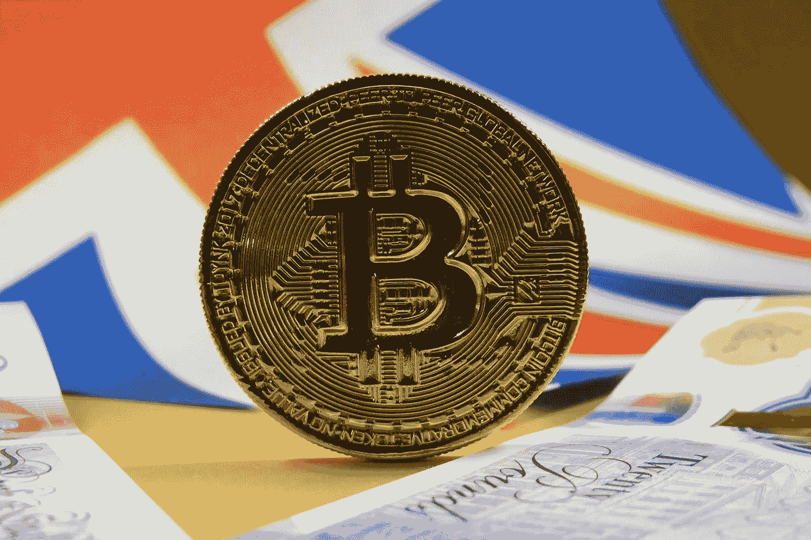

# Britcoin:各国会转而使用密码吗？

> 原文：<https://medium.com/geekculture/britcoin-will-countries-convert-to-crypto-dd02ef566afe?source=collection_archive---------19----------------------->

(Credit: Ewan Kennedy Via Unsplash.com)

英国财政大臣里什·苏纳克(Rishi Sunak)今天一直是头条新闻，因为据了解，他正在推动英国货币体系的重大变革，推出一种数字版本的英镑，称为“英国硬币”(Britcoin)，这是一种官方的政府加密货币，也称为中央银行数字货币(CBDC)。今年 4 月，Sunak 成立了一个特别工作组，研究如何推动(事实上，是复兴)这一…