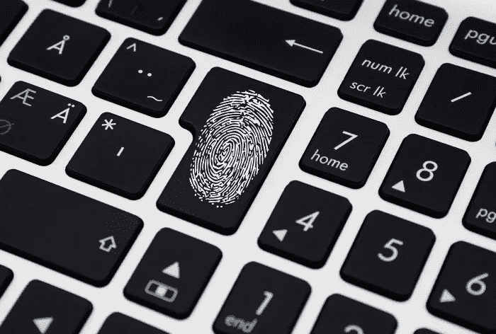

# 浏览器指纹识别

> 原文：<https://medium.com/geekculture/browser-fingerprinting-fac1afd3819f?source=collection_archive---------10----------------------->

## 你躲不了。你的浏览器会留下独一无二的指纹。

Image by [Kris](https://pixabay.com/users/thedigitalway-3008341/?utm_source=link-attribution&amp;utm_medium=referral&amp;utm_campaign=image&amp;utm_content=1590455) from [Pixabay](https://pixabay.com//?utm_source=link-attribution&amp;utm_medium=referral&amp;utm_campaign=image&amp;utm_content=1590455).

# 介绍

让我从一些有趣的事实和数字开始。

*   互联网上有超过 500 个 cookies 的页面
*   像 Canvas API 这样的 JavaScript APIs 可以与 web 服务器共享您的硬件和操作系统细节