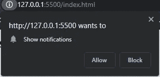
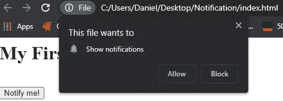
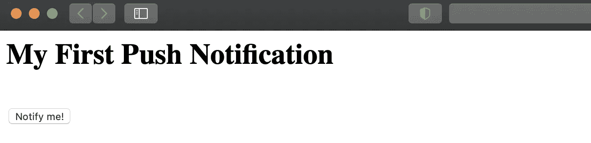
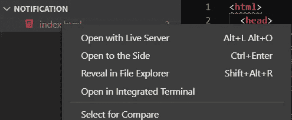
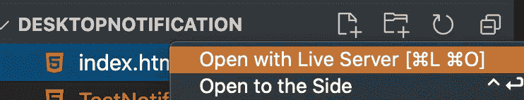
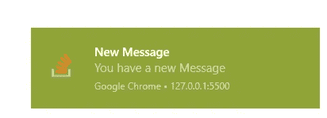
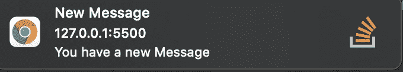

# 浏览器推送通知

> 原文：<https://medium.com/geekculture/browser-push-notification-426695a14701?source=collection_archive---------22----------------------->

你有没有想过脸书或 Gmail 是如何让他们的网站向你的电脑推送通知的？当您开发一个不断汇集数据并需要通知用户网站上有新内容的 web 应用程序时，这是一个很好的特性。我们将使用本指南创建这种推送通知。

Photo by [Markus Spiske](https://unsplash.com/@markusspiske?utm_source=medium&utm_medium=referral) on [Unsplash](https://unsplash.com?utm_source=medium&utm_medium=referral)

# 先决条件

*   Visual Studio 代码
*   Visual Studio 代码扩展— [Live Server](https://marketplace.visualstudio.com/items?itemName=ritwickdey.LiveServer)

# 在开始之前

推送通知只有一个问题，它不支持 IE。所有其他主要浏览器，如 Chrome、Firefox、Edge、Opera 和 Safari 都兼容，应该可以正常工作。并不是所有的功能都可以在移动浏览器上使用，所以我认为这只对桌面推送通知有用。

要理解通知 API 如何工作，请阅读[通知 API](https://developer.mozilla.org/en-US/docs/Web/API/notification) 文档。

在指南的后面，我将解释为什么需要 Visual Studio 代码扩展 Live 服务器。

有了这个方法。

# 让我们开始编码吧

## HTML

这将是一个简单明了的 HTML，因为本指南的重点只是推送通知。

上面的 HTML 不需要解释。

## JavaScript

我们将把下面的 JavaScript 添加到 HTML 的 head 部分

上面的脚本有两个部分。第一部分是检查您的用户是否为您的站点启用了通知。是的，在推送通知之前，您的用户必须首先允许它。一旦他们允许，就会推送通知。

基本上是告诉你的浏览器在所有的 DOM 都被加载时监听事件。这有点类似于 Jquery 的`$(document).ready(function(){.....`，更多细节请访问这个[链接](https://api.jquery.com/ready/)。权限检查有 3 种可能的结果，它们是

*   `denied` —用户拒绝显示通知
*   `granted` —用户接受显示通知。
*   `default` —用户的选择是未知的，因此浏览器会将该值视为被拒绝。

以上摘自 [Mozilla 开发者指南关于通知 API](https://developer.mozilla.org/en-US/docs/Web/API/notification)

在上述情况下，当许可不是`granted`时，API 将请求许可，因此调用函数`Notification.requestPermission()`，这将触发许可警报。

下面是一个来自 Chrome 浏览器的通知示例。

Chrome Permission

脚本的第二部分是通知本身。正如我前面提到的，IE 不支持推送通知，因此我们需要让我们的用户知道。这就是上面第 6 行到第 11 行试图做的事情。当`Notification` API 不可用时，我们简单地提醒用户。在真正实施时，Alert 可能不是最好的方式，这只是出于教育目的的一个示例。

第 13 行是为了防止由于任何原因事件侦听器没有被触发，当我们尝试推送通知时，将确保并检查通知是否被允许。

当通知被允许时，我们可以配置通知本身，即第 15 行到第 18 行。创建和推送通知的语法和`new Notification(title, options)`一样简单。在这里，我们给我们的通知标题“新消息”。有几个选项可用，您可以参考此[链接](https://developer.mozilla.org/en-US/docs/Web/API/Notification/Notification)了解每个选项的详细信息。在本例中，我们只是为通知提供了一个图标和一条正文消息。

通知 API 支持 4 个事件处理程序`onclick`、`onclose`、`onerror`和`onshow`。在第 20 行的例子中，我们想在用户点击通知时触发一些功能，API 将关注浏览器和触发通知的标签，然后关闭通知。

在每个通知事件期间，您可以决定用许多创造性的方法来处理您的网站，例如，您可以触发页面在用户单击它或导航到另一个页面时重新加载。您将可以访问`window`对象来执行各种操作。

## 身体

对于这个例子，我们将添加一个按钮来触发通知。给车身加上`<button onclick="notifyMe()">Notify me!</button>`。点击按钮时，将执行功能`notifyMe()`。

## 最终的 HTML

最终的 HTML 将如下所示

## 是时候测试一下了

确保您已经保存了 HTML 文件，让我们来查看我们创建的 HTML 文件。

在 Windows 机器或 Mac Chrome 上，当你点击允许并点击“通知我”时，你会看到如下的权限提示按钮。它会一次又一次地提示同一个框。这里出了什么问题？

Windows Chrome

在 Mac 机 Safari 上，什么都不会发生。权限框不会显示，当您单击该按钮时，没有任何反应。这里出了什么问题？

Mac Safari

你想通了吗？答案是，推送通知对文件不起作用。它必须是托管的，或者至少是一个站点或本地主机。这就是 visual studio Live 服务器扩展派上用场的地方。当然，有很多方法可以在本地托管你的文件，比如 xampp 或者 Inetpub。为了简单起见，我们将只使用[直播服务器](https://marketplace.visualstudio.com/items?itemName=ritwickdey.LiveServer)扩展。

让我们首先创建一个文件夹，并将我们的 HTML 文件移动到该文件夹中。启动 Visual Studio 代码并打开包含 HTML 文件的文件夹。加载后，在“资源管理器”窗口中右键单击该文件，然后选择“用实时服务器打开”。您的默认浏览器应该打开本地主机和一个端口，并且您的站点是可用的。

Open with Live Server Windows

Open with Live Server Mac

这一次，您可以单击权限框中的允许，然后点击“通知我”按钮。恭喜你！，你的第一条推送通知。通知示例如下

Window Notification

Mac Notification

通知出现后，在它消失前，最小化或聚焦于另一个应用程序，然后单击通知。您的浏览器将变为活动状态，并且该选项卡将成为焦点

下一步是当你的网站需要推送通知的时候，发挥创意，实现推送通知。祝你好运！