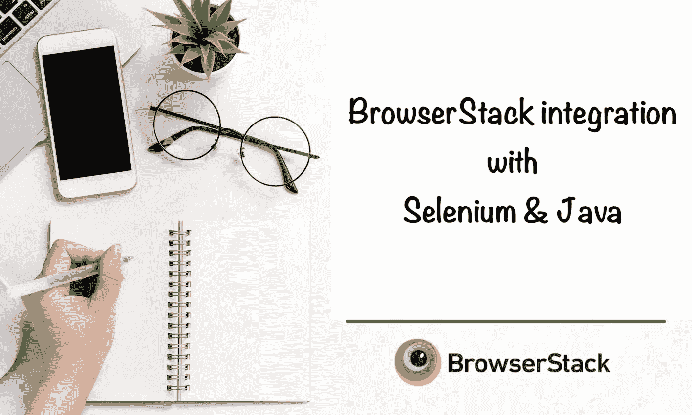

# BrowserStack 与 Selenium 和 Java 集成

> 原文：<https://medium.com/geekculture/browserstack-integration-with-selenium-java-3514abbd72d3?source=collection_archive---------7----------------------->

使用 BrowserStack 自动进行跨浏览器测试！

# 什么是跨浏览器测试？

你在开发网络应用吗？那么你**必须**注意跨浏览器测试！！！这肯定是您在测试周期中涵盖的范围！为什么？

*   你不能限制你的最终用户坚持使用一种浏览器。他们会你…