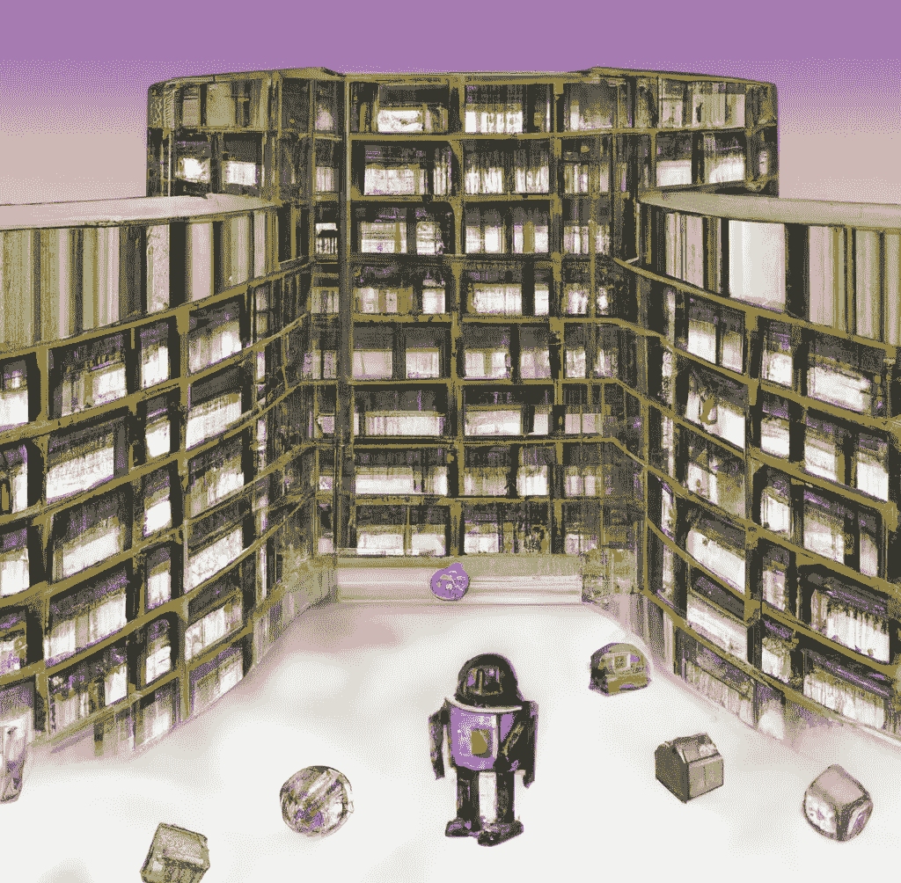

# 用 ChatGPT 浏览博尔赫斯巴别塔图书馆中的可读书籍

> 原文：<https://medium.com/geekculture/browsing-readable-books-in-borges-library-of-babel-with-chatgpt-1ac1344e77f?source=collection_archive---------5----------------------->

## 一篇将虚构与真实技术相结合的文章，讲述了如何在无限图书馆中模拟对具有可读内容的书籍的访问

Image edited by the author from his own generations with Dall-E-2

**索引
*-*** [***简介***](#5d0c) ***-***[***访问所有书籍***](#0e23) ***-***[***浏览带有可读文字的书籍***](#4052)