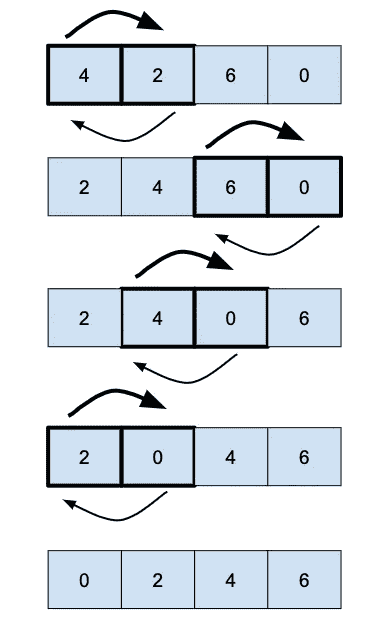

# 冒泡排序

> 原文：<https://medium.com/geekculture/bubble-sort-e9d14e2ab994?source=collection_archive---------19----------------------->

## 冒泡排序是最简单的排序算法之一，但不是最有效的。

冒泡排序通过**交换两个相邻的元素(冒泡)**来工作，如果它们没有被排序，重复直到排序。

一个**的基本实现**会是: