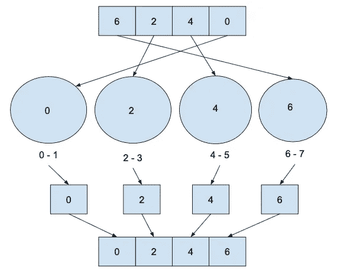

# 桶排序

> 原文：<https://medium.com/geekculture/bucket-sort-2053ab6707?source=collection_archive---------13----------------------->

## 存储桶排序的工作原理是根据范围将元素分布在不同的存储桶中，然后对每个存储桶单独排序并合并它们。

**桶的数量会显著影响时间复杂度。**可以使用任何排序方法对存储桶进行排序。