# 预算-在最好的地方花很少的钱度假

> 原文：<https://medium.com/geekculture/budget-holidays-for-little-money-in-the-best-areas-688ab65c91dc?source=collection_archive---------80----------------------->

## 该分析涉及美国华盛顿州西雅图市的 Airbnb 数据集

Photo by [Leon LEE](https://unsplash.com/@polipond?utm_source=medium&utm_medium=referral) on [Unsplash](https://unsplash.com?utm_source=medium&utm_medium=referral)

# **简介**

即使有许多在线平台争夺最好的服务和价格，也很难找到想要的物有所值的住宿。

本文的目的是通过对美国的案例研究，特别是西雅图最省钱的地方(Airbnb)T3 的案例研究，辨别并清楚地区分**的价格列表分析。**

由于经济增长、全球化以及激发人们旅行/学习新文化和拓宽视野的好奇心，在过去几年里，出国旅行和在自己国家旅行的人数急剧增加。

这篇文章将探讨花很少的钱住在最好的地方的可能性，因此称为预算假期。

问题是:你是否也花了很多时间犹豫不决，是选择在酒店度假出租物有所值，还是应该选择度假屋？花几个小时在网上寻找各种各样的住宿，比较价格，并问自己，我应该为所有旅游活动附近的特别好的地区支付更多费用，还是应该选择远离市中心的更便宜的地方？

因此，为了探索*潜在的经济*成本和收益，我使用 Airbnb 的数据深入了解了美国华盛顿州西雅图的价格和住宿情况。

> "什么因素高度影响西雅图度假屋的价格？"

1.**房产类型如何影响价格？**

2.**邻居如何影响价格？**

3.**房产价格可以预测到什么程度？**

# **第一部分:房产类型如何影响价格？**

为了更仔细地了解每种租赁类型的不同价格，有必要调查西雅图的价格分布。

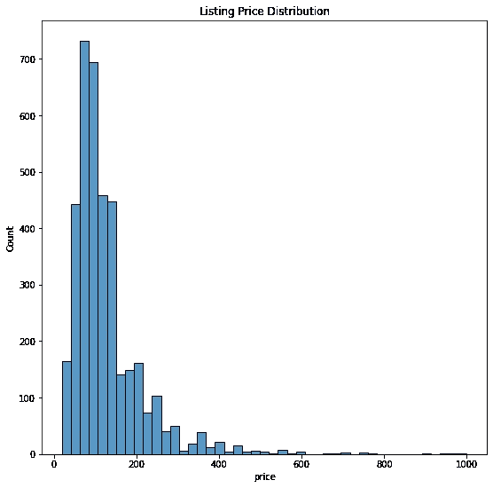

该图显示价格呈正态分布，很少有异常值。从下表中我们可以看到，总价格范围从最低 20 美元到最高 1000 美元不等。尽管平均值是 128 美元，标准偏差是 90 美元。

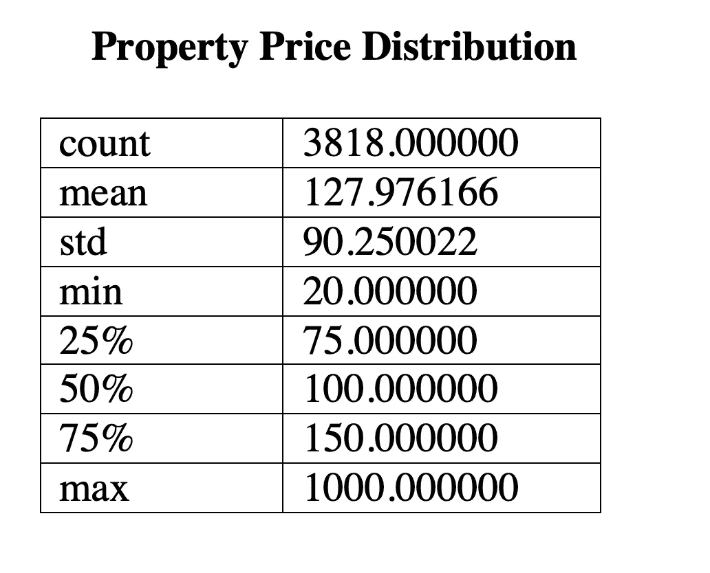

这一分析表明，确实有不同的价格组成，人们可以找到每一个不变的东西。但是，我们看不到您支付的住宿费用是多少？大概是帐篷吧？虽然你真的想省钱，但你不想不惜任何代价。

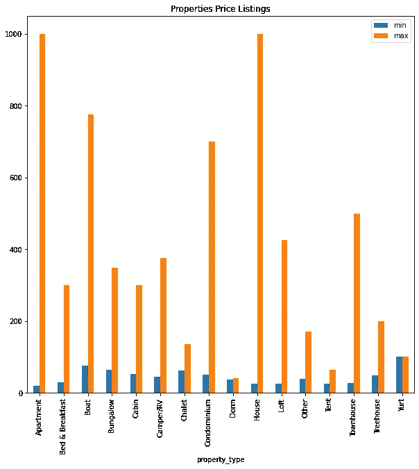

回到上图，我们可以看到几乎所有的房产都有一个很大的价格范围，从很低到相当高。然而，公寓和房屋的最低和最高价格相差最大。一个可能的解释是，公寓和房屋也是最受欢迎的租赁类型，就像其他类型的财产一样。

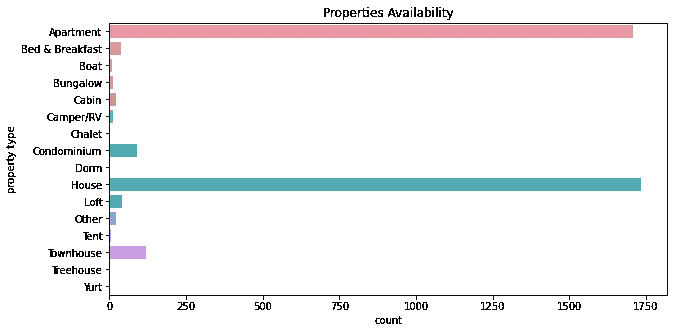

由于离群值，很难评估西雅图不同类型租金的共同价格。因此，查看(模式:每种住宿方式下出现频率更高的价格)下的表格，你会发现价格总体上保持“适中”，尤其是对于公寓和住宅等昂贵的物业类型。

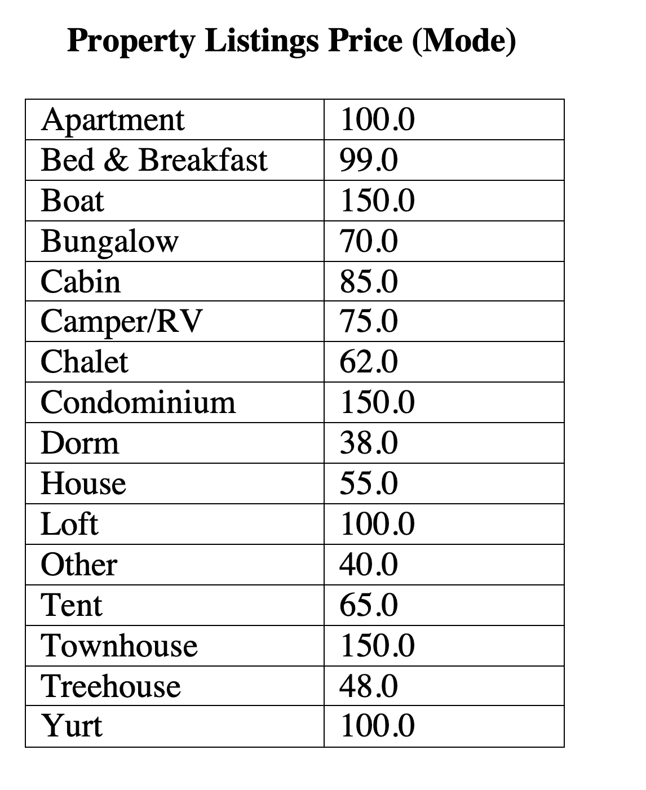

# 第二部分:邻居如何影响价格？

如果你看下图(*“附近的挂牌价格”*)评估不同地区的价格分布，可以清楚地看到，大多数地区的价格范围是巨大的。特别值得注意的是，波蒂奇湾、木兰东南部、西湖等地区受这一巨大差异的影响最大。

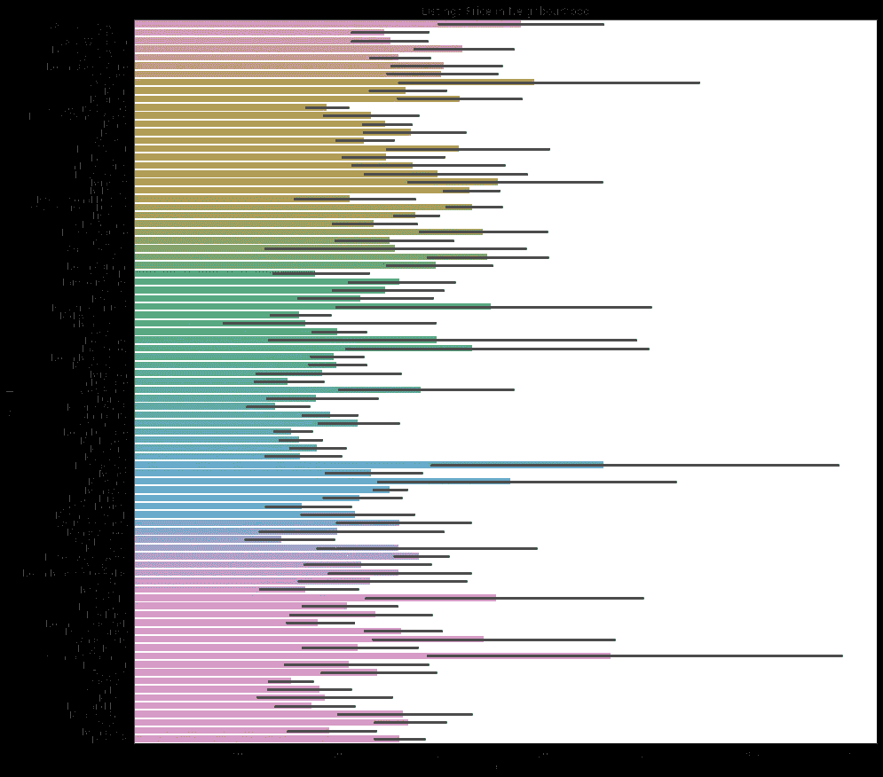

为了简单起见，在分析的下一阶段，本文将集中于十大最昂贵的地区(使用平均值进行选择)以及两种租赁类型，如公寓和房屋，因为它们是最受欢迎的租赁类型。

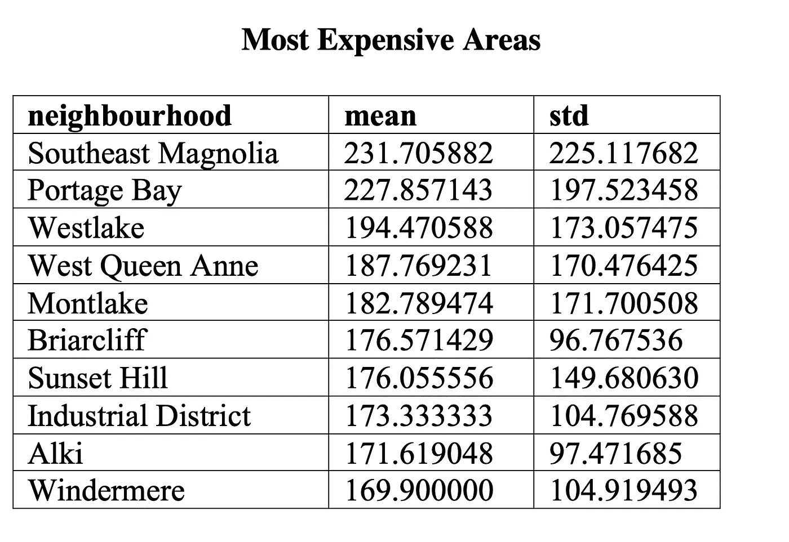

这两个图表显示了十大昂贵地区的房屋和公寓的最低和最高价格。比较这两个值，很明显，房屋的最低价格远远高于公寓的最低价格。非常有趣的是，如果你看看房子和公寓之间的最高价格，你会发现在大多数街区，房子仍然比公寓贵。

在最高价格数字下面，突出显示了公寓优于房屋的情况，例如 Windermere 或 Briarcliff。

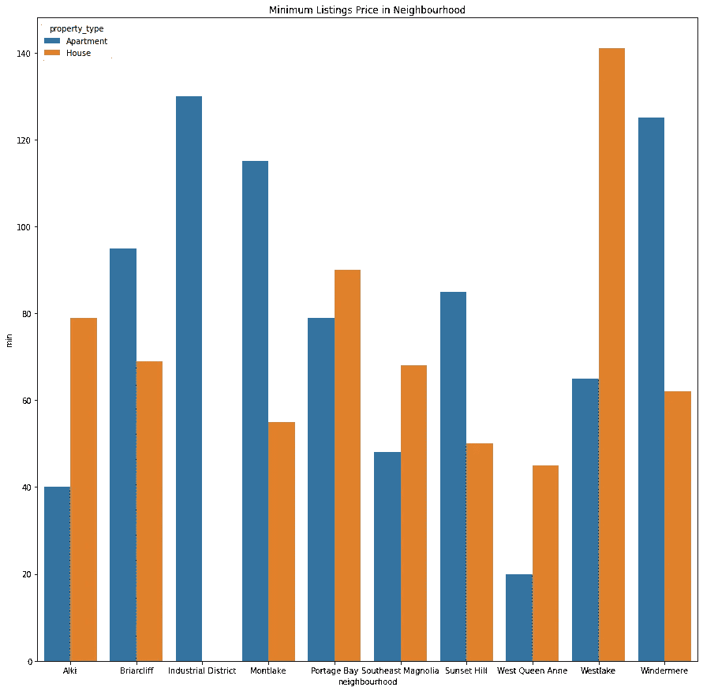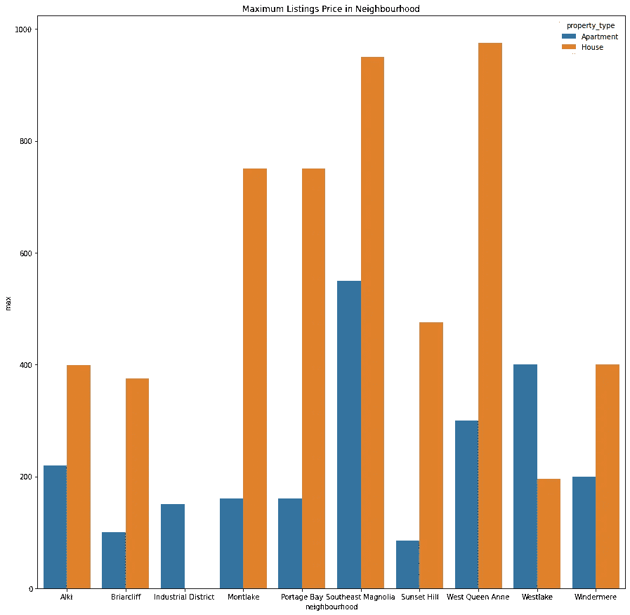

对精打细算的度假者来说，答案是肯定的。比如，如果你选择住在同一地区的公寓里，而不是房子里，就有可能以比你想象的更少的钱住在最好的地方。

# **第三部分:我们能多好地预测前提的价格？**

影响前提价格的因素有很多。然而，可能最重要的问题是我们如何使用这些信息？业务能从中获得哪些优势。作为主持人，你几乎对这个话题感兴趣:我的价格合适吗？我是低于还是高于同等房产的普通价格？

预测是自动考虑不同因素来估计正确价格的方法之一。出于这个原因，我将使用线性回归建立一个模型，以找到价格和其他可能影响价格的因素之间的依赖关系。

在我们开始建立模型之前，有必要定义我们将用于训练的特征。使用所有这些都是一种选择，但仍然不能保证你会得到最好的模型。为什么？因为它增加了尺寸和训练时间。

因此，我们从探索数据集中的数值变量开始。在这种情况下，最佳做法是查看热图。

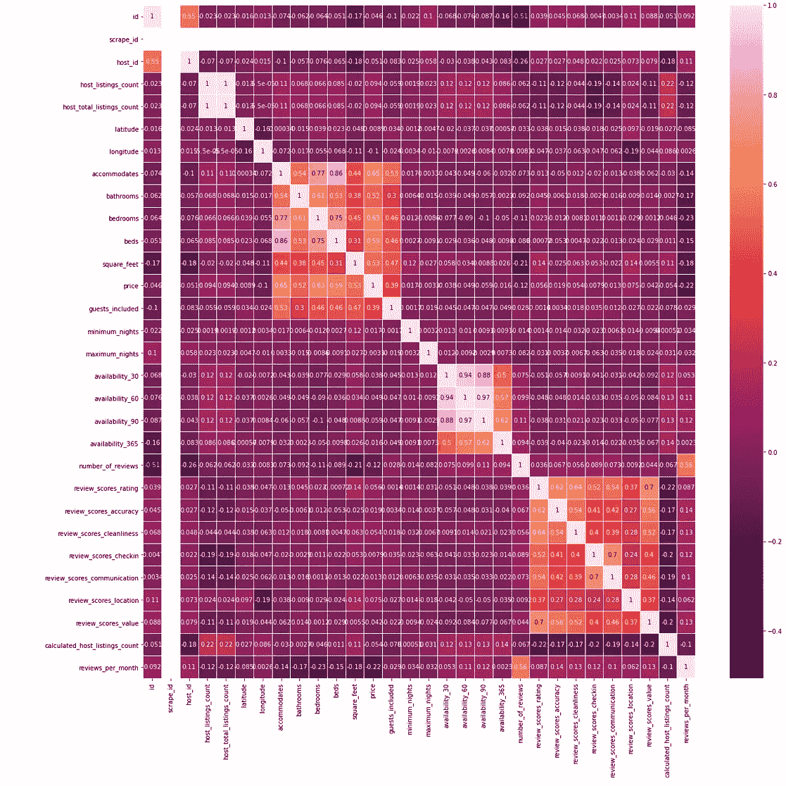

由于这个项目的重点是价格，我们将研究价格和数据集中其他要素之间的关系。矩阵显示价格与住宿、浴室、卧室、床和平方英尺高度相关。是的，这似乎是自然的，你必须为更多的额外服务支付更多的钱。

然而，审查对价格发展有负面影响。解决这一挑战的方法将是应用情感分析，从而计算出评论是正面还是负面。这个项目的范围不包括这一部分。

此外，特征选择基于热图矩阵以及上述分析。不幸的是，75 %的属性不包括关于方形饲料的信息。因此，在这种情况下，不建议在培训中使用或选择该功能。

为了正确地构建和分析模型，有必要将数据集分成训练和测试数据(70%和 30 %)。对于性能评估，我将使用 R 平方和 MSE 指标。r 平方衡量线性回归的拟合优度，它介于 0 和 1 之间(1 表示良好关系，否则为 0)。此外，我将使用 MSE(均方误差)来调查模型的方差和偏差。

转到模型，比较下面的两个数据集，我们可以看到测试集比训练集略胜一筹，相应地比较了 R 的平方 0.57 和 0.56。总的来说，训练集显示，它与解释差异的测试集相比有更多的差异(训练包含 1000 美元的租赁价格)。

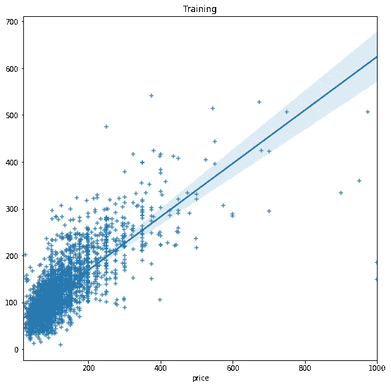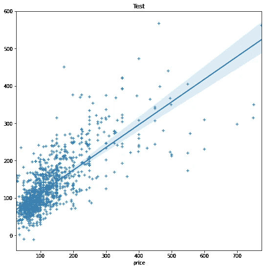

然而，在 MSE 的情况下，测试数据(3636)比训练数据(3425)更高，这表明模型过拟合训练数据。

总之，未来的研究有必要尝试其他类型的回归，例如随机样本一致性、数据争论和特征选择。

# **结论**

在这篇文章中，我们仔细研究了西雅图不同租赁类型和邻近地区的不同价格构成。

**1。**我们研究了不同的房价，结果是**对于所有租赁类型，都有针对所有预算的优惠。**

**2。**此外，我们调查了价格、租赁类型和邻近地区的组合，清楚地发现**房屋的价格几乎高于公寓**。然而，即使在这些地区，也有可能在西雅图最好的地区**享受**居家度假的“物有所值”的租赁服务。

**3。**最后，我们开发了线性回归模型来做出最佳价格预测。简而言之:线性回归模型的结果表明**尽管该模型对较低的价格很有效，但它很难预测较高的价格。**考虑到这一点，应进行其他进一步的实验和调查，以改进模型。

上述发现和其他因素，如物业的大小，以及设施不包括在这项研究中。因此，有必要对度假屋业主的*潜在经济*成本和*收益*进行进一步分析，不仅以度假屋出租吸引游客，还向他们提供**出租物有所值。**

**由于上述分析没有涵盖假期的所有部分，因此还有更多问题需要回答，例如:**

> **为什么有些房产贵得离谱？**

**要查看更多关于分析的信息，请随意使用我的 Github [链接进行调查。](https://github.com/LN5user/airbnb-seattle)**