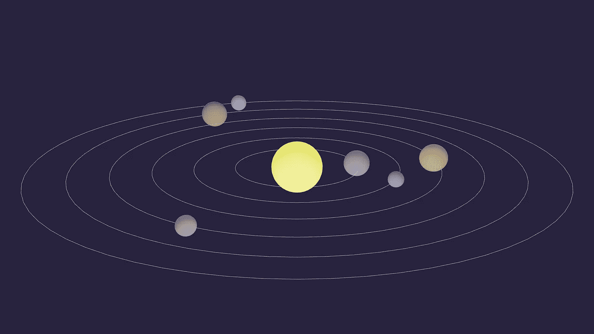
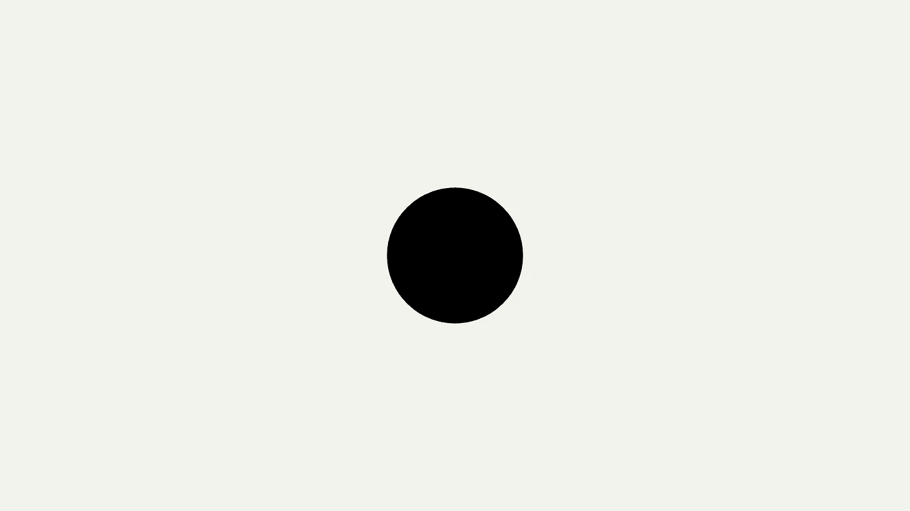
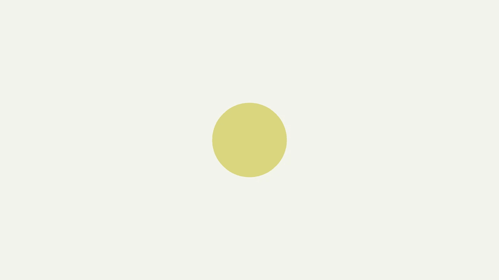
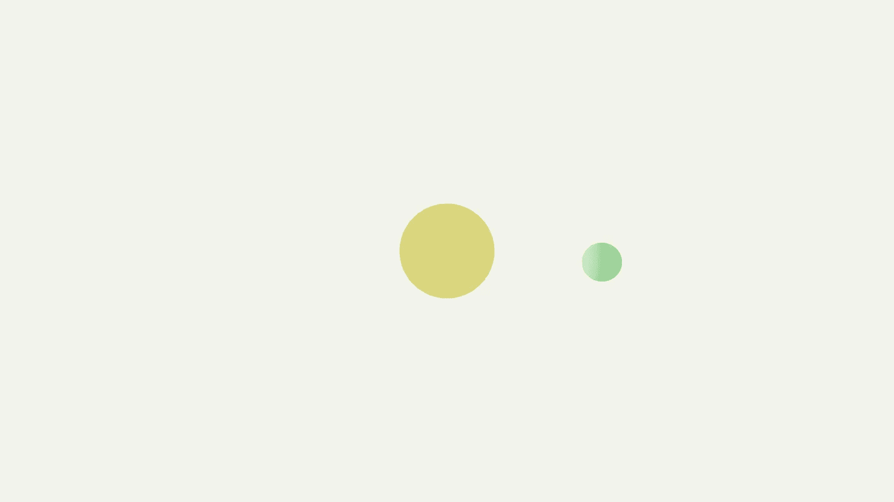
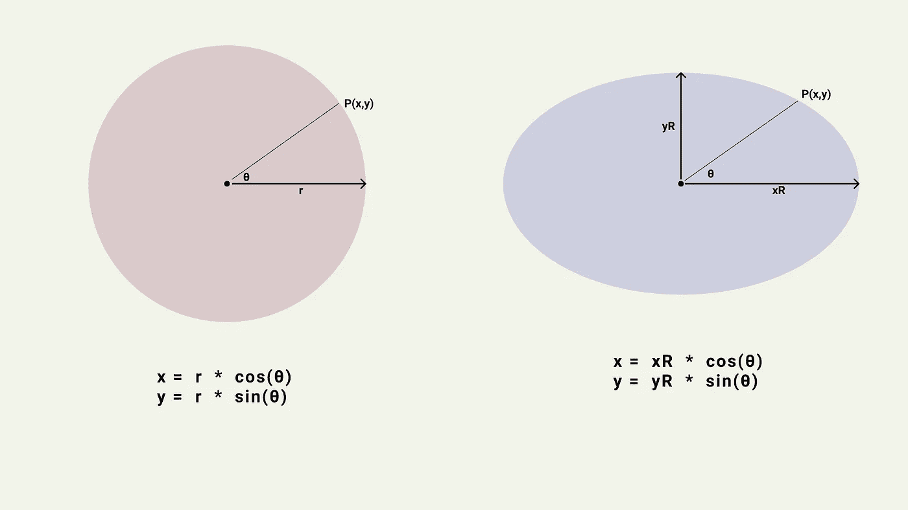
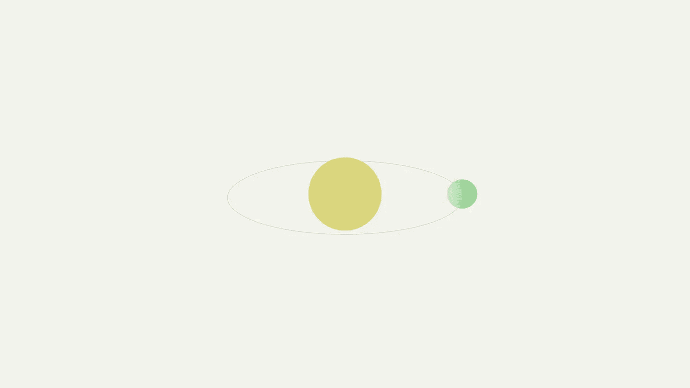

# 使用 React 构建 3D 应用程序|动画太阳系|第 1 部分

> 原文：<https://medium.com/geekculture/build-3d-apps-with-react-animated-solar-system-part-1-c4c394a8574c?source=collection_archive---------11----------------------->



大家好，在这篇文章中，我将带你了解如何使用 [**React 三纤维**](https://github.com/pmndrs/react-three-fiber) 创建一个基本的 3D 应用程序。React Three Fiber(又名 **r3f** )是由 [**Paul Henschel**](https://twitter.com/0xca0a) 创建的 **Three.js** 的 React 渲染器。虽然你可以在 React 中直接使用 three.js，但是 React Three Fiber 使创建 3D 应用程序更加容易，而不需要太多代码。

在这篇博客中，我们将使用 three.js 中的许多核心概念。即使你不熟悉这些概念，你仍然可以理解。如果你想学习 three.js 的基础知识，去[**threejsfundamentals.org**](https://threejsfundamentals.org/)那里你会找到一些不错的教程。

# 初始设置

让我们从安装依赖项开始。

```
npm i three [@react](http://twitter.com/react)-three/fiber [@react](http://twitter.com/react)-three/drei
```

**React 三纤程**依赖于 **three.js** 和[@ React](http://twitter.com/react)——Three/drei 有一些额外的功能，我们可以使用 **React 三纤程。**

在 **App.js** 文件中，我们将从 **React 三纤**库中导入 **Canvas** 组件。就像用来画画的真正的画布一样，这里的画布组件将是**父组件**，我们将在其中放置所有的 3D 对象。

```
import React from 'react';
import { Canvas } from '[@react](http://twitter.com/react)-three/fiber';export default function App() {
  return <Canvas></Canvas>;
}
```

# **添加对象**

现在我们可以添加一些三维物体到场景中。在 react three fiber 中将 3D 对象添加到场景中相当容易。就像在 **three.js** 中一样，要创建一个 3D 对象，我们需要用特定的**几何体**和**材质**创建一个**网格**。所有可用于 three.js 的几何体和材质也可用于 react three fiber。

你可以在这里 找到可用的 three.js **几何体列表** [**和可用的**材质列表****](https://threejs.org/docs/?q=material) **[**这里**](https://threejs.org/docs/?q=geometry) **。****

现在，你如何从 **three.js** docs 中取出一个几何图形或材料，并将其转换成 **react 三纤维**组件？

**简单！**按照这些步骤就可以了。

1.  将 three.js 材料/几何体名称转换为**骆驼箱**，这将是您的**组件名称**。
2.  对于几何图形，使用**几何图形**组件上的**参数属性**将通常传递给构造函数的所有参数作为数组传递。对于**材质，**将每个构造函数参数作为**属性**传递。

要使用这种材料和几何图形创建一个网格，你只需要用一个**网格**组件包裹这两个组件。

让我们以 three.js 文档 中的 [**立方体为例。**](https://threejs.org/docs/#api/en/geometries/BoxGeometry)

```
const geometry = new THREE.BoxGeometry( 1, 1, 1 );
const material = new THREE.MeshBasicMaterial( {color: 0x00ff00} );
const cube = new THREE.Mesh( geometry, material );
scene.add( cube );
```

而这里同样的例子转换成**反应三纤维**。

```
<mesh>
  <sphereGeometry args={[1, 1, 1]} />
  <meshStandardMaterial color={0x00ff00} />
</mesh>
```

现在回到我们的太阳系例子。让我们在场景的中心创建我们的太阳。

```
export default function App() {
  return (
    <Canvas>
      <mesh>
        <sphereGeometry args={[1, 32, 32]} />
        <meshStandardMaterial color="#E1DC59" />
      </mesh>
    </Canvas>
  );
}
```



# ***要有光***

嗯。球体在那里。但是为什么是黑色而不是黄色呢？这是因为 **meshStandardMaterial** 受到**灯光**的影响。因为我们没有任何灯光，所以它没有任何灯光可以反射。所以让我们添加一些灯光。

```
export default function App() {
  return (
    <Canvas>
      <ambientLight />
      <pointLight position={[0, 0, 0]} />
      <mesh>
        <sphereGeometry args={[1, 32, 32]} />
        <meshStandardMaterial color="#E1DC59" />
      </mesh>
    </Canvas>
  );
}
```

**环境光**均匀地照亮场景中的所有物体，而**点光源**是位于一个点上并从该点向所有方向发射光线的光源。听起来像是太阳会做的事！



我们现在有**灯**了！。接下来，我们可以添加我们的第一个行星，并把它放在稍微偏右的位置。要移动网格，我们可以使用网格组件上的**位置支柱**。我们可以将 **x，y，z** 位置值作为**数组**传递给这个道具。同样，如果我们想要旋转或缩放网格，我们可以更改网格上的**缩放**和**旋转**道具。

```
export default function App() {
  return (
    <Canvas>
      <ambientLight />
      <pointLight position={[0, 0, 0]} />
      <mesh>
        <sphereGeometry args={[1, 32, 32]} />
        <meshStandardMaterial color="#E1DC59" />
      </mesh>
      <mesh position={[4, 0, 0]}>
        <sphereGeometry args={[0.5, 32, 32]} />
        <meshStandardMaterial color="#78D481" />
      </mesh>
    </Canvas>
  );
}
```

# **添加控件**

如果我们有能力用鼠标移动场景四处查看，那该多好。进入**轨道控制**。在 **three.js** 中几乎没有不同的控件。我们将在太阳系的例子中使用轨道控制。**控制**是**不包括**在内核**反应三纤**封装中。所以我们要从[**@ react-three/drei**](https://github.com/pmndrs/drei)导入。

```
...
import { OrbitControls } from '[@react](http://twitter.com/react)-three/drei';export default function App() {
  return (
    <Canvas>
      ...
      <OrbitControls />
    </Canvas>
  );
}
```

让我们也调整我们的相机一点点，这样我们就可以在应用程序加载时更好地看到我们的场景。要调整相机，您可以使用画布上的相机道具。

```
export default function App() {
  return (
    <Canvas camera={{ position: [0, 20, 25], fov: 45 }}>
     ...
    </Canvas>
  );
}
```

# 一小段代码重构…

我们可以创建单独的太阳、行星和光组件，这样我们的代码看起来更有结构，这也有助于我们以后单独控制每个组件。

```
export default function App() {
  return (
    <Canvas camera={{ position: [0, 20, 25], fov: 45 }}>
      <Sun />
      <Planet />
      <Lights />
      <OrbitControls />
    </Canvas>
  );
}function Sun() {
  return (
    <mesh>
      <sphereGeometry args={[2.5, 32, 32]} />
      <meshStandardMaterial color="#E1DC59" />
    </mesh>
  );
}function Planet() {
  return (
    <mesh position={[8, 0, 0]}>
      <sphereGeometry args={[1, 32, 32]} />
      <meshStandardMaterial color="#78D481" />
    </mesh>
  );
}function Lights() {
  return (
    <>
      <ambientLight />
      <pointLight position={[0, 0, 0]} />
    </>
  );
}
```



# **黄道**

为了创建一个黄道，我们可以使用来自 **three.js** 的 **LineBasicMaterial** 。为了创建几何图形，我们需要计算椭圆上的一些**点。有多种方法可以得到椭圆上的点。最简单的方法是在一个圆上得到点，然后**不同地缩放**每个轴。**



```
const points = [];
for (let index = 0; index < 64; index++) {
  const angle = (index / 64) * 2 * Math.PI;
  const x = xRadius * Math.cos(angle);
  const z = zRadius * Math.sin(angle);
  points.push(new THREE.Vector3(x, 0, z));
}points.push(points[0]);
```

我们再次将初始点作为数组的最后一个索引，这样我们就得到了一条闭合的曲线。由于我们的太阳系垂直于 y 轴，我们正在计算 x 轴和 z 轴的椭圆值。为了创建线，我们可以使用来自**的**线组件**反应三根纤维**。

```
function Ecliptic({ xRadius = 1, zRadius = 1 }) {
  const points = [];
  for (let index = 0; index < 64; index++) {
    const angle = (index / 64) * 2 * Math.PI;
    const x = xRadius * Math.cos(angle);
    const z = zRadius * Math.sin(angle);
    points.push(new THREE.Vector3(x, 0, z));
  }points.push(points[0]);const lineGeometry = new THREE.BufferGeometry().setFromPoints(points);
  return (
    <line geometry={lineGeometry}>
      <lineBasicMaterial attach="material" color="#BFBBDA" linewidth={10} />
    </line>
  );
}
```

注意我们是如何将几何图形作为**道具**而不是**子**组件传递的？。当您需要更多的可定制性时，您总是可以将几何体或材质作为**道具**传递给网格。

我们将把黄道添加到**行星组件**中，这样当我们生成多个行星时。每个星球都有自己的黄道。

```
function Planet() {
  return (
    <>
      <mesh position={[8, 0, 0]}>
        <sphereGeometry args={[1, 32, 32]} />
        <meshStandardMaterial color="#78D481" />
      </mesh>
      <Ecliptic xRadius={8} zRadius={4} />
    </>
  );
}
```



# **生成随机行星**

现在我们可以使用我们的行星组件来创建多个行星，让我们创建一些随机的**行星。我们将把每个行星的**颜色**、**大小**和**椭圆半径**值存储在一个数组中，这样我们就可以遍历它来生成行星。**

首先，我们需要几个产生随机值的效用函数。

```
const random = (a, b) => a + Math.random() * b;
const randomInt = (a, b) => Math.floor(random(a, b));const randomColor = () =>
  `rgb(${randomInt(80, 50)}, ${randomInt(80, 50)}, ${randomInt(80, 50)})`;
```

我们可以使用这些函数来创建一组随机的行星配置。如果你想知道随机的颜色范围，我选择了 80-120，这样我们可以得到不太亮也不太暗的颜色。让我们创建行星集。

```
const planetData = [];
const totalPlanets = 6;for (let index = 0; index < totalPlanets; index++) {
  planetData.push({
    id: i,
    color: randomColor(),
    xRadius: (i + 1.5) * 4,
    zRadius: (i + 1.5) * 2,
    size: random(0.5, 1),
  });
}
```

你如何选择随机数发生器中使用的所有数字？试错真的！你可以尝试不同的号码，直到你得到一个你真正喜欢的样子。

让我们改变**行星**组件，这样它就可以从道具中获得所有这些细节。

```
function Planet({ planet: { color, xRadius, zRadius, size } }) {
  return (
    <>
      <mesh position={[xRadius, 0, 0]}>
        <sphereGeometry args={[size, 32, 32]} />
        <meshStandardMaterial color={color} />
      </mesh>
      <Ecliptic xRadius={xRadius} zRadius={zRadius} />
    </>
  );
}
```

现在我们可以循环遍历行星列表来创建多个行星。

```
export default function App() {
  return (
    <Canvas camera={{ position: [0, 20, 25], fov: 45 }}>
      <Sun />
      {planetData.map((planet) => (
        <Planet planet={planet} key={planet.id} />
      ))}
      <Lights />
      <OrbitControls />
    </Canvas>
  );
}
```

现在，如果你跟着做，你会得到这样的东西。


# **还会有更多的**

由于这篇文章太长了，我将在这里停下来，还有一些我打算包括动画在内的东西。如果到目前为止你喜欢这篇文章，不要忘记看看我将在几天后发表的下一篇文章！

如果你被代码困住了。这里有一个[**code sandbox**](https://codesandbox.io/s/animated-solarsystem-with-react-three-fiber-9y0dm)**的例子，可以作为参考。**