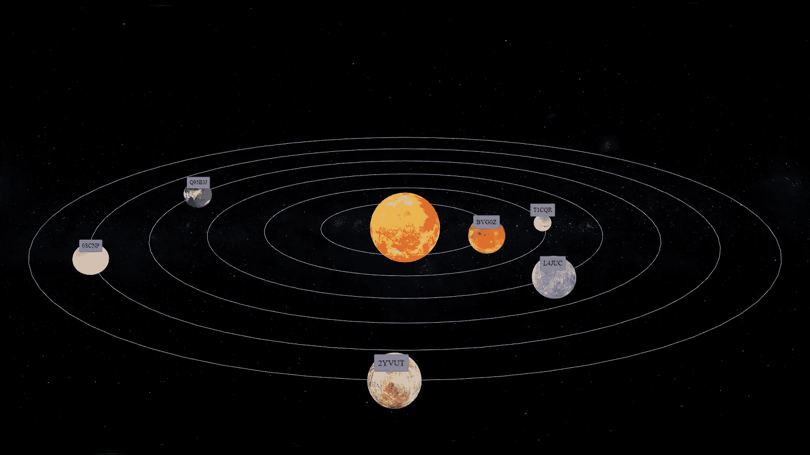
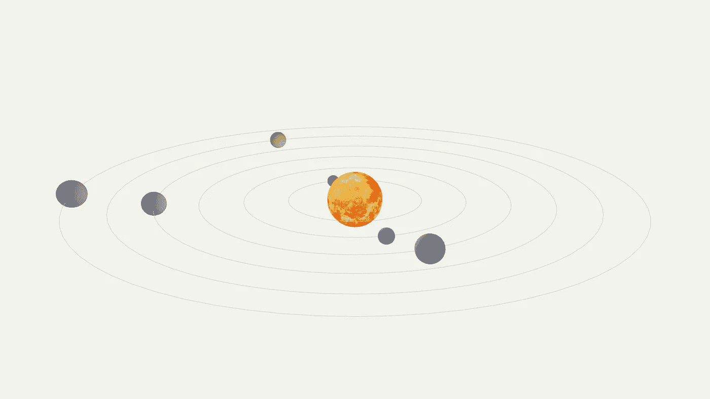
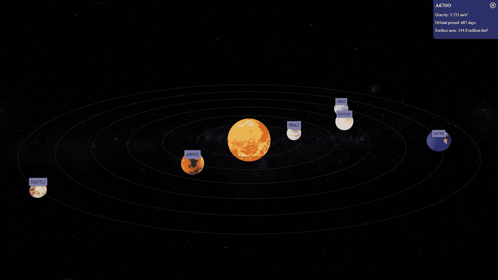

# 使用 React 构建 3D 应用程序|动画太阳系|第 2 部分

> 原文：<https://medium.com/geekculture/build-3d-apps-with-react-animated-solar-system-part-2-1186a5c8bd1?source=collection_archive---------7----------------------->



大家好。在本文中，我们将继续我们的动画太阳系应用程序。错过了第一部分？你可以在这里找到它。

[**用 React 构建 3D 应用|动画太阳系|第 1 部分**](/geekculture/build-3d-apps-with-react-animated-solar-system-part-1-c4c394a8574c)

到目前为止，我们已经创建了一组随机的行星，并为这些行星添加了黄道

现在是给行星赋予生命的时候了。为了在**中动画 3D 物体反应三根纤维**，我们可以使用 **useFrame** 钩子。

# 使用框架挂钩

useFrame 是一个**纤程**钩子，你可以用它在**纤程渲染循环**的每一帧上更新你的场景。然而，当你使用 **useFrame** 钩子时，你需要确保它总是在**画布**父对象中。否则，它将不起作用。

我们可以将一个**回调**函数传递给 **useFrame** 钩子，它将在一帧中被调用一次**。该函数接收**状态**和**增量**作为参数。**

```
useFrame((state, delta) => {
    //callback function
})
```

**Delta** 是**当前帧**和**最后一帧**的时间差。因此，如果您想要在每帧上逐渐改变对象属性，如**位置**或**旋转**，可以使用 delta 值。您也可以在**状态**变量中找到有用属性的良好组合。你可以参考 [**react 三纤程钩子 API 文档**](https://docs.pmnd.rs/react-three-fiber/API/hooks) 找到状态变量里面所有可用的属性。对于我们的应用程序，我们将使用来自**状态**的**时钟**属性。

```
useFrame(({ clock }) => {
  const t = clock.getElapsedTime();
});
```

**时钟**属性是对[和**三者的直接引用。时钟**的](https://threejs.org/docs/#api/en/core/Clock)实例。我们可以使用 **clock.getElapsedTime** 方法得到**第一帧**和**当前帧**的时间差。关于 **getElapsedTime** 方法的好处是，如果时钟还没有启动，它将**启动**时钟。所以我们不必在第一次渲染时手动启动时钟。

# **星球动画**

现在，我们如何使用这个时间值来让我们的行星在椭圆路径上移动呢？幸运的是，我们用来计算椭圆上**位置**的所有函数都是周期函数！因此，我们可以通过**时间**作为**角度**，我们的动画将完美地重复自己。为了给我们的行星网格对象分配新的位置值，我们需要使用 **React 的 useRef** 钩子创建一个网格的引用。此外，我们现在可以从行星网格中取出位置道具，因为**使用帧**也将运行并更新初始位置。

```
function Planet({ planet: { color, xRadius, zRadius, size } }) {
  const planetRef = React.useRef();useFrame(({ clock }) => {
    const t = clock.getElapsedTime();
    const x = xRadius * Math.sin(t);
    const z = zRadius * Math.cos(t);
    planetRef.current.position.x = x;
    planetRef.current.position.z = z;
  });return (
    <>
      <mesh ref={planetRef}>
        <sphereGeometry args={[size, 32, 32]} />
        <meshStandardMaterial color={color} />
      </mesh>
      <Ecliptic xRadius={xRadius} zRadius={zRadius} />
    </>
  );
}
```

**Yey！我们有自己的动画。但是好像不太对。是吗？我们有两个主要问题。**

1.  计算行星轨道速度的[公式在这种简单的应用程序中实现起来有点复杂。但是，我们仍然需要每个星球都有自己的速度。](https://www.physicsclassroom.com/class/circles/Lesson-4/Mathematics-of-Satellite-Motion)
2.  每个星球的**起始位置**应该是不一样的。

我们如何解决第一个问题？因为我们在函数中直接使用时间变量作为角度变量，我们可以简单地用某个数字乘以时间变量来改变速度。因为我们希望每个星球都有不同的速度，所以我们也可以将速度添加到我们的星球配置列表中。

**planetData.js**

```
.......
for (let index = 0; index < totalPlanets; index++) {
  planetData.push({
    id: index,
    color: randomColor(),
    xRadius: (index + 1.5) * 4,
    zRadius: (index + 1.5) * 2,
    size: random(0.5, 1),
    speed: random(0.5, 0.2)
  });
}
..........
```

**App.js**

```
function Planet({ planet: { color, xRadius, zRadius, size, speed } }) {
  const planetRef = React.useRef();useFrame(({ clock }) => {
    const t = clock.getElapsedTime() * speed;
    const x = xRadius * Math.sin(t);
    const z = zRadius * Math.cos(t);
    planetRef.current.position.x = x;
    planetRef.current.position.z = z;
  });return (
    <>
      <mesh ref={planetRef}>
        <sphereGeometry args={[size, 32, 32]} />
        <meshStandardMaterial color={color} />
      </mesh>
      <Ecliptic xRadius={xRadius} zRadius={zRadius} />
    </>
  );
}
```

到下一期。为什么我们所有的行星都从同一个位置开始？因为在第一帧中，时间变量是 0，这也是我们的初始角度。我们可以添加一个随机数，以确保每个行星的初始位置都是不同的。因此，就像时间值一样，我们可以使用任何数字作为随机值，因为我们用来计算位置的函数是**周期性**函数。对吗？是的，你可以使用任何数字，但是如果你所有的数字都很小，那么这个分布将只占月食的一小部分。所以，我们必须确保至少在 **0 和 2 *π*** *之间选择随机数。我们也可以将它添加到行星配置中。*

**planetData.js**

```
for (let index = 0; index < totalPlanets; index++) {
  planetData.push({
    id: index,
    color: randomColor(),
    xRadius: (index + 1.5) * 4,
    zRadius: (index + 1.5) * 2,
    size: random(0.5, 1),
    speed: random(0.1, 0.6),
    offset: random(0, Math.PI * 2),
  });
}
```

**App.js**

```
function Planet({ planet: { color, xRadius, zRadius, size, speed, offset } }) {
  const planetRef = React.useRef();useFrame(({ clock }) => {
    const t = clock.getElapsedTime() * speed + offset;
    const x = xRadius * Math.sin(t);
    const z = zRadius * Math.cos(t);
    planetRef.current.position.x = x;
    planetRef.current.position.z = z;
  });return (
    <>
      <mesh ref={planetRef}>
        <sphereGeometry args={[size, 32, 32]} />
        <meshStandardMaterial color={color} />
      </mesh>
      <Ecliptic xRadius={xRadius} zRadius={zRadius} />
    </>
  );
}
```

这就是你想要的！。一个生动的太阳系。

# **添加纹理**

众所周知，当**围绕**太阳旋转时，行星**也围绕它们的轴旋转**，这实际上创造了白天和黑夜。让我们通过在每一帧上围绕 **y 轴**少量旋转行星来创建动画。

```
function Planet({
  planet: { color, xRadius, zRadius, size, speed, offset, rotationSpeed },
}) {
  const planetRef = React.useRef();
  useFrame(({ clock }) => {
    const t = clock.getElapsedTime() * speed + offset;
    const x = xRadius * Math.sin(t);
    const z = zRadius * Math.cos(t);
    planetRef.current.position.x = x;
    planetRef.current.position.z = z;
    planetRef.current.rotation.y += rotationSpeed;
  });
...
}
```

在这一点上，我们将看不到这种旋转，因为我们的球体在整个表面上都有**统一的颜色**。为了解决这个问题，让我们的星球看起来更真实，我们可以添加一些**纹理**。我们可以从给太阳添加纹理开始。

我们在哪里可以找到一些太阳和行星的纹理？谷歌“**星球纹理**”会给你大量免费和付费的真实和虚拟星球纹理资源。本应用中使用的所有纹理都来自[**www.solarsystemscope.com**](https://www.solarsystemscope.com/textures/)。

要像在 **three.js** 中一样给 3D 对象添加纹理，我们可以使用**材质**的**贴图**属性。在我们使用它作为**贴图**属性之前，我们需要加载我们的纹理。为此，我们可以使用**反应三纤维**钩**使用装载机**。 **useLoader** 将 **thee.js loader 实例**作为第一个参数，将**文件路径**作为第二个参数。

```
import { Canvas, useFrame, useLoader } from "[@react](http://twitter.com/react)-three/fiber";
...
import sunTexture from "./textures/sun.jpg";...
function Sun() {
  const texture = useLoader(THREE.TextureLoader, img);
  return (
    <mesh>
      <sphereGeometry args={[2.5, 32, 32]} />
      <meshStandardMaterial map={texture} />
    </mesh>
  );
}
```

如果您只是添加了这两条线，您将在控制台上看到一条错误消息，并且太阳将根本不会显示。原因是当我们使用 **useLoader** 钩子时，我们需要确保在组件树上方的某个地方有一个**悬念**组件，该组件包装子组件的子集，其中一个子组件使用 **useLoader** 钩子。所以我们在 **app** 组件里面加一个**悬疑**组件。

```
export default function App() {
  return (
    <Canvas camera={{ position: [0, 20, 25], fov: 45 }}>
      <Suspense fallback={null}>
        <Sun />
        {planetData.map((planet) => (
          <Planet planet={planet} key={planet.id} />
        ))}
        <Lights />
        <OrbitControls />
      </Suspense>
    </Canvas>
  );
}
```



现在我们为我们的**孙**有了一个纹理。让我们也为行星添加纹理。为了延续我们的行星是随机的传统，我将创建一个纹理列表，并在给行星添加纹理之前对其进行 T42 洗牌。

```
const shuffle = (a) => {
  const temp = a.slice(0);
  for (let i = temp.length - 1; i > 0; i--) {
    const j = Math.floor(Math.random() * (i + 1));
    [temp[i], temp[j]] = [temp[j], temp[i]];
  }
  return temp;
};const textures = shuffle([tx1, tx2, tx3, tx4, tx5, tx6]);const planetData = [];
const totalPlanets = 6;
for (let index = 0; index < totalPlanets; index++) {
  planetData.push({
    id: index,
    color: randomColor(),
    xRadius: (index + 1.5) * 4,
    zRadius: (index + 1.5) * 2,
    size: random(0.5, 1),
    speed: random(0.1, 0.6),
    offset: random(0, Math.PI * 2),
    rotationSpeed: random(0.01, 0.03),
    textureMap: textures[index]
  });
}
```

另外，我给我们的场景添加了一个以星星为主题的背景，这是现在一切看起来的样子。

# **注释**

假设我们需要在一颗行星移动时显示它的名字。我们如何实现这一目标？嗯，我们可以用 **3D 文字**。但是渲染大量的 3D 文本会严重影响应用程序**的性能**，看起来也不会那么好。另一个选择是在一些 **HTML** 元素中创建文本，并随着对象一起移动。要移动带有 3D 对象的元素，我们需要获得该对象在 **3D 空间**中的**位置**，然后将其转换为浏览器的宽度和高度坐标，以便可以使用绝对定位来定位 HTML 元素。听起来很困惑吧！。是的，要在 **three.js** 中做到这一点，我们需要做一些计算。幸运的是，@react-three/Drei 有一个组件在幕后完成这一切！。我们所要做的就是导入它，并对我们的注释稍加修改。

**App.js**

```
import { OrbitControls, Html } from "@react-three/drei";
...
function Planet({
  planet: {
    color,
    xRadius,
    zRadius,
    size,
    speed,
    offset,
    rotationSpeed,
    textureMap,
    name
  }
}) {
  const planetRef = React.useRef();
  const texture = useLoader(THREE.TextureLoader, textureMap);
  useFrame(({ clock }) => {
    const t = clock.getElapsedTime() * speed + offset;
    const x = xRadius * Math.sin(t);
    const z = zRadius * Math.cos(t);
    planetRef.current.position.x = x;
    planetRef.current.position.z = z;
    planetRef.current.rotation.y += rotationSpeed;
  });return (
    <>
      <mesh ref={planetRef}>
        <sphereGeometry args={[size, 32, 32]} />
        <meshStandardMaterial map={texture} />
        <Html distanceFactor={15}>
          <div className="annotation">{name}</div>
        </Html>
      </mesh>
      <Ecliptic xRadius={xRadius} zRadius={zRadius} />
    </>
  );
}
```

**Styles.css**

```
...
.annotation {
  transform: translate3d(-50%, -150%, 0);
  text-align: left;
  background: #7676aa;
  color: rgb(7, 6, 20);
  padding: 16px;
  border-radius: 5px;
  font-size: 2rem;
}
```

**planetData.js**

```
for (let index = 0; index < totalPlanets; index++) {
  planetData.push({
    id: index,
    color: randomColor(),
    xRadius: (index + 1.5) * 4,
    zRadius: (index + 1.5) * 2,
    size: random(0.5, 1),
    speed: random(0.1, 0.6),
    offset: random(0, Math.PI * 2),
    rotationSpeed: random(0.01, 0.03),
    textureMap: textures[index],
    name: (Math.random() + 1).toString(36).substring(7).toUpperCase()
  });
}
```

我们可以使用 **CSS 属性转换**来定位与对象相关的注释。通过调整 HTML 组件上的 **distanceFactor** prop，我们可以调整注释的比例。此外，我们正在生成一个随机的名字只是为了好玩！

# **事件处理程序**

如果当用户点击某个星球时，我们需要给用户更多关于这个星球的信息，那该怎么办呢？ **React three fiber** 组件也拥有普通 **React** 元素拥有的大部分事件处理程序。所以我们可以使用行星**啮合**上的 **onClick** 处理程序道具来触发对话。

**App.js**

```
export default function App() {
  const [dialogueData, setDialogueData] = useState(null);
  const hideDialoge = () => {
    setDialogueData(null);
  };
  return (
    <>
      <Dialog hideDialoge={hideDialoge} dialogueData={dialogueData} />
      <Canvas camera={{ position: [0, 20, 25], fov: 45 }}>
        <Suspense fallback={null}>
          <Sun />
          {planetData.map((planet) => (
            <Planet
              planet={planet}
              key={planet.id}
              setDialogueData={setDialogueData}
            />
          ))}
          <Lights />
          <OrbitControls />
        </Suspense>
      </Canvas>
    </>
  );
}...
...function Planet({
  planet: { textureMap, xRadius, zRadius, size, id },
  setDialogueData,
}) {
  const texture = useLoader(THREE.TextureLoader, textureMap);
  return (
    <>
      <mesh
        position={[xRadius, 0, 0]}
        onClick={() => {
          setDialogueData({ size, id });
        }}
      >
        <sphereGeometry args={[size, 32, 32]} />
        <meshStandardMaterial map={texture} />
        <Html distanceFactor={15}>
          <div className="annotation">HJHRJHR</div>
        </Html>
      </mesh>
      <Ecliptic xRadius={xRadius} zRadius={zRadius} />
    </>
  );
}
```

**Dialog.js**

```
import React from "react";export default function Dialog({ hideDialog, dialogData }) {
  if (!dialogData) {
    return null;
  }
  const { name, gravity, orbitalPeriod, surfaceArea } = dialogData;
  return (
    <div className="dialog">
      <div className="dialog-header">
        <div className="">{name}</div>
        <svg
          onClick={hideDialog}
          width="24px"
          height="24px"
          viewBox="0 0 200 200"
          fill="none"
          ae jo" href="http://www.w3.org/2000/svg" rel="noopener ugc nofollow" target="_blank">http://www.w3.org/2000/svg"
        >...
        </svg>
      </div>
      <div className="details">Gravity: {gravity} m/s²</div>
      <div className="details">Orbital period: {orbitalPeriod} days</div>
      <div className="details">Surface area: {surfaceArea} million km²</div>
    </div>
  );
}
```



这里是最终的**代码沙箱**供你参考。

# 最后的想法

这里我们可以做很多改进。我们可以使用**自定义着色器**来生成所有的行星，而不是使用球体和纹理。我们可以给行星添加卫星，让太阳的火焰充满活力。或者我们可以添加一些其他的 3D 物体，比如小行星带。我可能会在后面的教程中涉及其中的一些。但现在就这样了。希望你和我一样喜欢它！