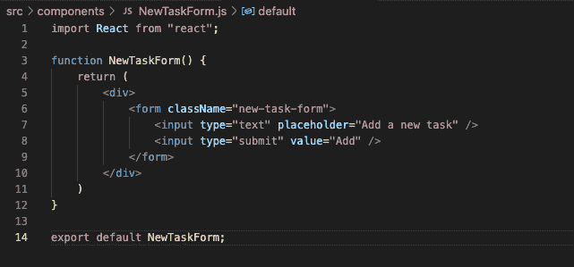
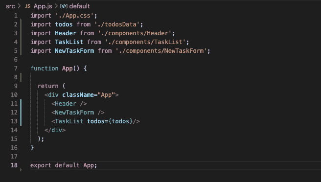
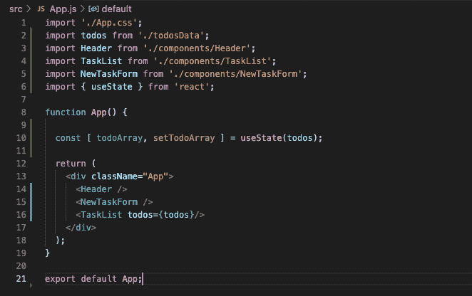
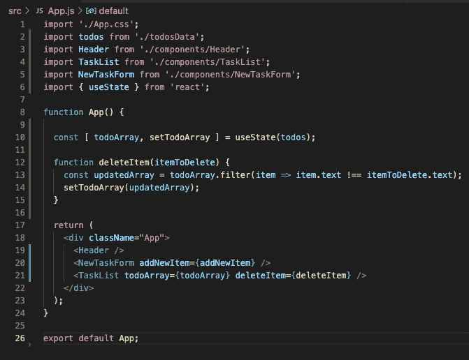
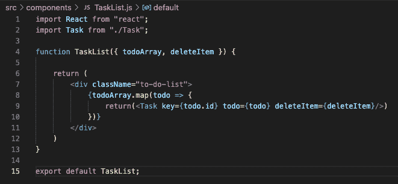
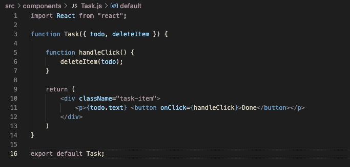
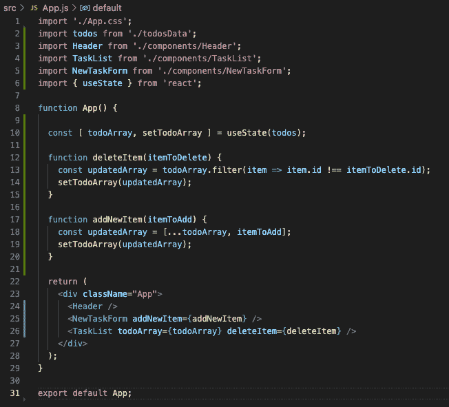
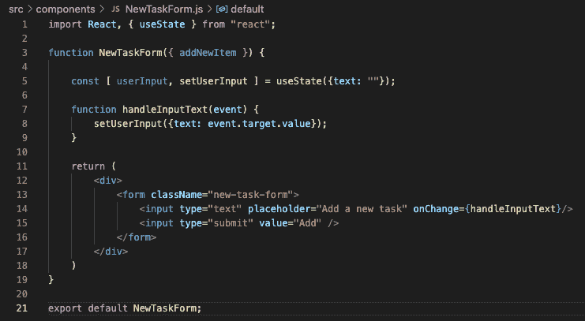
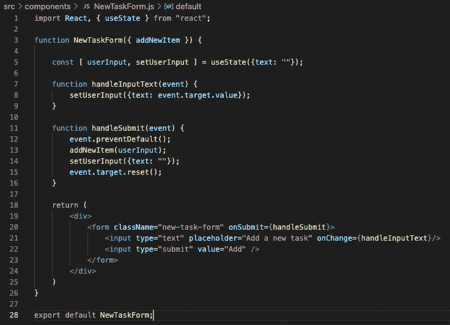
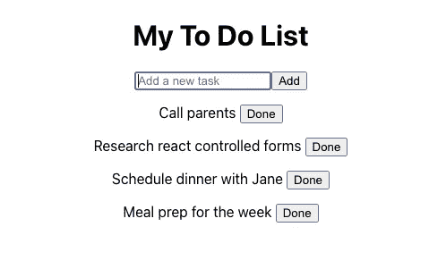

# 在 React 中构建一个基本的应用程序，第二部分

> 原文：<https://medium.com/geekculture/build-a-basic-app-in-react-part-ii-c70e10f7e850?source=collection_archive---------20----------------------->

是时候回顾一下 React **state** 并将其整合到我们正在构建的待办事项应用中了。如果你还没有，一定要[看看这篇文章的第一部分](/@nataliebarba/build-a-basic-app-in-react-part-i-9c6c27dbfc41)，它评论了我们开始构建这个应用时**的组件和道具**。

现在进入状态。

# **快速概述**

那么什么是国家呢？在 React 中，**状态**是随着用户与应用程序交互而变化的动态数据。状态可以在组件的生命周期中改变，这一事实使得它与**道具**不同——道具依赖于父组件将静态信息传递给它们的子组件。

注意，为了在代码中处理状态，您必须导入 React **useState 钩子**。什么是钩子？ [React 文档](https://reactjs.org/docs/hooks-state.html)描述得最好。它是“一个特殊的功能，可以让你‘挂钩’反应特征。”例如，useState 是为 React 类组件构建的一个特性。我们正在使用功能组件构建我们的应用程序，这些组件不包含相同的功能，但我们可以通过挂钩导入我们需要的功能，如 useState。要了解更多信息，请务必查看文档。

实现 useState 如下所示:

> 从“react”导入 React、{ use state }；
> 
> 函数示例(){
> //声明一个新的状态变量，我们就称之为“count”
> const[count，set count]= useState(0)；
> ……
> }

在左边，我们有两个变量。首先是状态变量，其次是更新状态的 setter 函数。在右边，我们将状态变量设置为我们决定的初始值。所以对于上面的例子，我们最初将 count 设置为 0。稍后，我们可以说 setCount(5)将计数更新为 5。我们将在代码中看到更多的例子。让我们开始吧。

# **目标**

我们将为我们的待办事项应用添加两个关键功能:

1.  能够将任务标记为完成或“完成”，并将其从我们的任务列表中删除。
2.  添加新任务的能力

我们将通过使用状态来实现这两个目标。

# **规划国家居住地**

当我们思考如何实现我们的目标时，我们应该问自己，我们需要操纵数据吗？如果有，哪些数据？

无论我们想要删除一个现有的任务还是添加一个新的任务，我们都需要操作我们迭代的数组，以便在页面上呈现每个待办事项元素。

我们希望在组件的生命周期内，根据用户的操作改变数据。听起来像州政府。这个国家应该生活在哪里？这四个问题帮助我们做出决定:

*   识别每一个基于该状态呈现某些内容的组件
*   找到一个共同的所有者组件(一个单独的组件，组件层次结构中所有需要该状态的组件)
*   要么是共同所有者，要么是更高层的另一个组件
*   如果你找不到一个值得拥有的组件，就需要一个新的组件

TaskList.js 和 NewTaskForm.js 都需要使用这个由用户操作更新的数组。虽然我们为 NewTaskForm 组件创建了一个文件，但是我们既没有构建它，也没有将它导入到任何地方，所以让我们花点时间来处理它。

# **NewTaskForm.js**

我们可以通过为新任务添加一个输入区域并添加一个提交按钮来创建一个非常简单的表单，如下所示

现在我们必须将它导入到我们的 homebase，App.js 中。

# **App.js**

我们知道新的 TaskForm 不需要访问我们之前构建的数据 todos，所以还不需要传入 props。

# **规划状态续**

现在我们已经设置好了所有的组件，我们可以返回并确定我们的状态将位于何处——我们将通过用户操作来操作的待办事项数组的状态。正如我们提到的，NewTaskForm.js 和 TaskList.js 都需要访问这个数组，所以我们希望我们的状态位于它们共享的父组件 App.js 中。

# **App.js**

记住，如果我们想要使用状态，我们必须导入 use state 钩子。然后，让我们为我们一直提到的待办事项数组创建一个状态变量。我们将该数组的初始值设置为从 todosData.js 导入的数组。

让我们一次处理一个用户动作，从点击“Done”按钮开始。

我们知道，当我们单击“Done”时，我们会想要从 todoArray 中删除一个元素。我们必须创建一个管理这个逻辑的函数，并且任何时候我们创建一个函数来管理一个状态的操作，我们都应该在与我们定义的状态相同的组件中这样做。

让我们创建一个名为 deleteItem 的函数，它将 itemToDelete 作为参数。我们将创建原始 todoArray 的一个副本，减去我们希望使用 filter 方法删除的项目。我们可以假设没有两个待办事项会完全相同，并根据待办事项的文本描述进行过滤。最后，我们将使用 setter 函数将 todoArray 更新为更新后的数组。

现在，我们不是将原始数据集 todos 向下传递到 TaskList.js，而是要传递随用户操作更新的数组 todoArray。我们还希望传递新定义的 deleteItem 函数，以便(最终)我们的事件处理函数可以调用它。我们更新的 App.js 应该如下:

# **TaskList.js**

在这里，我们需要相应地更新我们被破坏的道具。我们还必须更新我们正在映射的数组，以便为每个待办事项创建任务组件。我们在这里不会使用 deleteItem 函数，所以让我们也将它传递给我们的任务组件。

# **Task.js**

回到 Task.js，我们要做的就是向按钮添加一个 click 事件侦听器，它将执行 deleteItem 函数。我们可以创建一个事件处理函数，如下调用该函数。

现在，如果你在浏览器中刷新你的应用程序，点击任何一个“完成”按钮，就可以摆脱任务了。

**请注意，刷新后应用程序中的更改不会持续。为了使更改持久，必须有与服务器的通信，这不在本文中讨论。*

# **App.js**

因为我们将向已经有一个状态的同一数组添加一个新任务，所以我们不需要创建一个新状态。类似于我们如何创建一个函数来处理删除任务，让我们创建一个用于添加任务的函数，回到我们的状态所在的 App.js 中。

我们将遵循类似的步骤:创建一个新的数组，使用 spread 操作符创建原始数组的副本，然后在数组末尾添加新的元素。

当用户提交新任务时，我们需要调用这个函数，这将发生在 NewTaskForm.js 中，所以让我们把它作为 props 传递下去。

# **NewTaskForm.js**

在直接进入提交活动逻辑之前，让我们把表单做成一个 [**受控表单**](https://reactjs.org/docs/uncontrolled-components.html) 。

*“在受控组件中，表单数据由 React 组件处理。另一种选择是不受控制的组件，表单数据由 DOM 本身处理。*

在导入 useState 钩子之后，我们可以通过为用户输入创建一个状态来做到这一点。因为 todoArray 是由 to-do 对象组成的，所以我们应该遵循这种格式，并用一个“text”键和一个空字符串作为它的值将我们的新状态初始化为一个对象。让我们定义我们的事件处理函数，在用户输入时更新这个状态。最后一步，让我们用这个新函数向输入文本添加一个 onChange 监听器。

现在我们可以处理提交了。

让我们创建将传递给提交事件侦听器的函数。默认情况下，表单提交会刷新我们的浏览器。我们不希望这样，所以我们将从防止这种默认行为开始。接下来，我们将使用我们在 App.js 中定义并作为 props 传递的函数，向 todoArray 添加我们的状态变量，该变量表示我们使用 state 基于用户输入创建和更新的对象。让我们将状态和表单重置为空值。最后，我们需要创建一个 onSubmit 事件监听器，使用我们新创建的函数，如下所示。

# **结论**

现在，您应该能够在浏览器中打开它，并且能够:

1.  用按钮查看标题、表单和待办事项列表
2.  点击“完成”删除待办事项
3.  使用表单添加新的待办事项

构建交互式 React 应用程序的工作做得很好，感谢您的关注！