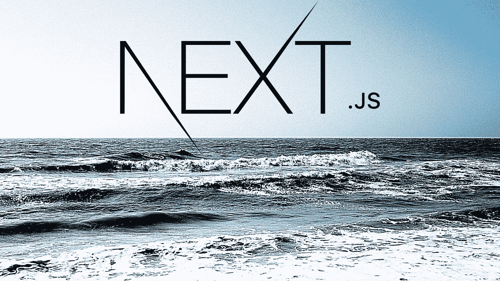

# 用 Next 建立一个博客。射流研究…

> 原文：<https://medium.com/geekculture/build-a-blog-with-next-js-2315d9683ef?source=collection_archive---------0----------------------->

## 使用 Next 建立自己的博客网站的快速介绍和指南。射流研究…

Created by the author in [Canva](https://www.canva.com/)

万一你还不熟悉，接下来。JS 是一个流行的 React 框架。该框架允许您构建 React 应用程序，无需任何配置即可生成静态站点和服务器端呈现。