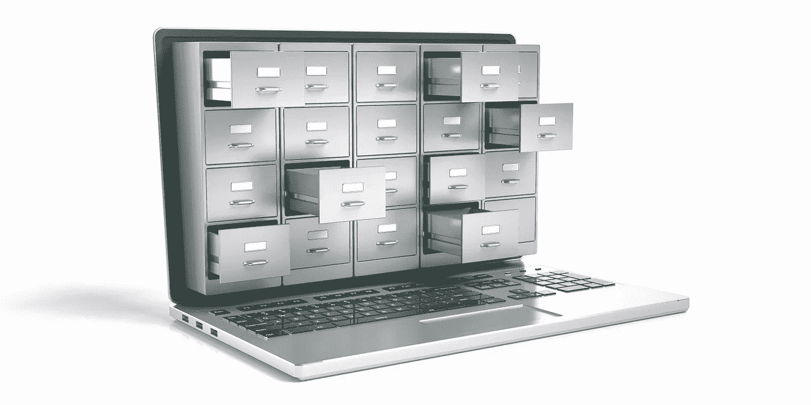

# 利用开放数据建立业务

> 原文：<https://medium.com/geekculture/build-a-business-with-open-data-a8d9ff7e63ef?source=collection_archive---------27----------------------->

There are lots of free data sets to exploit (image: Shutterstock)

大量的网上信息可能会改变你的业务，或者帮助你开创一个新的业务。尼克·罗林森探索开放数据的潜力

D 数据是您组织最有价值的资源，这包括您不拥有的数据。这听起来可能很荒谬，但事实是，贵公司生成或获取的所有信息仅代表一小部分可用于…