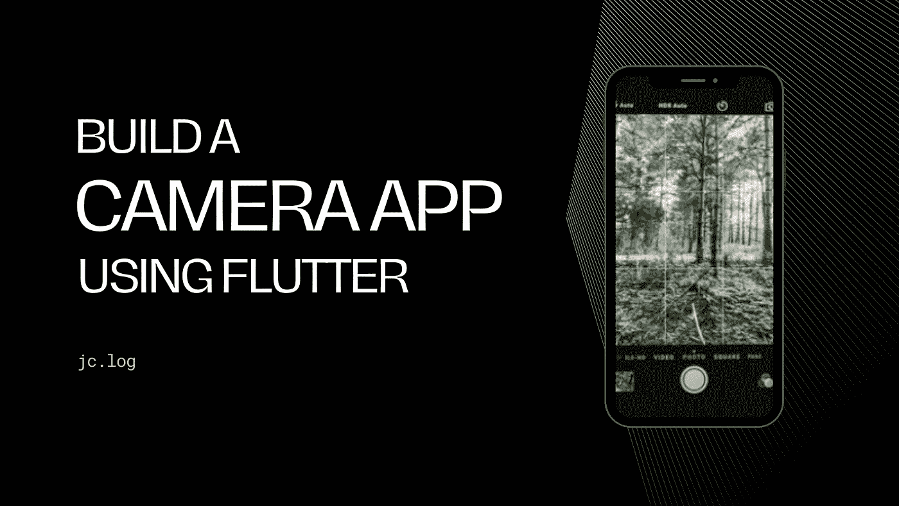
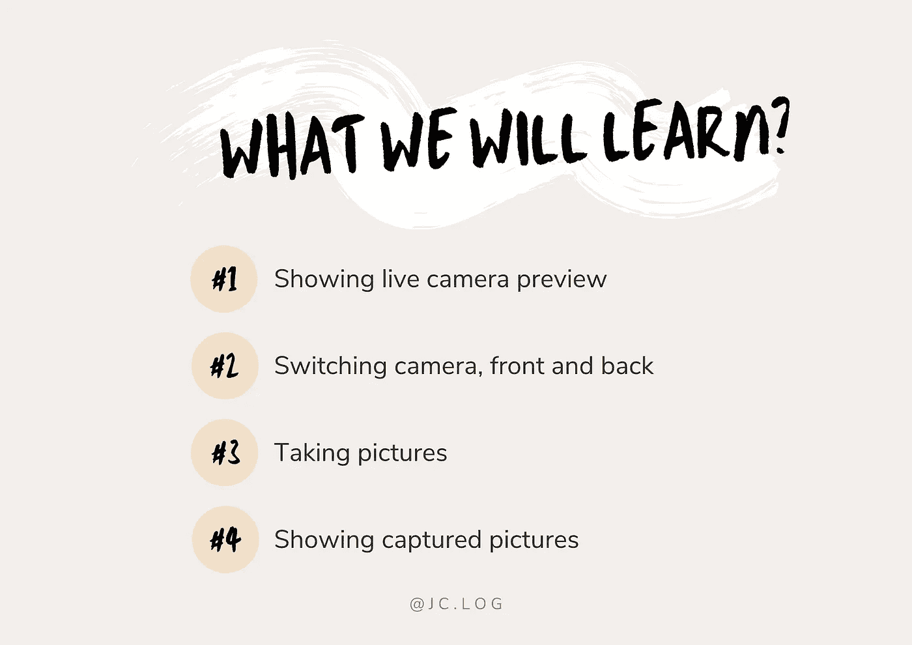
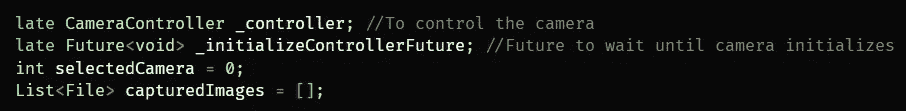
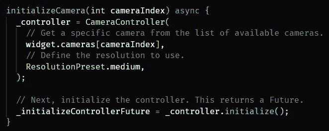
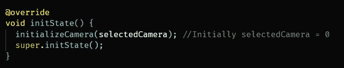
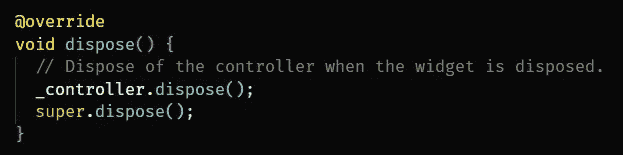
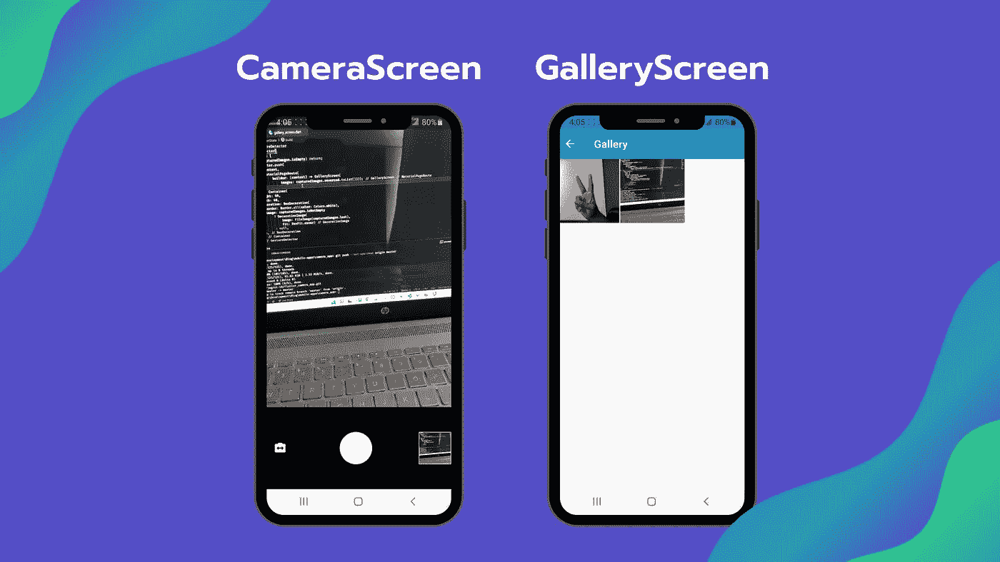

# 建立一个相机应用程序:在应用程序中抖动相机

> 原文：<https://medium.com/geekculture/build-a-camera-app-flutter-in-app-camera-825b829fe138?source=collection_archive---------0----------------------->



在许多应用程序中，我们需要用户通过点击图片来上传图片。为此，我们可以使用设备的默认相机应用程序，但如果我们需要集成一个应用内相机呢？颤振也是可能的。flutter 团队开发了一个名为`camera`([https://pub.dev/packages/camera](https://pub.dev/packages/camera))的软件包，可以让我们做到这一点。

让我们通过一个简单的例子来看看如何实现这一点。

# 设置项目

首先，通过将下面一行添加到`pubspec.yaml`文件中，将`camera`包安装到您的项目中。

```
camera: ^0.8.1+3
```

**— IOS 设置**

此插件需要 IOS 10.0 或更高版本。
在`Info.plist`文件中添加以下行进行设置。

```
<key>NSCameraUsageDescription</key>
<string>Can I use the camera please?</string>
<key>NSMicrophoneUsageDescription</key>
<string>Can I use the mic please?</string>
```

— **安卓设置**

在您的`android/app/build.gradle`文件中，将最低 Android sdk 版本更改为 21(或更高)。

```
minSdkVersion 21
```

现在我们的项目设置已经完成，我们可以开始编写应用程序了。

我们将在应用程序中创建两个屏幕。
1。`CameraScreen` —该屏幕将显示相机输出并拍照
2。`GalleryScreen` —该屏幕将在 gridview 中显示捕获的图片。



# 加载摄像机

要显示相机预览，我们需要先加载相机。为此，转到`main.dart`文件中的`main`函数和`runApp`上面的这些行。

```
WidgetsFlutterBinding.ensureInitialized(); //Ensure plugin services are initializedfinal cameras = await availableCameras(); //Get list of available cameras
```

现在我们有了相机列表，我们需要将它们传递给我们的`CameraScreen`。

所以，摄像机会像这样通过


Passing cameras list

做完这些，这就是`main.dart`的样子。

# 照相机屏幕

这个屏幕的布局很简单。在顶部，我们将显示实时相机预览，在底部将有三个按钮(切换相机，捕捉和显示画廊)。

创建一个名为`CameraScreen`的有状态小部件。

我们将创建四个变量，



我们必须设置`selectedCamera = 0`，从后置摄像头开始。如果设备有一个以上的摄像头，那么我们可以通过更改此索引来切换到它。

现在让我们创建一个方法来初始化选定的相机。



在这个方法中，我们将传递想要初始化的摄像机索引。使用传递的摄像机列表，我们将加载具有我们选择的分辨率的特定摄像机。

使用这种方法，我们将在`initState`中初始化后置摄像头。



initState

不要忘记处理相机控制器。



dispose

现在让我们来构建用户界面。

为了显示 CameraPreview，我们将使用以下代码。在摄像头加载之前，我们会显示`CircularProgressIndicator`。

```
FutureBuilder<void>(
  future: **_initializeControllerFuture**,
  builder: (context, snapshot) {
    if (snapshot.connectionState == ConnectionState.done) {
      // If the Future is complete, display the preview.
      return **CameraPreview(_controller)**;
    } else {
      // Otherwise, display a loading indicator.
      return const Center(child: CircularProgressIndicator());
    }
  },
),
```

好了，现在我们必须在一个`row`中显示三个按钮。

# 切换相机按钮

首先是切换相机图标按钮。点击这个按钮，相机会在前后之间切换。

为此，我们将使用同样的`initializeCamera`方法，但是这次`cameraIndex`将是动态的。`cameraIndex`将为`0`后置摄像头`1`前置摄像头(如果有前置摄像头)。

单击时，我们将检查设备是否有多个摄像头，如果没有，我们将显示一个带有消息的 snackbar。

```
IconButton(
  onPressed: () {
    if (widget.cameras.length > 1) {
      setState(() {
        **selectedCamera = selectedCamera == 0 ? 1 : 0;**//Switch camera **initializeCamera(selectedCamera);**
      });
    } else {
      ScaffoldMessenger.of(context).showSnackBar(SnackBar(
        content: Text('No secondary camera found'),
        duration: const Duration(seconds: 2),
      ));
    }
  },
  icon: Icon(Icons.switch_camera_rounded, color: Colors.white),
),
```

# 捕获按钮

为了显示一个捕获按钮，我使用了一个简单的半径为 60 的白色圆圈。点击时，我们将使用相机控制器拍摄一张照片，并将其添加到`captureImages`数组中。

```
GestureDetector(
  onTap: () async {
    await _initializeControllerFuture; //To make sure camera is initialized
    var xFile = await **_controller.takePicture()**;
    setState(() {
      **capturedImages.add(File(xFile.path));**
    });
  },
  child: Container(
    height: 60,
    width: 60,
    decoration: BoxDecoration(
      shape: BoxShape.circle,
      color: Colors.white,
    ),
  ),
),
```

# 显示图库按钮

这个按钮非常简单，我们将显示从`capturedImages`数组中获取的**最后一个**图像，单击它将导航到`GalleryScreen`。

```
GestureDetector(
  onTap: () {
    if (capturedImages.isEmpty) return; //Return if no image
      Navigator.push(context,
        MaterialPageRoute(
          builder: (context) => GalleryScreen(
            images: **capturedImages.reversed.toList()**)));
  },
  child: Container(
    height: 60,
    width: 60,
    decoration: BoxDecoration(
      border: Border.all(color: Colors.white),
      image: capturedImages.isNotEmpty
      ? DecorationImage(image: FileImage(**capturedImages.last**), fit: BoxFit.cover)
      : null,
    ),
  ),
),
```

如您所见，`GalleryScreen`接受捕获的图像列表，以便我们可以在 gridview 中显示它们。让我们完成这一部分，看看应用程序的运行。

# 画廊屏幕

这个屏幕非常直。获取图像列表并在`GridView`中显示。

# 最终产品

构建好 app 后，这里是最终的结果。



相机包([https://pub.dev/packages/camera](https://pub.dev/packages/camera))也能够捕捉视频。为此，您可以使用`startVideoRecording`、`pauseVideoRecording`和`stopVideoRecording`方法。

这是该项目的 Github 链接。希望对你有帮助。

[](https://github.com/jagrut-18/flutter_camera_app.git) [## jagrut-18/flutter_camera_app

### 一个新的颤振项目。这个项目是颤振应用的起点。一些帮助您入门的资源…

github.com](https://github.com/jagrut-18/flutter_camera_app.git) 

这一次到此为止。希望你喜欢。

感谢您阅读至此。请务必留下任何建议和评论👏为了这个故事。