# 用 ReactJS 和 NodeJS 构建一个 Cloudinary 图像上传器

> 原文：<https://medium.com/geekculture/build-a-cloudinary-image-uploader-with-reactjs-and-nodejs-b2cb6bb33239?source=collection_archive---------22----------------------->


Cloudinary

在这篇文章中，我们将构建一个 Cloudinary 上传程序，通过它我们将能够通过我们的应用程序将图像上传到 cloudinary。我们将在项目中使用 ReactJS 和 NodeJS。

因此，打开您的终端并创建一个新文件夹，在该文件夹中创建一个名为 frontend 的新 react 应用程序。

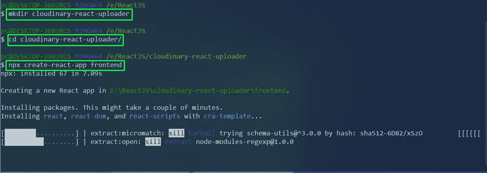

Initialization

接下来，我们将删除项目中不需要的不必要的文件。

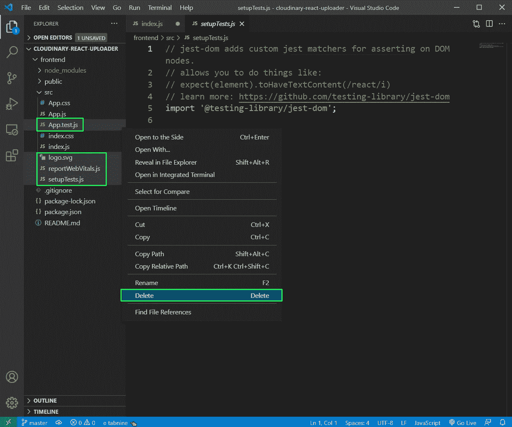

Remove

从 **index.js** 文件中删除，更新后的文件包含以下内容。

```
import React from 'react';
import ReactDOM from 'react-dom';
import './index.css';
import './base.css';
import App from './App';ReactDOM.render(
  <React.StrictMode>
    <App />
  </React.StrictMode>,
  document.getElementById('root')
);
```

现在，在 **src** 文件夹中创建一个文件 **base.css** 。它将包含我们的小应用程序的大部分风格。

```
:root {
    --text-color: #333;
    --accent-color: rgb(15, 73, 54);
    --btn-text-color: #f9f9f9;
    --alert-success-bg-color: #d4edda;
    --alert-success-text-color: #073813;
    --alert-danger-bg-color: #dbb1b6;
    --alert-danger-text-color: #3a070c;
}* {
    box-sizing: border-box;
    color: var(--text-color);
}
.container {
    margin: 0 auto;
    max-width: 1200px;
    padding: 2rem;
}img {
    border-radius: 5px;
}.nav {
    display: flex;
    justify-content: space-between;
    align-items: center;
}.nav-brand {
    font-size: 24px;
}.nav-items {
    list-style: none;
    display: flex;
}.nav-item > a {
    margin: 0 1rem;
    text-decoration: none;
    font-size: 16px;
    color: #333;
    padding-bottom: 2px;
    font-weight: 500;
    text-transform: uppercase;
}
.nav-item > a:hover {
    border-bottom: 4px solid var(--accent-color);
}.title {
    text-align: center;
    margin-bottom: 4rem;
}.btn {
    padding: 0.5rem 1rem;
    border: 1px solid var(--accent-color);
    background-color: var(--accent-color);
    color: var(--btn-text-color);
    border-radius: 5px;
    transition: 250ms;
    cursor: pointer;
    font-size: 16px;
}.btn:hover {
    border: 1px solid var(--accent-color);
    background-color: var(--btn-text-color);
    color: var(--acent-color);
}.form {
    margin-bottom: 2rem;
}.form-input {
    display: block;
    margin-bottom: 10px;
}.alert {
    padding: 1rem 2rem;
    border-radius: 5px;
    position: fixed;
    top: 2rem;
    right: 0rem;
    min-width: 200px;
}.alert-success {
    background-color: var(--alert-success-bg-color);
    color: var(--alert-success-text-color);
}.alert-danger {
    background-color: var(--alert-danger-bg-color);
    color: var(--alert-danger-text-color);
}
```

现在，在**前端**文件夹中安装 react 路由器。

```
npm i react-router-dom
```

之后更新 **App.js** 文件如下。我们在这里使用路由器，有两条路径用于**/上传**和 **/** ，分别加载 **Home** 和 **Upload** 组件。

```
import React from 'react';
import './App.css';
import { BrowserRouter as Router, Link, Switch, Route } from 'react-router-dom';
import Upload from './pages/Upload.js';
import Home from './pages/Home.js';function App() {
    return (
        <div className="container">
            <Router>
                <nav className="nav">
                    <div className="nav-brand">Cloudinary React</div>
                    <ul className="nav-items">
                        <li className="nav-item">
                            <Link to="/">Gallery</Link>
                        </li>
                        <li className="nav-item">
                            <Link to="/upload">Upload</Link>
                        </li>
                    </ul>
                </nav>
                <Switch>
                    <Route component={Upload} path="/upload" />
                    <Route component={Home} path="/" />
                </Switch>
            </Router>
        </div>
    );
}export default App;
```

另外，删除 **App.css** 中的所有内容，并更新以下内容。

```
.gallery {
  display: grid;
  grid-template-columns: repeat(auto-fit, 300px);
  grid-gap: 2rem;
  justify-content: center;
}@media (max-width: 786px) {
  .gallery {
      grid-template-columns: 1fr;
      justify-items: center;
  }
}
```

现在，在 **src** 中创建一个 **pages** 文件夹，并在其中创建两个文件 **Home.js** 和 **Upload.js** 。现在它们将只包含一个功能组件。

Home.js 的内容如下。

```
import React from 'react'const Home = () => {
    return (
        <div>
            <h1>Home</h1>
        </div>
    )
}export default Home
```

**Upload.js** 的内容如下。

```
import React from 'react'const Upload = () => {
    return (
        <div>
            <h1>Upload</h1>
        </div>
    )
}export default Upload
```

现在，我们的基本应用程序在 localhost 中将如下所示。


localhost

现在，我们将开始向我们的 to **Upload.js** 文件添加逻辑。这里我们添加了一个输入类型文件，它的 **onChange** 调用一个函数 **handleFileInputChange** 。

现在，在 **handleFileInputChange** ()中，我们正在调用另一个函数 **previewFile** ，它在浏览器中显示所选文件的预览。

```
import React, { useState } from 'react'const Upload = () => {
    const [fileInputState, setFileInputState] = useState('');
    const [previewSource, setPreviewSource] = useState('');const handleFileInputChange = (e) => {
        const file = e.target.files[0];
        previewFile(file);
        setFileInputState(e.target.value);
    };const previewFile = (file) => {
        const reader = new FileReader();
        reader.readAsDataURL(file);
        reader.onloadend = () => {
            setPreviewSource(reader.result);
        };
    };return (
        <div>
            <h1>Upload</h1>
            <form>
                <input
                    id="fileInput"
                    type="file"
                    name="image"
                    onChange={handleFileInputChange}
                    value={fileInputState}
                    className="form-input"
                />
                <button className="btn" type="submit">
                    Submit
                </button>
            </form>
            {previewSource && (
                
            )}
        </div>
    )
}export default Upload
```

现在，在 localhost 中，如果我们上传一个图像，我们将得到这个漂亮的预览。

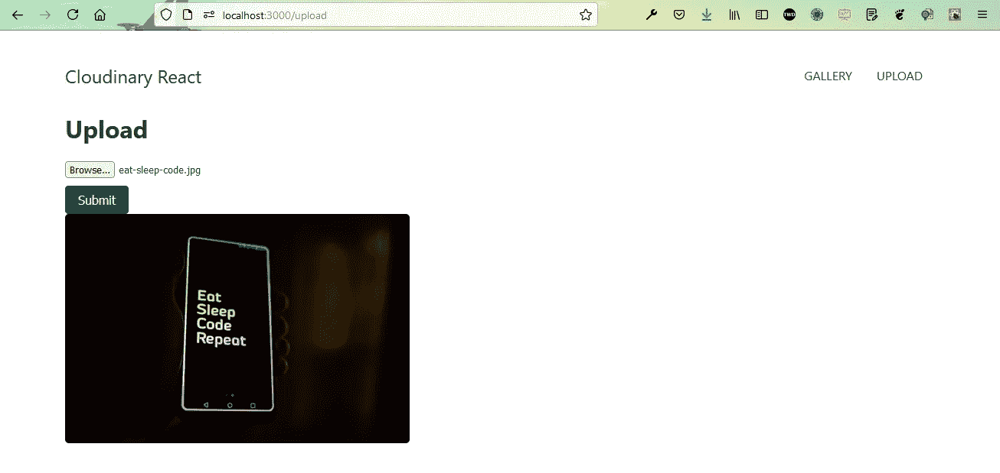

Nice Preview

现在，我们将把 **onSubmit** 功能添加到 **Upload.js** 中的表单，该表单调用函数 **handleSubmitFile** 。我们还为样式添加了一个类，我们已经在 **base.css** 文件中添加了这个类。

```
<form onSubmit={handleSubmitFile} className="form">
```

接下来，我们将为 **Upload.js** 文件中的 **handleSubmitFile** 添加函数。这里，我们还创建了一个新的状态 **selectedFile** ，我们正在 handleFileInputChange()中设置它。

在中，我们首先读取文件并将其发送给另一个函数 **uploadImage** ()，该函数获取 base64 编码的图像并将其传递给一个 API 端点 **/api/upload** ，这是我们尚未创建的。

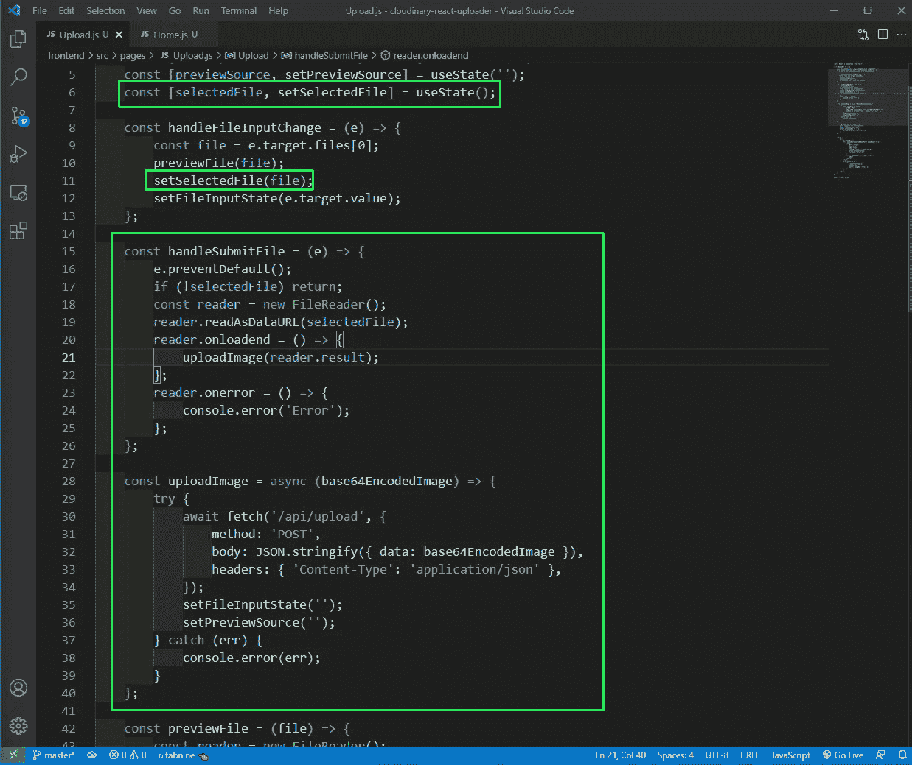

Upload.js

现在，在移动到后端之前，我们需要将前端与它连接起来。因此，转到 **package.json** 文件并添加后端代理。

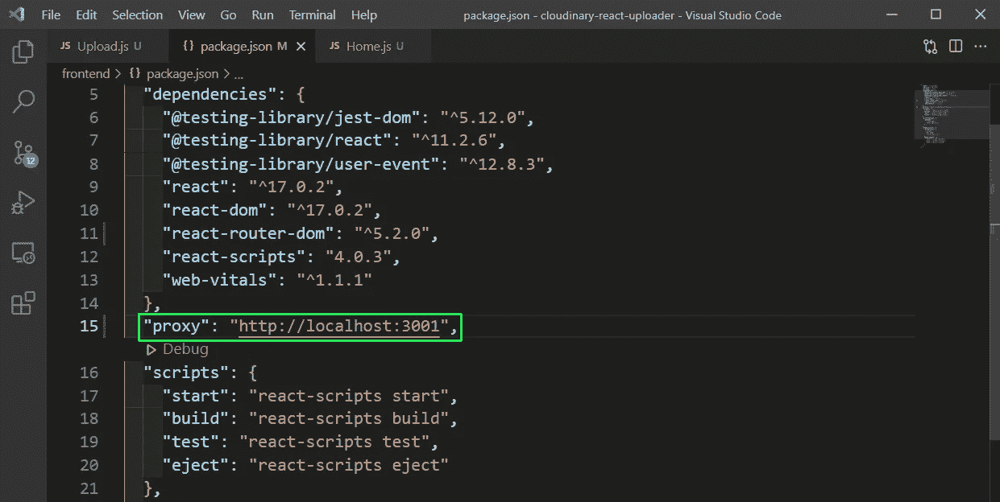

package.json

现在，在我们的项目中创建一个文件夹**后端**，并对其进行修改。之后发出命令 **npm init** 。除了入口点是 **server.js** 之外，您可以对所有东西按 enter 键

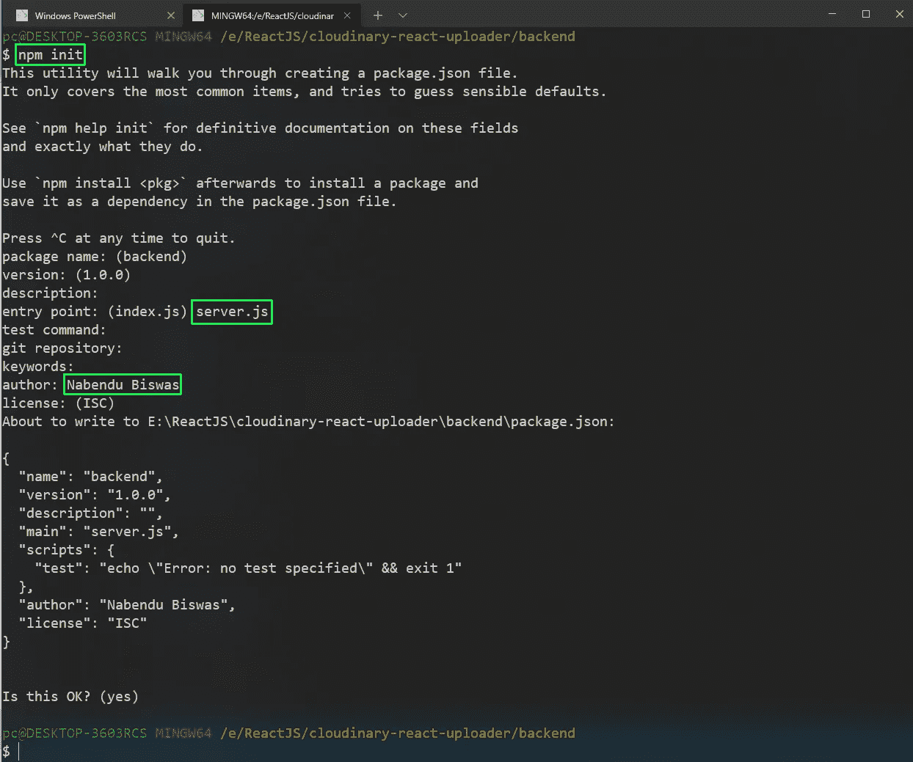

npm init

之后，在**后端**文件夹中，我们需要安装我们的依赖项。

```
npm i cloudinary cors dotenv express nodemon
```

现在，在**后端**文件夹中创建一个 **server.js** 文件，并将以下内容放入其中。

这里，我们正在做基本的节点工作，并创建一个 post route，我们从前端获取 base64 编码的图像。

```
const express = require('express');
const app = express();
var cors = require('cors');app.use(express.json({ limit: '50mb' }));
app.use(express.urlencoded({ limit: '50mb', extended: true }));
app.use(cors());app.post('/api/upload', async (req, res) => {
    try {
        const fileStr = req.body.data;
        console.log(fileStr);
    } catch (err) {
        console.error(err);
        res.status(500).json({ err: 'Something went wrong' });
    }
});const port = process.env.PORT || 3001;
app.listen(port, () => {
    console.log('listening on 3001');
});
```

现在，用 **nodemon server.js** 命令启动后端。之后，回到前端，提交一个文件，我们会看到一个大的控制台日志。

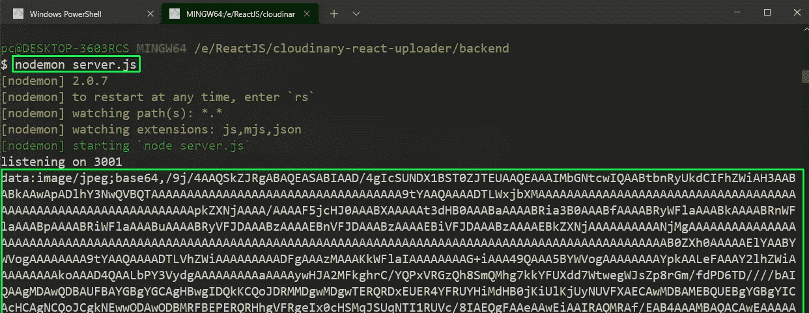

nodemon

现在，我们将配置我们的云阵列。因此，在**后端**文件夹中创建一个 **utils** 文件夹，并在其中创建一个 **cloudinary.js** 文件。把下面的内容放进去。在这里，我们只是做进口和使用云的秘密。

```
require('dotenv').config();const cloudinary = require('cloudinary').v2;cloudinary.config({
    cloud_name: process.env.CLOUDINARY_NAME,
    api_key: process.env.CLOUDINARY_API_KEY,
    api_secret: process.env.CLOUDINARY_API_SECRET,
});module.exports = { cloudinary };
```

接下来，登录 cloudinary.com 并创建你的账户，如果你没有的话。在仪表板上，你会得到我们项目所需的三个秘密。


Cloudinary

接下来，在后端文件夹中创建一个. env 文件，并将这三个秘密。

```
CLOUDINARY_API_KEY=4xxxxxxxxxxxxxx9
CLOUDINARY_API_SECRET=rxxxxxxxxxxxxxxxxxxxxxxxxs
CLOUDINARY_NAME=dxxxxxxxxxo
```

在 server.js 文件中创建我们的代码之前，我们需要在 cloudinary 中进行设置。所以，在 cloudinary 站点点击右上角的**设置**图标。然后点击**上传**标签。向下滚动一点，您会找到**上传预设**，在这里点击**添加上传预设**链接。


Upload

在下一个屏幕中，给上传预设一个名称，签名模式为已签名，以及一个文件夹，图像将保存在其中。之后点击保存按钮。


Save

在下一个屏幕中，您将获得新的预设。


New presets

现在，回到我们的 **server.js** 文件中，我们将首先为 cloudinary 添加导入，然后在我们的帖子中，我们将使用 cloudinary **上传器**将我们的图像上传到 cloudinary 中的 **cloudinary_react** 文件夹。

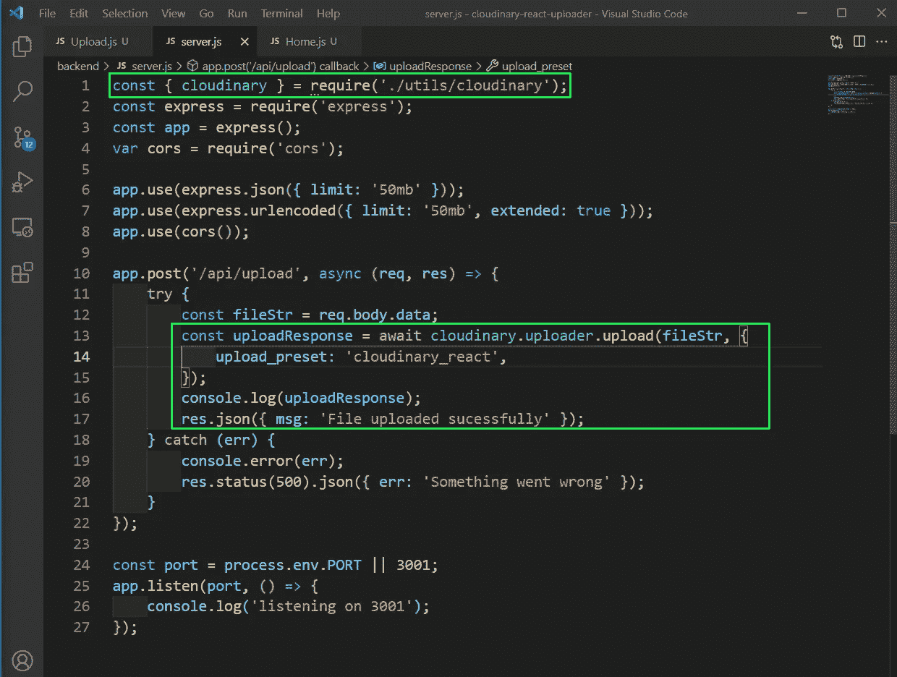

server.js

现在，从前端上传任何文件，它将被上传到 cloudinary。注意，我们没有手动创建文件夹 **cloudinary_react** ，它是由 cloudinary 创建的。

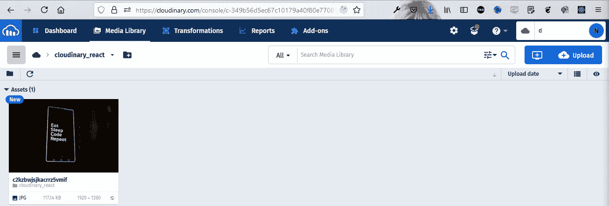

Cloudinary image

接下来，我们将添加一个 GET 请求，从我们的 cloudinary 文件夹中获取所有图像。因此，在我们的 **server.js** 文件中添加 **/api/images** 端点。

这里，我们使用 inbuild cloudinary 方法从我们的 **cloudinary_react** 中获取文件，并将它们发送回去。

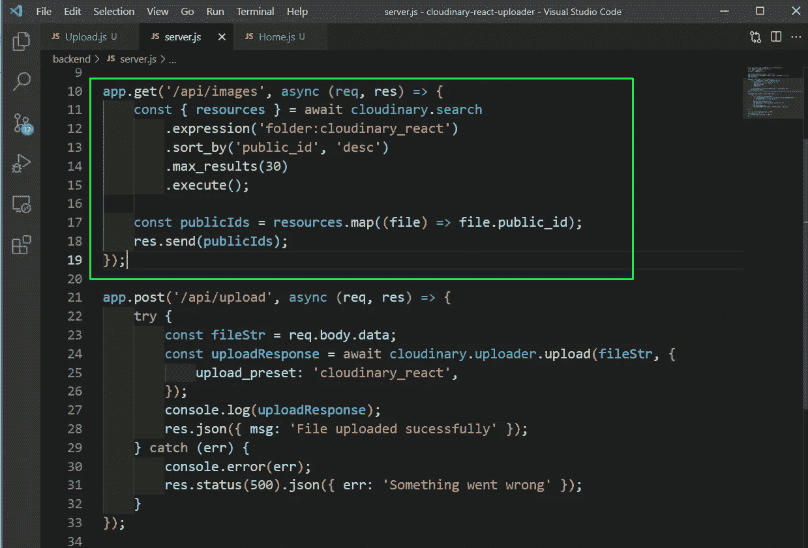

server.js

现在，我已经从前端添加了一些图像，现在如果我们去[http://localhost:3001/API/images](http://localhost:3001/api/images)端点，我们将获得我们所有的图像。

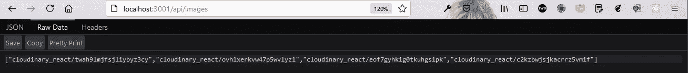

All images

现在，在前端文件夹中用下面的命令安装 cloudinary 的包。

```
npm i cloudinary-react
```

接下来，在 **Home.js** 文件中更新以下内容。在这里，我们首先进行所需的导入。之后，我们从 useEffect 调用一个 **loadImages** ()，这个函数只被调用一次。

在 **loadImages** 函数中，我们对/api/images 进行 API 调用，并将数据设置为 **imageIds** 状态。

在我们的 return 语句中，我们循环遍历 imageIds 数组，并使用来自 cloudinary-react 的图像来显示图像。注意，我们还需要云的名称，我们再次将它保存在一个环境变量中。

```
import React, { useEffect, useState } from 'react';
import { Image } from 'cloudinary-react';export default function Home() {
    const [imageIds, setImageIds] = useState();
    const loadImages = async () => {
        try {
            const res = await fetch('/api/images');
            const data = await res.json();
            setImageIds(data);
        } catch (err) {
            console.error(err);
        }
    };useEffect(() => {
        loadImages();
    }, []);return (
        <div>
            <h1 className="title">Cloudinary Gallery</h1>
            <div className="gallery">
                {imageIds &&
                    imageIds.map((imageId, index) => (
                        <Image
                            key={index}
                            cloudName={process.env.REACT_APP_CLOUDINARY_NAME}
                            publicId={imageId}
                            width="300"
                            height="200"
                            crop="scale"
                        />
                    ))}
            </div>
        </div>
    );
}
```

接下来，创建一个**。env** 文件放在**前端**文件夹中，并将我们的云名添加到其中。

```
REACT_APP_CLOUDINARY_NAME=dxxxxxxxo
```

我们也将它包含在**中。gitignore** 文件。

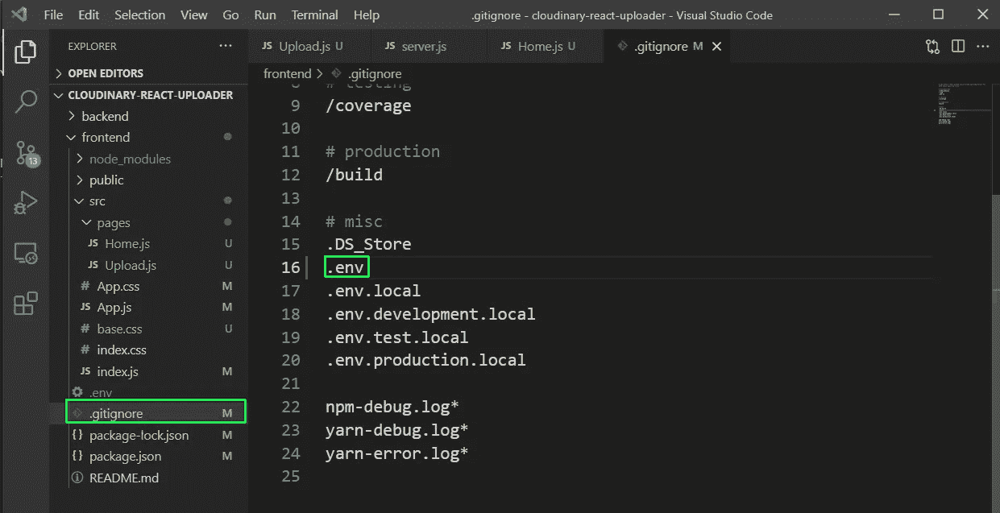

.gitignore

我也忘了创建一个**。后端文件夹中的 gitignore** 。因此，创建了相同的，并把我们的环境文件和 node_modules 放在其中，因为我们不想把它们推到 github。

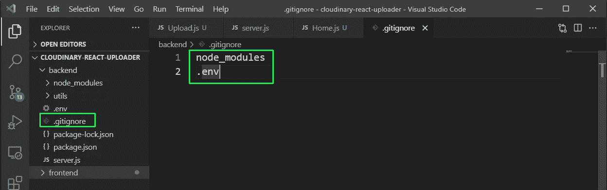

.gitignore

我们的应用程序现在已经完成，所有图像的上传和显示工作。


App complete

你可以在[这个](https://github.com/nabendu82/cloudinary-react-uploader) github 回购中找到相同的代码。