# 使用可教机器建立一个自定义图像分类 Android 应用程序(旧版本 TF 应用程序)

> 原文：<https://medium.com/geekculture/build-a-custom-image-classification-android-app-using-teachable-machine-f60b197eaa90?source=collection_archive---------2----------------------->

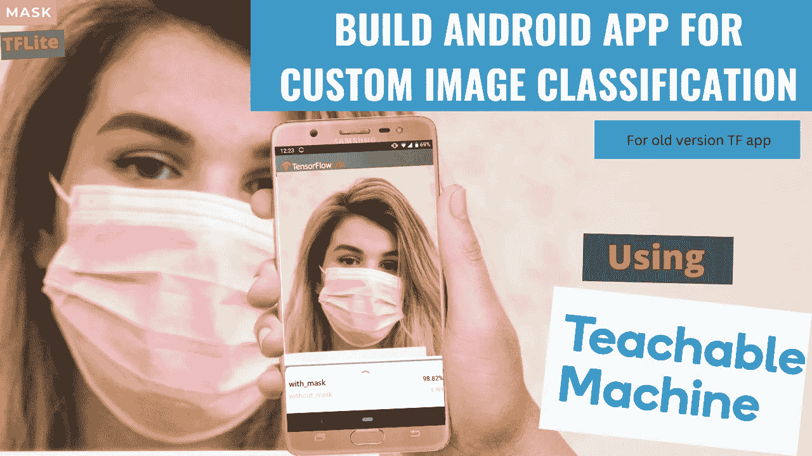

使用 Teachable Machine 训练一个用于自定义图像分类的深度学习模型，将其转换为 TFLite 模型，最后使用 TensorFlow 的 GitHub 中的样本 TFLite [图像分类 app](https://github.com/tensorflow/examples/tree/demo/lite/examples/image_classification/android) 将其部署在移动设备上。

## **重要的**

这是针对 TENSORFLOW 应用程序的旧 JAVA 版本。可以在 GITHUB 上切换到以前的版本。使用本教程中使用的 JAVA 版本参考应用程序的以下链接:

[https://github . com/tensor flow/examples/tree/demo/lite/examples/image _ classification/Android](https://github.com/tensorflow/examples/tree/demo/lite/examples/image_classification/android)

## 路标

*   ⁍收集图像数据集。
*   ⁍开放教育机械形象工程
*   ⁍训练模型。
*   ⁍对模型进行了评估。
*   ⁍出口模型
*   ⁍为 Android 创建 TFLite 模型
*   ⁍从 TensorFlow 下载样本图像分类应用程序，并根据您的自定义 TFLite 模型进行调整。

图像分类或图像识别是这样一个概念，你向设备的摄像头传感器展示一幅图像，它会告诉你该图像中存在什么，或者告诉我们它属于哪一类。

在本教程中，我将带您完成自定义图像分类，方法是在谷歌令人兴奋的在线工具的帮助下训练一个简单的深度学习模型:[teacheble machine with Google，](https://teachablemachine.withgoogle.com/)然后将模型导出到与 Android 设备兼容的 TensorFlow lite 版本。最后，我们将把这个模型部署到 Android 设备上。

# 模型

用于训练我们的定制图像分类器的训练平台是带有 google 的[teacheble machine](https://teachablemachine.withgoogle.com/)。这是一个令人兴奋的平台，只需点击几下鼠标即可学习深度学习培训流程。首先，从你的系统上传不同种类的物体，或者使用网络摄像头，然后训练它。最后，经过训练，您可以导出您选择的模型。你可以选择任何你想要的格式并下载模型。我正在训练一个面具图像分类的模型。这将在下一节提到的 5 个步骤中完成。前 3 个步骤与使用可示教机器的[列车图像分类模型](https://techzizou.com/train-a-model-for-image-classification-using-teachable-machine/)教程中的步骤相同。

1.  [**上传您的数据集**](#tm1)
2.  [**训练模型**](#tm2)
3.  [**预览模型/使用 javascript**](https://techzizou.com/wp-admin/post.php?post=441&action=edit#tm3) 测试模型
4.  [**以 TFLite 格式导出模型**](#tm4)
5.  [**下载 TFLite 模型，用您的自定义模型**](#tm5) 调整 TFLite 影像分类样本 app

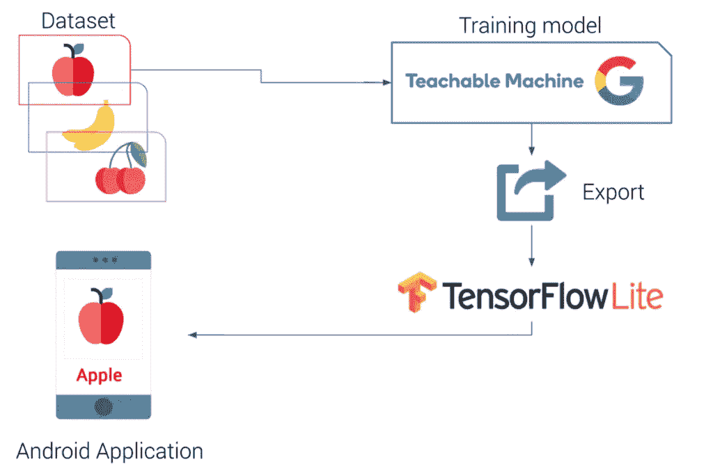

# 要求

*   不同类别的自定义对象图像数据集。
*   Android Studio 3.2 +(安装在 Linux、Mac 或 Windows 机器上)
*   处于[开发者模式](https://developer.android.com/studio/debug/dev-options)的 Android 设备启用了 USB 调试
*   USB 线(将 Android 设备连接到您的电脑)

# 我们开始吧！！

(但首先✅Subscribe 到我的 YouTube 频道👉🏻[https://bit.ly/3Ap3sdi](https://bit.ly/3Ap3sdi)😁😜)

**目标**:使用可教机器建立一个定制的图像分类 android 应用。

## 首先，进入[可示教机器](https://teachablemachine.withgoogle.com/)站点。

## 注意:TeachableMachine 目前仅支持 MobileNet 型号。

点击主页上的“开始”并选择“图像项目”。您也可以使用 google drive 登录以保存您的模型文件，否则如果您关闭选项卡或刷新页面，您将会丢失所有图像和模型文件。

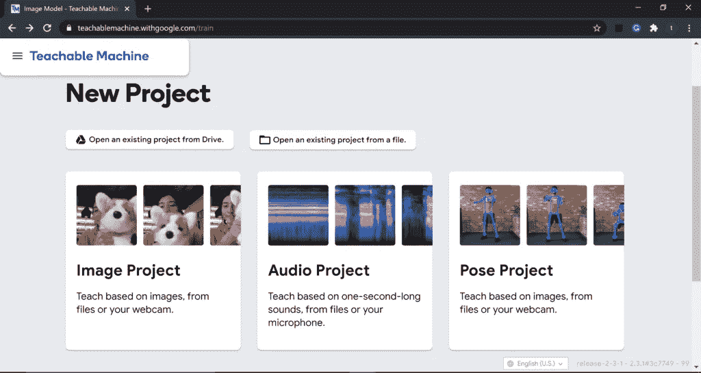

# 第一步。上传数据集

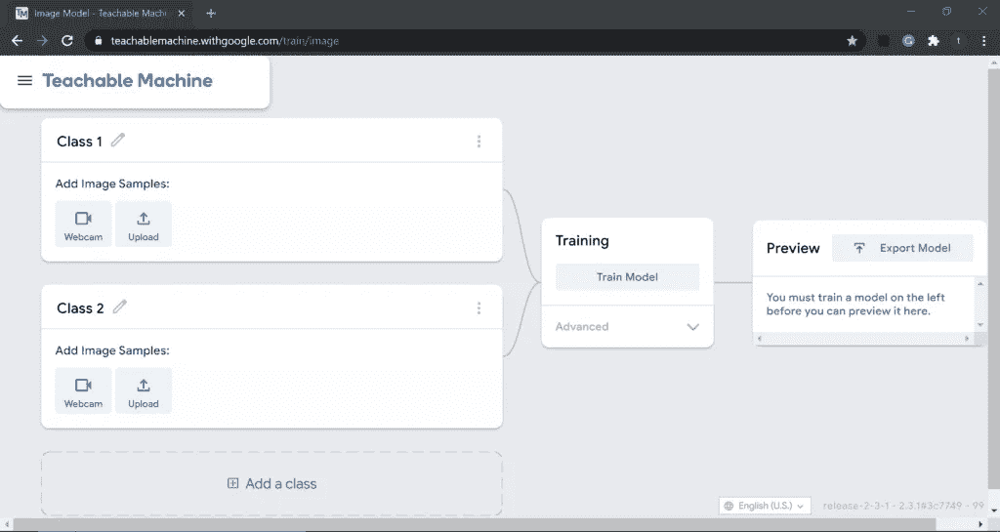

创建数据集并上传至[可示教机器](https://teachablemachine.withgoogle.com/)，并相应定义类别名称。我正在用 2 个类训练一个面具图像分类模型，即。、**带 _ 面具**&**不带 _ 面具**。

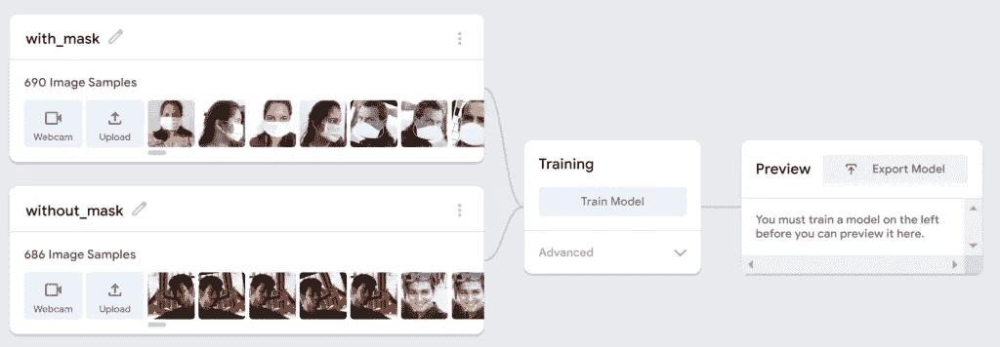

# 步骤 2)训练图像分类模型

在训练期间，您可以调整**超参数**，如下所示:

*   纪元数量
*   批量
*   学习率

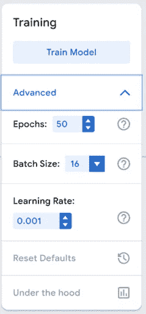

设置超参数值后，点击列车模型。这个过程需要一段时间，取决于图像和时期的数量。

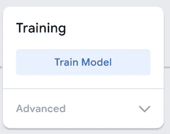

**重要提示:**在训练过程中，不要切换标签，因为这会停止训练过程。


# 步骤 3)预览你训练好的模型或者使用 javascript 测试模型

训练结束后，您可以在预览窗口中预览已训练的模型。您可以上传图片进行测试，也可以使用网络摄像头进行测试。请参见下面的“预览”测试结果。

## 使用网络摄像头


## 使用图像


您还可以使用 javascript 测试模型。

您可以使用 javascript 格式将您的模型用于基于浏览器的项目。


首先，点击**导出模型**。接下来，进入 **Tensorflow.js** 选项卡，点击**上传我的模型**。当你上传你的模型时，Teachable Machine 会把它放在给定的可共享链接上免费下载。如果您希望任何人使用您的模型，您可以与他们共享该链接——任何拥有该链接的人都可以在他们的项目中使用您的模型。请注意，您的模型已经发布到 Google 服务器上，但是您用来制作模型的示例却没有。只是你的模型——预测你展示的是哪个类的数学程序。

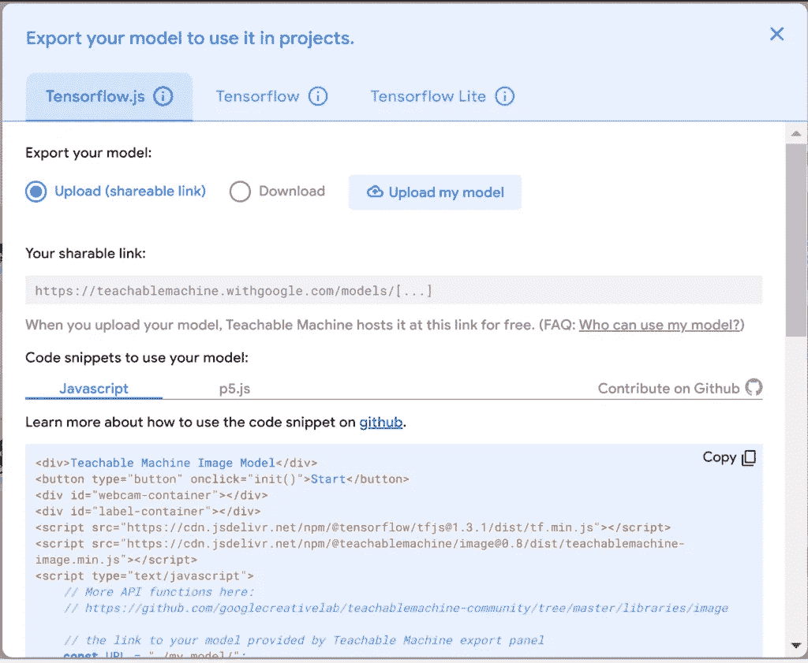

您将看到 Javascript 代码片段，其中写有您的模型的链接。您可以使用这段代码在浏览器上测试您的模型。

您也可以使用 **p5.js web 编辑器**工具在线测试您的模型。web 编辑器为 ***p5* 。js** 是一个 JavaScript 库，目标是让艺术家、设计师、教育工作者和初学者能够使用编码。要将它用于您定制的模型，选择 **p5.js** 代码片段选项卡并复制代码。接下来，点击下图所示的 **p5.js Web 编辑器**链接。

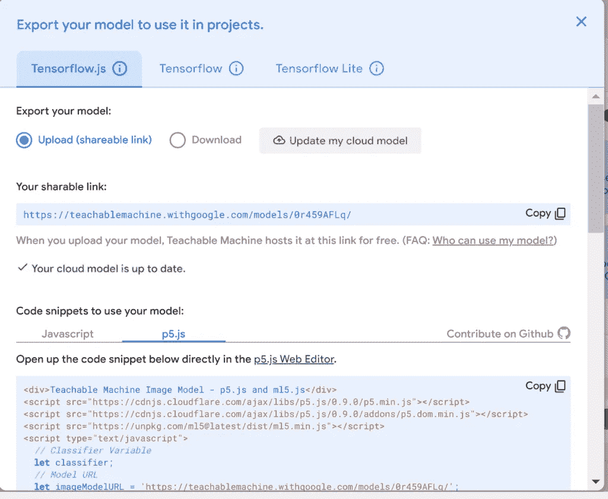

打开 p5.js web 编辑器工具后，您将会在那里找到白天和夜间分类的默认代码。删除整个旧代码，粘贴从定制模型的 p5.js 代码片段中复制的新代码，然后按 play。现在，您可以使用 p5.js web 编辑器工具测试您的模型。

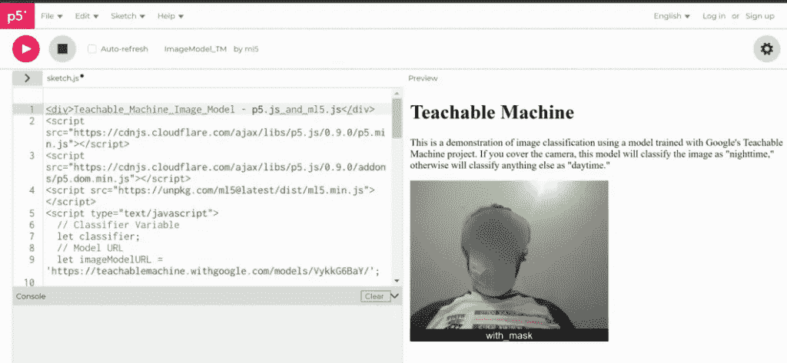

# 步骤 4)以 TFLite 格式导出模型

最后，将模型以 TensorFlow lite 格式导出，部署到移动设备上。

点击**导出模型**并选择 **TensorFlow Lite** 选项卡。接下来，选择您想要的模型格式。您可以下载 TFLite 的量化和浮点文件格式。

**注:可示教机器目前仅支持 MobileNet 模型架构。**

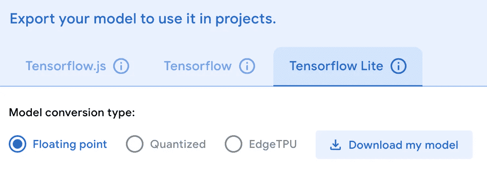

的。tflite 文件应该放在 android 项目目录的 asset 文件夹中，并在相应读取它的 java 文件中更改名称(参见步骤 5)

# 步骤 5)下载 TFLite 模型，并根据您的自定义模型调整 TFLite 影像分类示例应用程序

(使用 Android Studio 构建应用程序，如下文链接所述:

[https://github . com/tensor flow/examples/blob/demo/lite/examples/image _ classification/Android/readme . MD](https://github.com/tensorflow/examples/blob/master/lite/examples/image_classification/android/README.md)

*   ⦿从[这里](https://github.com/tensorflow/examples/tree/demo)下载我在本教程中使用的旧 TensorFlow Lite 示例存档，并将其解压缩。你会在里面找到 ***图像分类*** app。

***示例-demo \ lite \ examples \ image _ 分类***

*   ⦿接下来，复制你的 **TFLite 模型**和 **labels.txt** 文件在图像分类安卓 app 的 ***assets*** 文件夹里。

***示例-demo \ lite \ examples \ image _ class ification \ Android \ models \ src \ main \ assets***

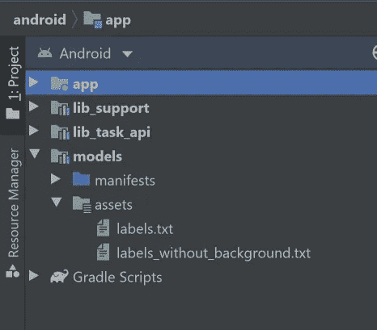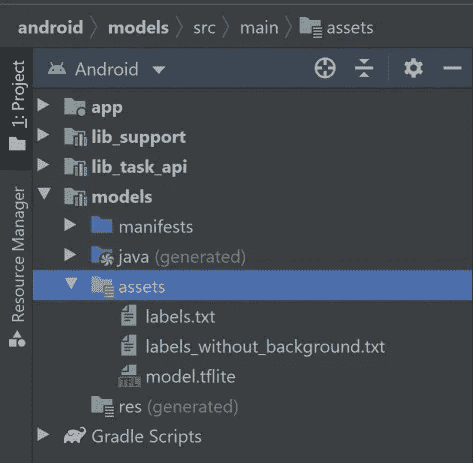

# 在实施解决方案(任务库和支持库)之间切换

这个图像分类 Android 参考应用程序演示了两种实现方案:

(1) `[lib_task_api](https://github.com/tensorflow/examples/tree/master/lite/examples/image_classification/android/lib_task_api)`利用来自 [TensorFlow Lite 任务库](https://www.tensorflow.org/lite/inference_with_metadata/task_library/image_classifier)的现成 API

(2) `[lib_support](https://github.com/tensorflow/examples/tree/master/lite/examples/image_classification/android/lib_support)`使用 [TensorFlow Lite 支持库](https://www.tensorflow.org/lite/inference_with_metadata/lite_support)创建自定义推理管道。

在 **Android Studio** 中，你可以将构建版本更改为你想要构建和运行的版本——只需进入`Build > Select Build Variant`并从下拉菜单中选择一个即可(如下图所示)。更多详情请参见[在 Android Studio](https://developer.android.com/studio/build/build-variants#product-flavors) 中配置产品口味。

***注意*** *:如果你只是单纯的想让开箱即用的 API 运行 app，推荐的选项是* `***lib_task_api***` *进行推理。如果你想定制你自己的模型并控制输入和输出的细节，使用* `***lib_support***` *修改你的模型输入和输出可能会更容易。*

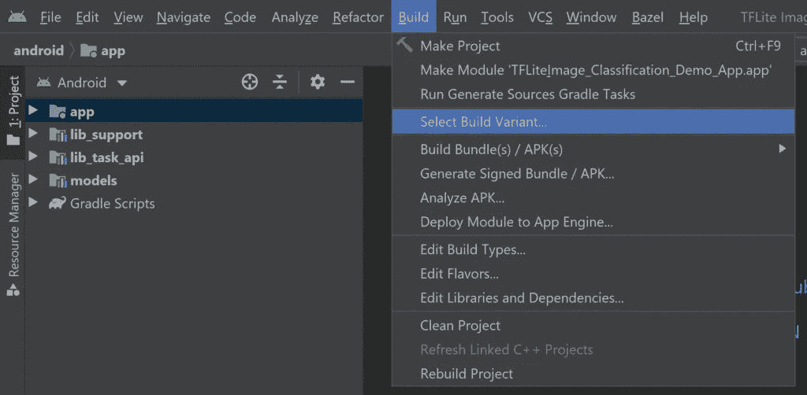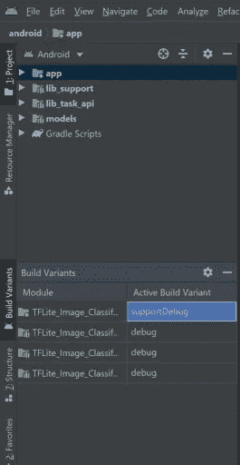

# 重要事项:

**默认实现是“lib _ task _ API”**。对于初学者，你可以选择“lib_support”实现，因为它不需要任何元数据，而 lib_task_api 实现需要元数据。 **如果你使用的是 lib_task_api，你可以使用我们下载的图像分类 Android 应用内的 *metadata* 文件夹中的脚本来创建元数据。您需要为它安装某些包，如 *requirements.txt* 文件中所提到的，还需要根据您的需求调整模型信息及其描述。使用下面链接中的命令为其创建元数据。**

*   [https://www . tensor flow . org/lite/convert/metadata # image _ classification](https://www.tensorflow.org/lite/convert/metadata#image_classification)

## 您也可以使用下面的 colab 笔记本来创建元数据:

*   [https://colab . research . Google . com/drive/15 bxifwyglujesf _ ubyklqp 6 ia 9 tpj x23？usp =共享](https://colab.research.google.com/drive/15bXIFWYGlujeSF_UBYkLqP6ia9TpJx23?usp=sharing)

此外，请查看以下 2 个链接，了解有关图像分类器元数据的更多信息。

*   [https://www.tensorflow.org/lite/convert/metadata](https://www.tensorflow.org/lite/convert/metadata)
*   [https://www . tensor flow . org/lite/convert/metadata _ writer _ tutorial # image _ classifiers](https://www.tensorflow.org/lite/convert/metadata_writer_tutorial#image_classifiers)

# ⦿注: `I am using the lib_support implementation here which requires no metadata.`

# ⦿接下来，对代码进行如下修改。

*   编辑梯度构建模块文件。打开“ **build.gradle** ”文件***$ TF _ EXAMPLES/EXAMPLES-demo/lite/EXAMPLES/image _ classification/Android/app/build . gradle***注释掉中的行**apply:'**download _ model . gradle**'，该行下载默认的图像分类应用的 TFLite 模型并覆盖您的资产。**

```
// apply from:'download_model.gradle'
```

*   选择`Build -> Make Project`并检查项目是否成功构建。您需要在设置中配置 Android SDK。您至少需要 SDK 版本 23。这个`build.gradle`文件会提示你下载任何缺失的库。
*   接下来，给出您的 TFLite 型号`**model.tflite & model_quant.tflite**`和标签文件`**labels.txt**`的路径。为此，在一个文本编辑器或 Android Studio 本身中打开`***ClassifierFloatMobileNet.java***`***&***`***ClassifierQuantizedMobileNet.java***`*文件，找到 **getModelPath()** 的定义。验证它指向它们各自的 TFLite 模型(在我的例子中是**model . TF lite**&**model _ quant . TF lite**)。接下来，验证标签 **getLabelPath()** 的路径指向您的标签文件“ **labels.txt** ”。(上面两个用于 lib_support 实现的 java 文件在下面的路径`***../image_classification/android/lib_support/src/main/java/org/tensorflow/lite/examples/classification/tflite/***`中)*
*   *如果您也有 EfficientNet 的量化 TFLite 模型和浮点 TFLite 模型，我们可以执行与上述相同的步骤，并将所有分类器中的 **getModelPath()** 和 **getLabelPath()** 设置为指向各自的模型。请注意，您需要拥有自定义数据集的所有 4 种类型的模型来运行应用程序，否则将会出现错误。然而，在本教程中，由于我只演示了 MobileNet 的浮点量化模型，因此我将删除 Android Studio 中其他 2 个 EfficientNet 分类器的用法和所有引用。*
*   *我还对代码进行了一些其他更改，因为我只使用了 2 个类别，样本图像分类应用程序中显示的默认类别数为 3，所以我根据自己的要求进行了调整。我已经在 2 节课上分享了我的定制 Android 应用程序。你可以在这篇文章的底部找到链接。*
*   *最后，将 Android 设备连接到计算机，并确保批准手机上出现的任何 ADB 权限提示。选择`Run -> Run app.`在进行任何其他新更改或添加更多功能之前测试您的应用。现在，您已经使用 Teachable Machine 制作了一个基本的图像分类应用程序，您可以尝试对您的 TFLite 模型进行更改，或者对应用程序**进行任何自定义。玩得开心！***

# ***阅读这些 TensorFlow 图像分类应用 GitHub 自述文件，并探索旧 java 版本的代码页以了解更多信息- >***

*   *[**TensorFlow Lite 图像分类 Android 实例应用/自述**](https://github.com/tensorflow/examples/blob/demo/lite/examples/image_classification/android/README.md)*
*   *[**TensorFlow Lite Android 图像分类示例/Explore_the_code**](https://github.com/tensorflow/examples/blob/demo/lite/examples/image_classification/android/EXPLORE_THE_CODE.md)*

# *掩膜数据集*

*[般若 Github](https://github.com/prajnasb/observations)*

# *看看我在 Youtube 上的视频吧！*

# *信用*

## *文件/参考资料*

*   *▸ [张量流简介](https://github.com/tensorflow/tensorflow)*
*   *υ[tensor flow 模型 Git 库](https://github.com/tensorflow/models)*
*   *▸ [TensorFlow 2 分类模型动物园](https://github.com/tensorflow/models/blob/master/research/object_detection/g3doc/tf2_classification_zoo.md)*
*   *[TensorFlow Lite 示例应用](https://github.com/techzizou/examples/tree/master/lite)*
*   *υ[tensor flow Lite 图像分类 Android 示例应用](https://github.com/tensorflow/examples/blob/master/lite/examples/image_classification/android/README.md)*
*   *▸ [Tensorflow 教程](https://www.tensorflow.org/tutorials)*
*   *集成图像分类器*
*   *υ[向 TensorFlow Lite 模型添加元数据](https://www.tensorflow.org/lite/convert/metadata)*
*   *υ[tensor flow Lite 元数据编写器 API](https://www.tensorflow.org/lite/convert/metadata_writer_tutorial#image_classifiers)*
*   *[创建元数据命令](https://www.tensorflow.org/lite/convert/metadata#image_classification)*
*   *υ[tensor flow Lite 图像分类 Android 示例应用/自述](https://github.com/tensorflow/examples/blob/demo/lite/examples/image_classification/android/README.md)*
*   *υ[tensor flow Lite Android 图像分类示例/Explore_the_code](https://github.com/tensorflow/examples/blob/demo/lite/examples/image_classification/android/EXPLORE_THE_CODE.md)*

# *♕·特奇佐·♕*