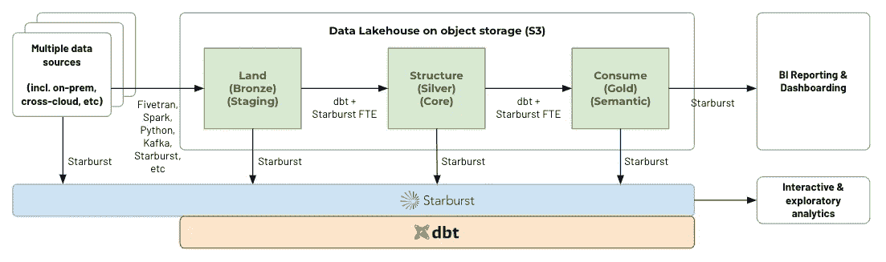
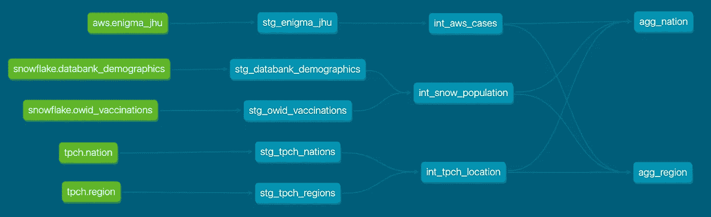
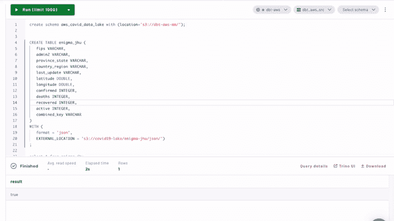
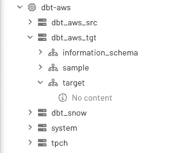
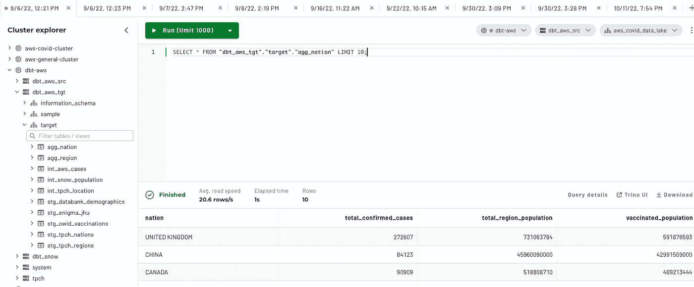
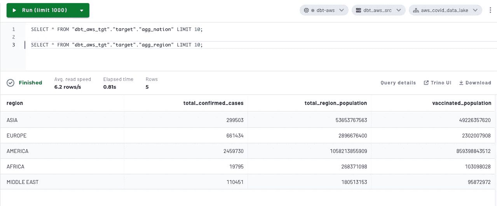
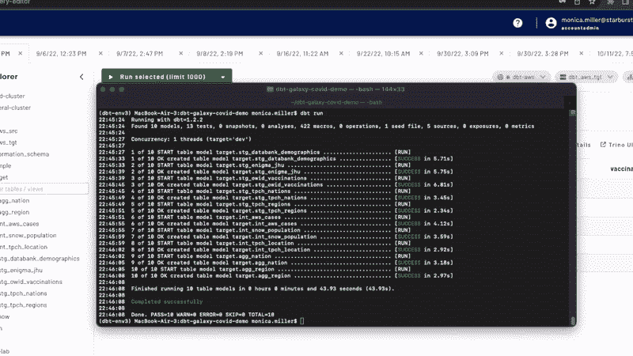

# 用 dbt 和 Starburst Galaxy 构建一个数据仓库报告结构

> 原文：<https://medium.com/geekculture/build-a-data-lakehouse-reporting-structure-with-dbt-and-starburst-galaxy-9223ca413d56?source=collection_archive---------5----------------------->

## 将多个数据源组合到一个 dbt 项目中

自从我第一次介绍 dbt 以来，至少可以说我很感兴趣。作为一名数据工程师，我试图在没有任何真正的版本控制方法的情况下管理复杂而全面的数据管道，并担心输出的数据质量。我们针对这些挑战开发的解决方案都无法与复杂的软件原理相提并论，一旦我们采用 dbt，我们就可以将这些软件原理集成到我们现有的数据生态系统中。我有一颗怀疑者的灵魂，在我的整个一生中，我一直避免追随任何潮流，直到我觉得这种宣传是合理的——特别是当它需要花费数小时的时间来重写已经存在的(某种程度上)正常运行的代码时。自然地，我坚信 dbt 实际上必须赢得它正在接受的炒作，在我自己进行了试验，当然也尝试了心爱的 jaffle 商店介绍后，我完全投入了。

有一个问题。我们的数据分散在多个存储位置，因此不可能在我们的管道中实际使用 dbt，直到我们执行了大量耗时的数据迁移，将所有数据重新定位到一个集中的位置。相信你对创建一个集中位置来存储你的所有数据的策略的看法，我个人认为在当前的数据环境下，单一来源的事实似乎有点不现实。然而，我们制定了一个为期两年的计划，将大部分数据迁移到一个存储位置。概括地说，我从一个怀疑的愤世嫉俗者转变为一个福音传播者，我相信这是现代数据工程师新标准的开端，但我需要等待 9-12 个月才能开始旅程。

## dbt + Trino

我花了六个月的时间，但我终于报仇了。我现在是一个新解决方案的传播者: **dbt + Trino** 一起。这个激情项目对我来说是非常私人的，因为上面向你揭示的原因，我现在已经能够成功地将多个来源联合在一起。我从 S3、雪花和 TCP-H 数据集来源构建模型，并将每个新的冰山表放在 S3，以构建一个[数据湖库](https://www.starburst.io/learn/data-fundamentals/data-lakehouse/)报告结构。我选择了 Starburst Galaxy，因为这是现在使用 Trino 最快、最简单的方式。

将 Starburst Galaxy 与 dbt 集成在一起，建立了两个改变游戏规则的用例来实现新功能:

1.  *访问尚未或无法添加到您的* [*数据湖*](https://www.starburst.io/learn/data-fundamentals/data-lake/) *或数据仓库*中的新数据源。如果没有 Trino/Starburst Galaxy，dbt 将无法访问尚未到达您的集中式数据位置的数据源，这将导致不完整的数据分析和较低质量的洞察。
2.  *使用中的多个数据平台无法相互连接。*如果您在一个数据平台中配置 AI/ML 工作负载，而在另一个平台中配置 BI/报告工作负载，则两者无法相互通信。

这个例子将处理第一个用例，我们从驻留在多个存储位置的多个不同的源创建一个开放的数据湖库架构。

## 体系结构

受 Jeremy Cohen 的 [Cinco de Trino demo](https://github.com/dbt-labs/trino-dbt-tpch-demo) 的启发，本教程的目标是展示一起实现 dbt+starbrust Galaxy 以创建数据湖库的能力。更多关于星爆数据湖的信息，请访问这个[博客](https://www.starburst.io/blog/part-2-of-current-data-patterns-blog-series-data-lakehouse/)。在本例中，我们将使用 Iceberg 开放式表格格式在 S3 构建我们的 lakehouse 报告结构，并使用与传统土地、结构和消费命名法略有不同的命名约定，以适应 dbt 标准。

**湖畔小屋建筑关键字:**

*   土地=分期付款
*   结构=中间
*   消费=聚合

data lakehouse architecture diagram

**来源:**

*   自动气象站新冠肺炎数据湖
*   雪花公共 COVID19 数据库
*   TPC-H 标准数据集

为什么我们要使用这么多的数据源？对于这个数据湖屋教程，我们将带您经历创建报告结构的所有步骤，包括将您的来源收集到您在 S3 的土地图层中。由于 dbt 专门用作转换工具，并且只能在数据存储在一个存储解决方案中后使用，Starburst Galaxy 的 dbt 超级能力是能够将来自多个不同来源的数据联合到一个 dbt 存储库中。

**血统图:**

谱系图展示了这个项目中的所有模型。每个源都以绿色突出显示，并以其来源的数据位置为序，将在此基础上使用 Iceberg 创建我们在 S3 的三个数据湖库层。您应该注意到上面显示的理想体系结构图和结果数据谱系图之间几乎相同的结构，结果数据谱系图显示了贯穿报告结构每一层的模型。

data lineage model from sources to targets

出于一致性的考虑，在我的中间模型中，我只做了同构源系统之间的连接。由于我的两个聚合模型遵循相同的逻辑结构，只是在不同的汇总粒度上，一个按国家，一个按地区，我认为最好在最终的聚合输出之前保持源的组织性。我很欣赏项目存储库本身的灵活性，因为每个项目都有不同的约束，通过拥有这种能力，我能够以最适合我的环境的方式构建我的存储库。

## 教程信息

本教程的美妙之处在于，我已经为您预先构建了所有模型。通过这种方式，您可以快速地将自己暴露在一个工作示例中，然后尝试在一个已经开发的项目结构中为自己构建一个新的模型。从头开始任何一个新项目都可能让人不知所措，即使已经为你做好了说明。我的希望是，这种类型的教程可以让你很快认识到为什么将这两种技术结合在一起是如此酷，并希望鼓励你自己在这个项目结构中进行实验。我在本节中添加了教程步骤的高级概述，可用于补充[存储库自述文件指令](https://github.com/monimiller/dbt-galaxy-covid-demo)。

## 先决条件

完成本教程需要以下先决条件:

*   注册一个[星爆银河账号](https://galaxy.starburst.io/login)。星爆星系将成为我们的查询引擎。
*   [AWS 账户凭证](https://aws.amazon.com/free/?trk=78b916d7-7c94-4cab-98d9-0ce5e648dd5f&sc_channel=ps&s_kwcid=AL!4422!3!438195700988!p!!g!!aws%20account&ef_id=CjwKCAjw-rOaBhA9EiwAUkLV4n1w2sHgB3eVU2KABaLYLU5rub27xX8G1PaTLKsVSWnJCqNGTYpHUxoCzTYQAvD_BwE:G:s&s_kwcid=AL!4422!3!438195700988!p!!g!!aws%20account&all-free-tier.sort-by=item.additionalFields.SortRank&all-free-tier.sort-order=asc&awsf.Free%20Tier%20Types=*all&awsf.Free%20Tier%20Categories=*all)。S3 将充当源和目标，因为我们正在实施数据湖库架构。
*   [雪花账户凭证](https://signup.snowflake.com/)。您不需要雪花源来查看值，但是当前教程设置为合并来自公共 COVID19 雪花数据库的表。
*   您选择的 dbt 安装。我在我的 M1 mac 电脑上使用了虚拟环境，因为这是最值得推荐的。我将在这个自述文件中添加以下步骤。查看其他 [dbt 核心安装信息](https://docs.getdbt.com/dbt-cli/install/overview)，选择最适合您的信息。

## AWS 入门

在俄亥俄州地区(us-east-2)创建一个新的 S3 存储桶，使用一些独特的命名约定，例如**dbt-AWS-<username>**(例如:dbt-aws-monica)。您必须指定此区域，因为这是 AWS 新冠肺炎公共数据湖所在的地方。S3 存储桶将存储从新冠肺炎数据湖获取的源数据，同时还充当数据湖库的目标存储解决方案。每一个目的都将通过在星爆星系中创建单独的星表而与其他目的分开。接下来，[创建一个 AWS 访问密钥](https://docs.starburst.io/starburst-galaxy/security/external-aws.html)，它可以验证 S3 和星爆星系之间的连接。

## 星爆银河入门

在这部分完成后，你将在星爆星系中有三个星表和一个星团。

首先，用上面创建的凭证创建一个 S3 配置单元目录。将目录命名为 **dbt_aws_src。**这是您将从公共 AWS 新冠肺炎数据湖创建源表的位置。接下来，创建一个名为 **dbt-aws** 的集群。附加已经为您配置好的 **dbt_aws_src** 目录以及 **tpch** 目录。然后，创建另一个名为 **dbt_aws_tgt** 的 S3 目录，但这次使用开放表格格式 Iceberg。将该目录也添加到现有的 **dbt-aws** 集群中。

在我们的三个源系统中，您需要自己配置的唯一源表是来自 AWS 新冠肺炎数据湖的 enigma 表。按照[星爆星系数据湖教程](https://docs.starburst.io/starburst-galaxy/tutorials/query-data-lake.html)在现有的 S3 源目录中创建这个 **enigma_jhu** 表。

1.  配置基于角色的访问控制两个对象存储位置。

—公众 AWS 新冠肺炎数据湖: **s3://covid19-lake/***

**—** 您新创建的 S3 桶: **s3://dbt-aws- <用户名> /***

2.使用之前创建的对象位置在源目录中创建一个模式。

3.创建 enigma_jhu 表。

create the enigma_jhu table

现在，您应该能够在集群中看到三个目录。

## 雪花入门

[按照说明](https://docs.starburst.io/starburst-galaxy/catalogs/snowflake.html)从您的雪花凭证创建和配置雪花目录。连接到 COVID19 数据库，并为您的目录指定一个描述性名称，如 **dbt-snow** 。将此目录连接到现有的 **dbt-aws** 集群。

完成此步骤后，您应该有四个目录连接到一个集群。

## dbt 入门

安装 **dbt-trino** 适配器插件，可以让你将 dbt 与 trino 和 Starburst Galaxy 一起使用。您可能想在 python 虚拟环境中这样做。有关安装 dbt 的更多说明，请访问项目资源库或其他有用的链接。

*   [用 pip](https://docs.getdbt.com/docs/get-started/pip-install) dbt 指令安装
*   [星爆文档](https://docs.starburst.io/data-consumer/clients/dbt.html)详述了如何安装 dbt-trino 并创建一个虚拟环境

安装 dbt 后，克隆 [Github 库](https://github.com/monimiller/dbt-galaxy-covid-demo)。正确配置你的 **~/。dbt/profiles.yml** 文件，其中包含连接星爆星系所需的准确信息。将目录指定为 **dbt_aws_tgt** ，并输入一个有意义的模式名，如 **target。**这个模式是您的模型将被创建的地方。

运行适当的验证来验证 dbt 和星爆星系之间的连接。

1.  dbt 调试
2.  dbt deps

## 创建您的模型

在您的连接被验证之后，但是在您使用 **dbt run** 创建您的模型之前，您应该会看到一个类似的集群浏览器，如下所示。所有的源都可以被查询，但是目标表还没有被创建。

执行 dbt run 命令，并观察模型的执行。

现在，整个数据仓库的所有模型都已经创建并执行完毕。您可以单独查询每个表，并探索每个报告结构层，它们共同创建两个最终的汇总报告。

查看最终汇总的国家和地区报告。

针对每个模型执行测试。然后，创建您自己的测试。最后，尝试一些其他的 dbt 命令，从存储库中的模型创建文档。

## 结束营业的时间

我希望这能让您更清楚地了解在数据领域结合我最喜欢的两种技术所带来的好处。[用](https://github.com/monimiller/dbt-galaxy-covid-demo)[星爆银河](https://galaxy.starburst.io/login)亲自试试这个教程，让我知道你的想法。