# 构建一个 Flutter Android 应用程序，并使用 Bitrise CI/CD 平台将其部署到 Google Play

> 原文：<https://medium.com/geekculture/build-a-flutter-android-app-and-deploy-it-to-google-play-using-bitrise-ci-cd-platform-68de0612ede?source=collection_archive---------7----------------------->

在我的[上一篇文章](https://i-kurochka.medium.com/build-a-flutter-ios-app-and-deploy-it-to-testflight-using-bitrise-ci-cd-platform-dc1eef5f253a)中，我描述了什么是 [Bitrise](https://bitrise.io) 以及如何使用它来构建一个基于 Flutter 的 iOS 应用程序，并将其上传到 Appstore/Testflight。

现在是时候弄清楚如何为 Android 做同样的事情了。

老实说，Android 的过程似乎更容易(对我来说)和简单，尽管它非常类似于 iOS。

所以过程是:

1.  构建应用程序
2.  签署二进制文件(aab 或 apk)
3.  将签名的二进制文件上传到 Google Play 控制台
4.  将构建推向发布轨道(即内部、封闭测试、开放测试或公开发布)

# 构建应用程序

因为我已经在我的上一篇文章[中描述了创建 Bitrise 应用程序和构建 Flutter 应用程序的过程，所以在这篇文章中我就不深入讨论了。](https://i-kurochka.medium.com/build-a-flutter-ios-app-and-deploy-it-to-testflight-using-bitrise-ci-cd-platform-dc1eef5f253a)

唯一改变的是，在“Flutter Build”步骤中，您将“Platform”参数更改为“Android”(或者“both”，如果您想使用相同的管道交付给两个平台的话)

一旦你到了那里，你可能想要将“Android 平台配置”部分中的“Android 输出工件类型”更改为“appbundle”，因为从 2021 年 8 月开始，这种格式[将在 Google Play 市场中被要求](https://developer.android.com/guide/app-bundle)用于所有新应用。

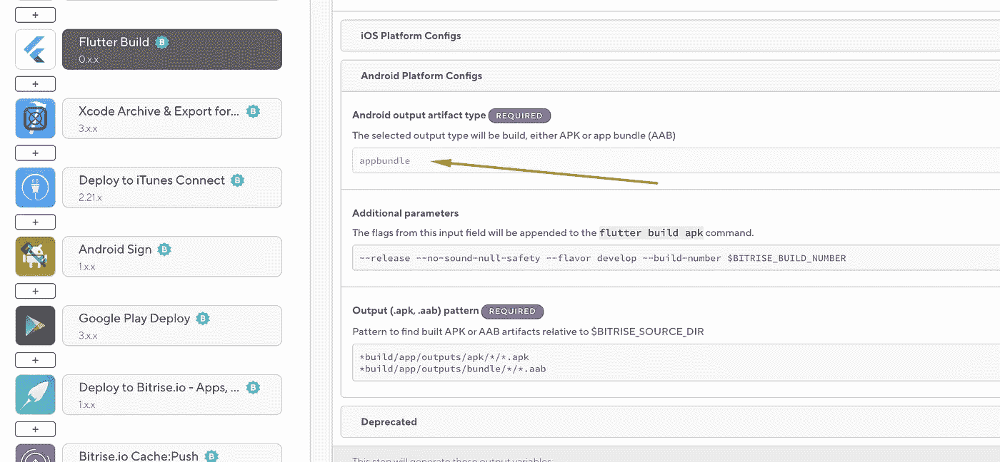

# 签署 android 版本

要为 Google Play market 签名，我们需要生成带有私钥的密钥库(keystore.jks)。这里重要的一点是，Android Studio(以及 Bitrise)使用 java OpenJDK，而不是 Oracle Java JDK，并且使用 Oracle Java OpenJDK 生成的密钥库与使用 OpenJDK 生成的密钥库不兼容。因此，为了生成我们的密钥库，我使用了 Android Studio

在 Android Studio 中打开 project/android 文件夹，等待它索引文件和软件包，并激活菜单构建中的操作。使用“构建→生成签名包/ APK”菜单

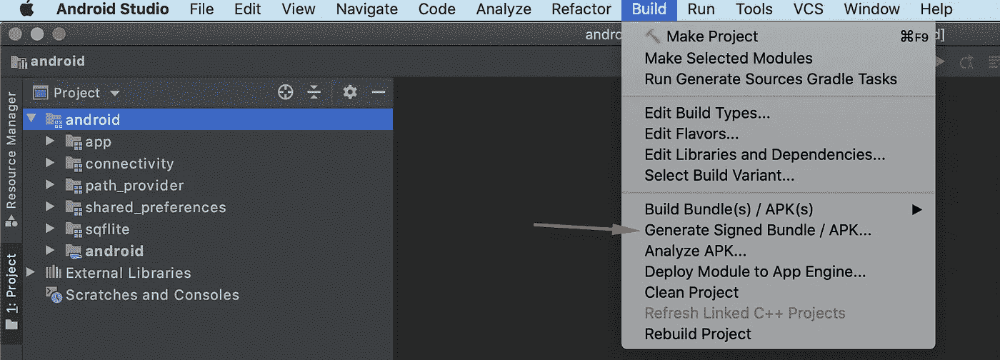

在弹出窗口中，单击“密钥存储路径”下的“新建”

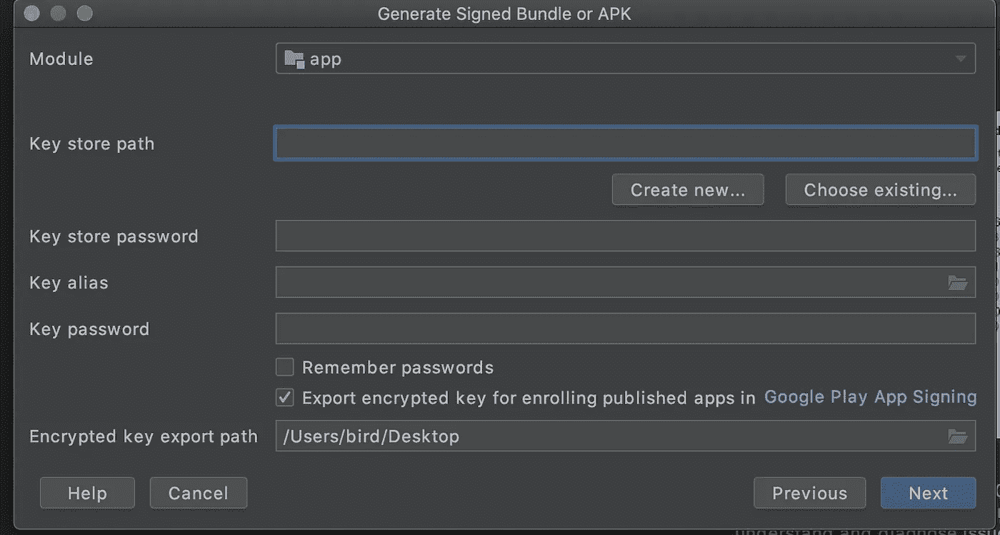

下一步，填写您的组织的详细信息、您的密钥库的密码、您的私钥的别名和密码，选择保存它的路径，最后生成您的密钥库。不要忘记在某个地方写下你选择的密码，因为你会需要它们。

重要的是要知道，用于签署上传到 Play market 的应用程序的第一个版本的密钥必须用于上传该应用程序的更新，并且在未来不能更改，所以不要丢失它，否则您将无法上传新版本。

生成密钥存储后，打开 Bitrise 应用程序并导航到工作流编辑器→代码签名选项卡。向下滚动到“ANDROID 密钥库文件”部分并上传您的文件，填写别名和密码字段。

现在，您将能够使用 Bitrise 对您的构建进行签名。在“Flutter Build”之后的某个地方添加一个新步骤，在 Bitrise steps 目录中找到“Android Sign”。要找到它，你需要将右边的过滤器切换到“全部”

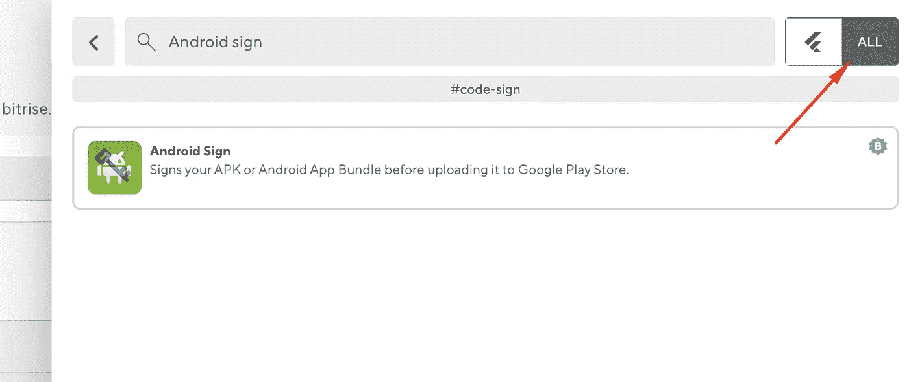

你不需要改变任何东西，默认值对我们有用。尝试运行您的工作流，看看构建阶段是否成功通过。

# 上传第一个已签名的版本以进入市场

在您可以通过 Google Play API 上传构建之前，您应该手动上传初始构建，以初始化新创建的应用程序。

在后期构建完成后，打开它的“应用和工件”部分，找到并下载你的签名*-signed.aab 文件。

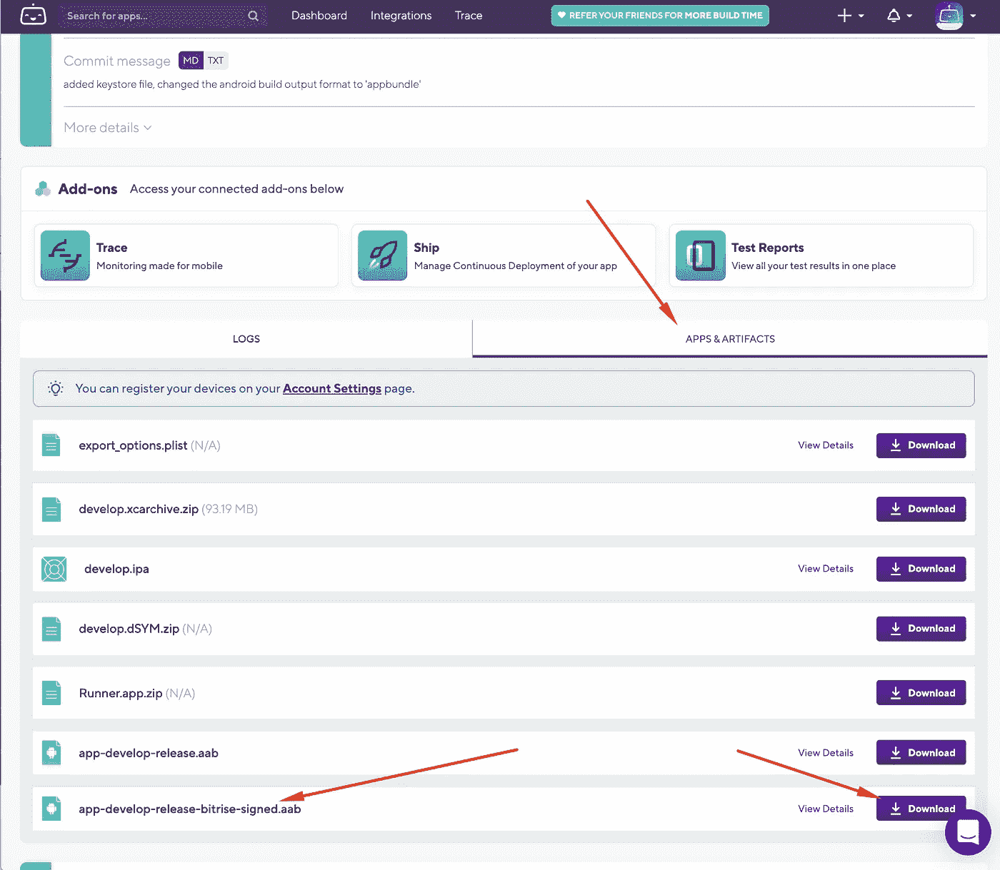

然后，转到 [Google Play 控制台](https://play.google.com/console/developers)，导航到您的应用程序的发布-封闭测试子部分，为您的内部测试人员创建、设置和展示您的第一个发布。要做到这一点，你需要填写相当多的表格，并上传应用程序的标志和一些虚拟截图。在这个阶段不要担心内容，你可以稍后编辑一切，只需在那里粘贴一些“lorem ipsum”的东西来完成设置并激活 Alpha 发布轨道。**这一步对于激活通过 API 发布后续版本的能力非常重要。**

# 配置开发人员 API 访问

要使用 Google Play API 上传构建，您需要配置开发者 API 访问权限。导航到 Google Play 控制台→设置→ API 访问并链接您的 Google Cloud 项目，可以是现有的，也可以像我一样创建一个新项目。

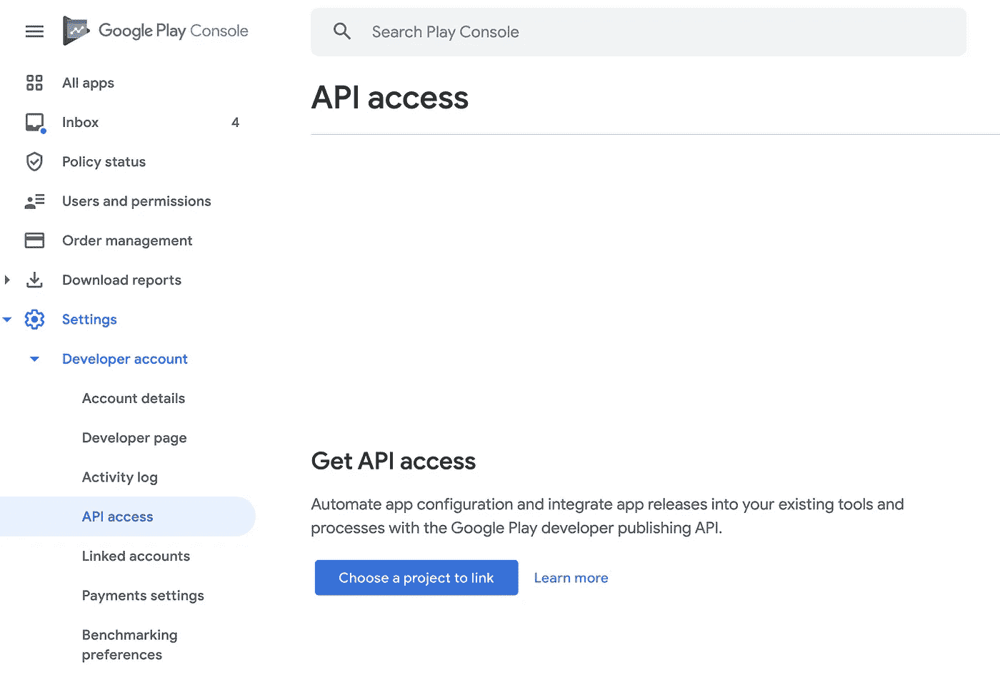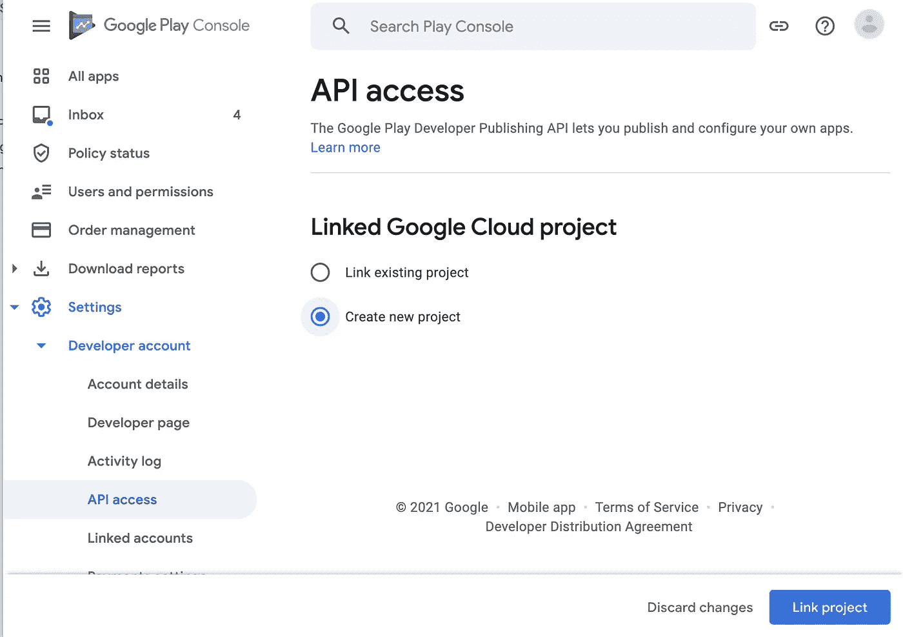

项目链接后，创建一个新的服务帐户，这个过程非常简单，不要跳过权限步骤，授予您的服务帐户访问 Google Play 控制台的权限。

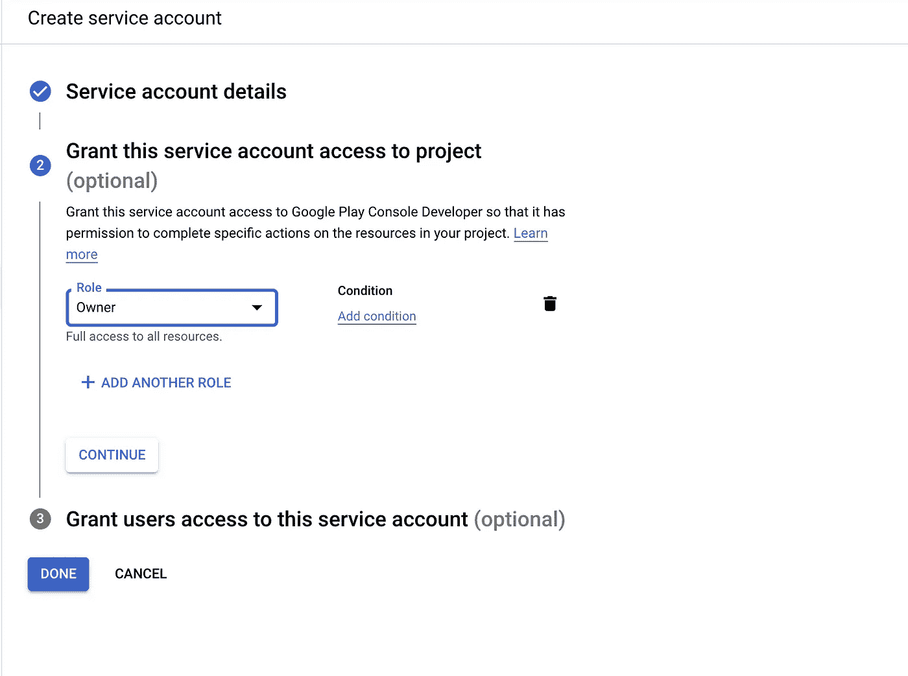

创建服务帐户后，转到它的密钥部分，生成并下载一个新密钥

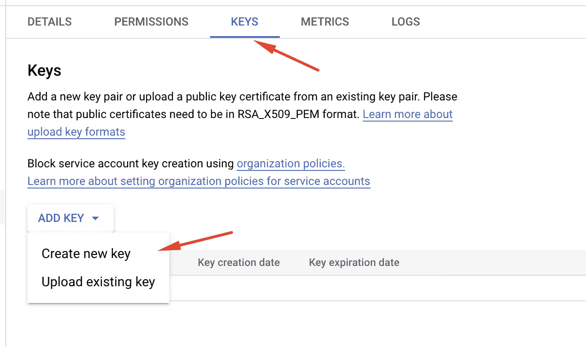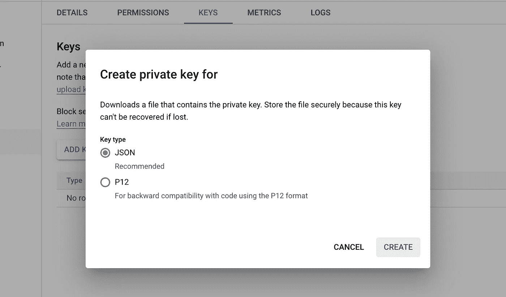

完成后，您将被导航回播放控制台 API 访问设置页面，刷新服务帐户列表后，您将在其中看到已创建的帐户。点击授权访问就完成了。

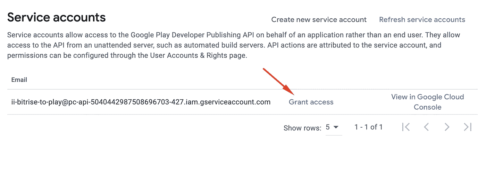

# 配置最后一步，上传

回到你的 Bitrise 应用程序的工作流程，在“Android Sign”后添加一个新步骤，并在列表中找到“Google Play Deploy”步骤。

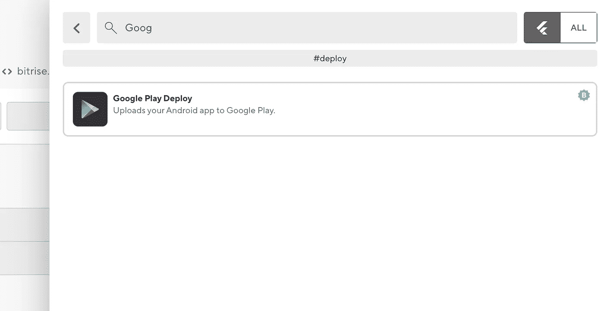

在这一步中，唯一需要配置的是我们的应用程序的“包名”(又名捆绑包 ID)和“轨道”，可以设置为您的管道所需的任何轨道(例如，alpha、beta、release 等)。我为我的开发构建使用了“内部”跟踪。

就这样，伙计们！希望这是有帮助的(在这种情况下鼓掌三次；)

# 陷阱

在这一节中，我将列出我在设置工作流程时遇到的错误和问题，以及必须解决的方法。只是为了帮助将来可能会寻找解决方案的人。

**" Java . io . io exception:Invalid keystore format "** 在我的例子中，我首先使用 Oracle Java v16 生成密钥库，它与 bitrise 正在使用的 openJDK 不兼容，我通过使用 Android Studio UI 生成密钥库解决了这个问题。

**无法验证编辑，错误:googleapi:错误 400:只能在草稿应用程序上创建状态为草稿的发布。** 当你的应用处于草稿状态时，你不能将你上传的构建推送到任何发布轨道。要解决这个问题，请手动配置和展开 Alpha 轨道。

# 资源

[https://flutter.dev/docs/deployment/android](https://flutter.dev/docs/deployment/android)

[https://medium . com/bewuzyu/part-1-how-to-setup-a-flutter-application-with-bit rise-346 DBA 7d 1 Bab](/bewizyu/part-1-how-to-setup-a-flutter-application-with-bitrise-346dba7d1bab)

[https://blog . bit rise . io/how-to-deploy-Android-app-to-Google-play-store](https://blog.bitrise.io/how-to-deploy-android-app-to-google-play-store)

[https://developers . Google . com/Android-publisher/getting _ started](https://developers.google.com/android-publisher/getting_started)

[https://dev center . bit rise . io/deploy/Android-deploy/generating-and-deploying-Android-app-bundles/](https://devcenter.bitrise.io/deploy/android-deploy/generating-and-deploying-android-app-bundles/#signing-an-android-app-bundle)