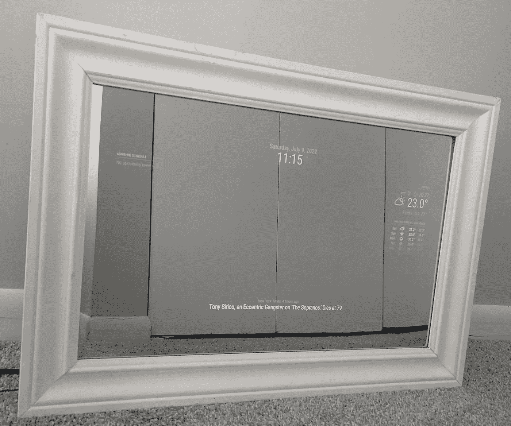

# 用谷歌助手制作一面魔镜

> 原文：<https://medium.com/geekculture/build-a-magic-mirror-w-google-assistant-e4c5ebfcc580?source=collection_archive---------2----------------------->

如果你曾经考虑过或者正在使用 Google home，并且正在寻找有趣的方法来通过 DIY 项目扩展你的“智能家居”,这篇文章就是为你准备的！我个人对医学院的心脏病学/呼吸病学部分感到无聊，所以需要在不研究^_^的时候做些事情

最重要的事情是供应品！当获得这些物资时，要考虑魔法的大小…