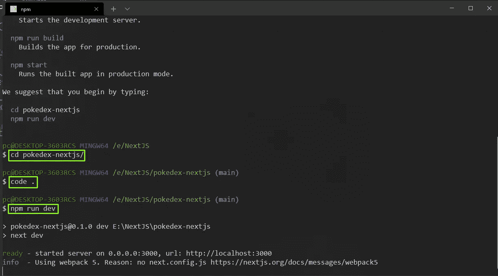
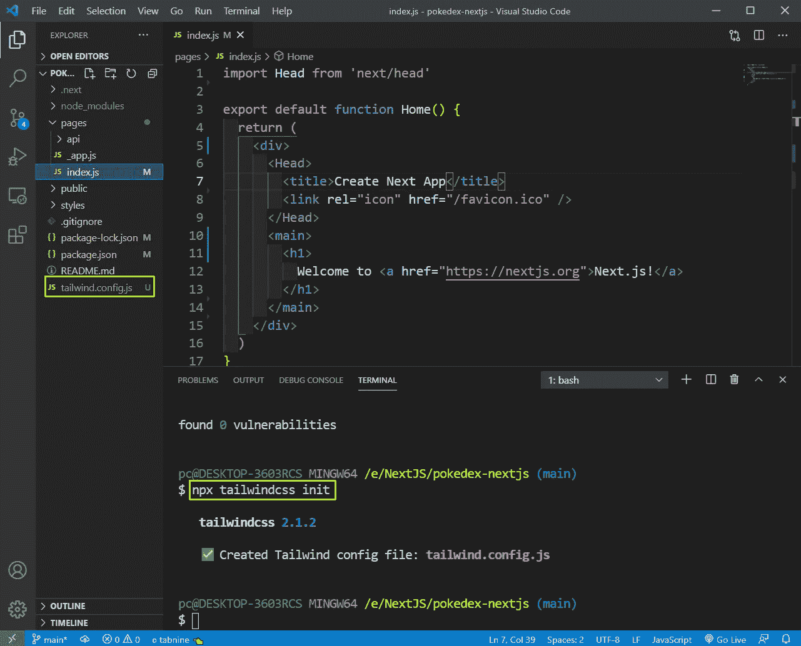
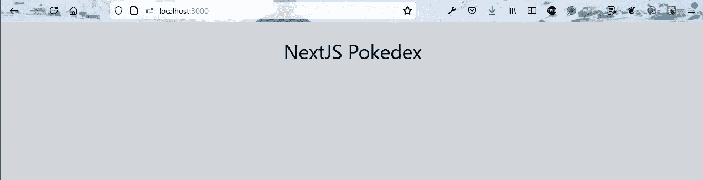
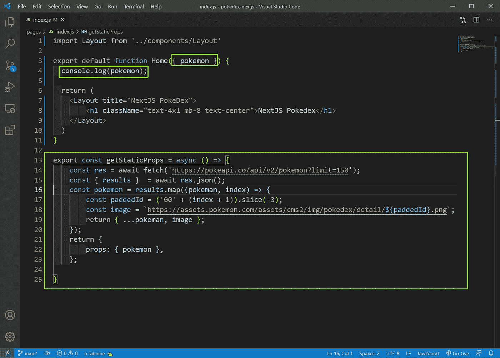
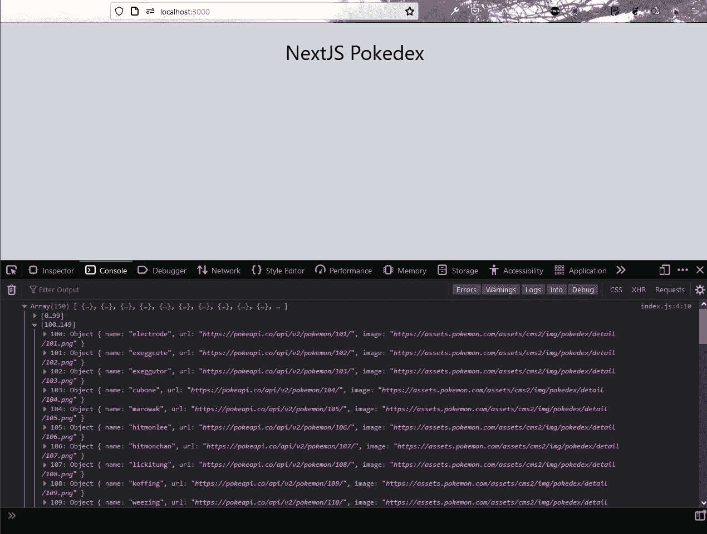
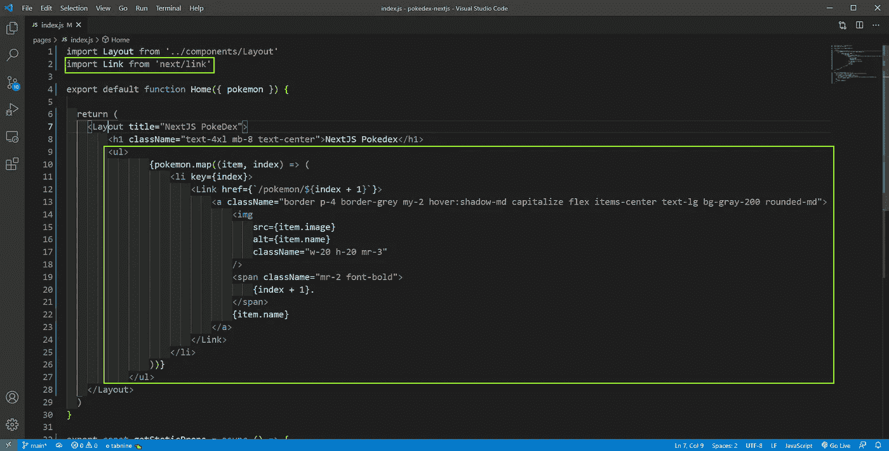
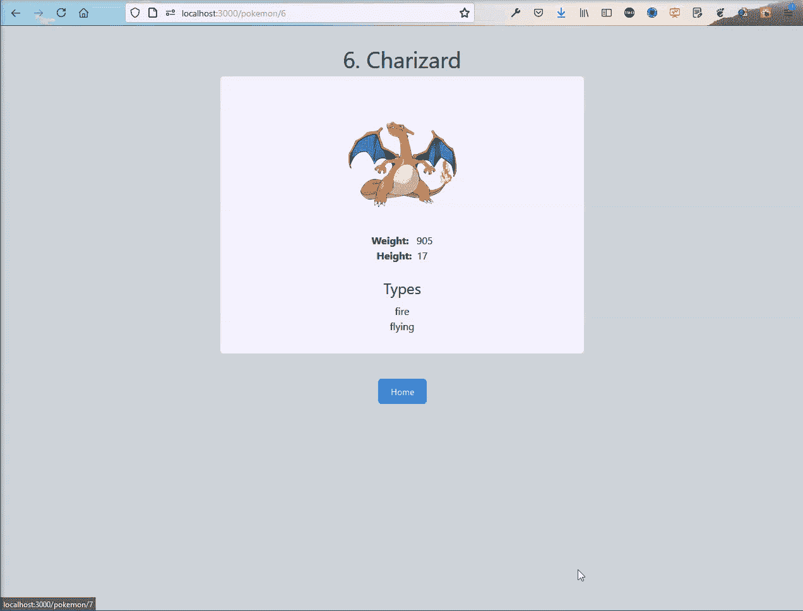

# 用 NextJS 和 Tailwind CSS 构建一个 Pokedex

> 原文：<https://medium.com/geekculture/build-a-pokedex-with-nextjs-and-tailwind-css-4630f0ac51d2?source=collection_archive---------17----------------------->


Photo by [Janis Fasel](https://unsplash.com/@janisfasel?utm_source=unsplash&utm_medium=referral&utm_content=creditCopyText) on [Unsplash](https://unsplash.com/s/photos/pokemon?utm_source=unsplash&utm_medium=referral&utm_content=creditCopyText)

NextJS 的下一个应用是 Pokedex 应用，我们将在其中使用 Tailwind CSS。

因此，打开您的终端，使用下面的命令创建一个新的 Next.js 应用程序。

```
npx create-next-app pokedex-nextjs
```

现在，按照说明，切换到新创建的文件夹。我也用 VS 代码打开了这个项目。之后，运行`**npm run dev**`启动项目。



start

现在，我们将从 **index.js** 文件中移除大部分代码，这是我们应用的起点。所以，我们的 **index.js** 如下图。

```
import Head from 'next/head'export default function Home() {
  return (
    <div>
      <Head>
        <title>Create Next App</title>
        <link rel="icon" href="/favicon.ico" />
      </Head>
      <main>
        <h1>
          Welcome to <a href="https://nextjs.org">Next.js!</a>
        </h1>
      </main>
    </div>
  )
}
```

接下来，我们将为 Tailwind CSS 安装依赖项。因此，打开终端并安装下面的依赖项。

```
npm install --save-dev tailwindcss postcss-preset-env postcss
```

下面是初始化 tailwind 运行的下一个命令。

```
npx tailwindcss init
```

它将在我们的根目录下创建一个 **tailwind.config.js** 文件。



tailwind.config.js

之后，在根目录下创建一个 **postcss.config.js** 文件，并添加以下代码。

```
module.exports = {
    plugins: ['tailwindcss', 'postcss-preset-env'],
}
```

最后，我们需要转到 **styles** 文件夹中的 **globals.css** 文件，删除所有内容，并为顺风添加以下内容。

```
@tailwind base;
@tailwind components;
@tailwind utilities;
```

之后，我们将通过在根目录下创建一个**组件**文件夹并在其中创建一个文件 **Layout.js** 来使用它。

```
import Head from 'next/head'const Layout = ({ title, children }) => {
    return (
        <div className="bg-gray-300">
            <Head>
                <title>{title}</title>
                <link rel="icon" href="/favicon.ico" />
            </Head><main className="container mx-auto max-w-xl pt-8 min-h-screen">
                {children}
            </main>
        </div>
    )
}export default Layout
```

接下来，我们将返回到我们的 **index.js** 文件，使用来自 tailwind css 的类，并用我们的布局组件包装所有内容。我们的 **index.js** 将包含以下内容。

```
import Layout from '../components/Layout'export default function Home() {
  return (
    <Layout title="NextJS PokeDex">
        <h1 className="text-4xl mb-8 text-center">NextJS Pokedex</h1>
    </Layout>
  )
}
```

我们在 localhost 的应用程序将如下所示。



localhost

接下来，我们将在我们的 **index.js** 中使用 **getStaticProps** 来获取所有 150 个口袋妖怪的数据。这是 **getStaticProps** 的一个非常好的用例，因为想要在渲染的时候从服务器获取所有的数据。

此外，口袋妖怪 api 不返回任何图像，这需要我们从另一个 API。现在这个 api 返回格式像 001.png，010.png 的 png 图像，这就是原因，我们在索引中添加 00。

将图像添加到 pokemon 数组后，我们将它作为道具传递给 Home 函数。



index.js

现在，我们可以在控制台中看到，我们正在正确地获取所有 150 个数据。



localhost

接下来，我们将显示我们的 Home 函数中的数据，通过它我的映射，并利用不同的 tailwind css 类的帮助。另外，请注意，我们用一个 NextJS 链接标签包装了所有内容，该标签还包含一个 anchor 标签。此外，在 href 中，我们将页面传递给/pokemon/2 类型的 url。



index.js

现在，我们的本地主机将展示所有美丽的口袋妖怪。


localhost

现在，我们想显示单个口袋妖怪的详细信息，只要我们点击任何口袋妖怪。在 **pages** 文件夹中创建一个文件夹 **pokemon** 。在它里面创建一个文件 **[id]。js** 。

现在，在**【id】。js** 文件我们将使用 **getServerSideProps** 调用这个 api，方法与我们在 **index.js** 文件中看到的类似。我们传递的是 id，它是从点击的页面中获取的。我们也再次使用逻辑来获得图像。这也是对 getServerSideProps 的一个很好的使用，因为用户可以点击他选择的任何一个口袋妖怪，而我们只想得到那个口袋妖怪的数据。

之后，我们对它进行解结构，并在组件内部显示它。

```
import Layout from '../../components/Layout';
import Link from 'next/link';const Pokemon = ({ pokemon }) => {
    return (
        <Layout title={pokemon.name}>
            <h1 className="text-4xl mb-2 text-center capitalize">
                {pokemon.id}. {pokemon.name}
            </h1>
            <div className="flex flex-col items-center bg-purple-50 rounded-md p-8">
                
                <p>
                    <span className="font-bold mr-2">Weight:</span> {pokemon.weight}
                </p>
                <p>
                    <span className="font-bold mr-2">Height:</span>
                    {pokemon.height}
                </p>
                <h2 className="text-2xl mt-6 mb-2">Types</h2>
                {pokemon.types.map((type, index) => (
                    <p key={index}>{type.type.name}</p>
                ))}
            </div>
            <p className="mt-10 text-center">
                <Link href="/">
                    <a>
                        <button className="focus:outline-none text-white text-sm py-2.5 px-5 rounded-md bg-blue-500 hover:bg-blue-600 hover:shadow-lg">Home</button>
                    </a>
                </Link>
            </p>
        </Layout>
    )
}export const getServerSideProps = async (context) => {
    const { id } = context.query;
    const res = await fetch(`https://pokeapi.co/api/v2/pokemon/${id}`);
    const pokemon = await res.json();
    const paddedId = ('00' + id).slice(-3);
    pokemon.image = `https://assets.pokemon.com/assets/cms2/img/pokedex/detail/${paddedId}.png`;
    return {
        props: { pokemon },
    };
}export default Pokemon
```

现在，我们的应用程序是完整的，点击任何口袋妖怪，它会带我们到显示关于口袋妖怪信息的详细页面。



localhost

你可以在这里找到相同[的 github。](https://github.com/nabendu82/pokedex-nextjs)

你也可以在我的 YouTube 频道上找到同样的内容。