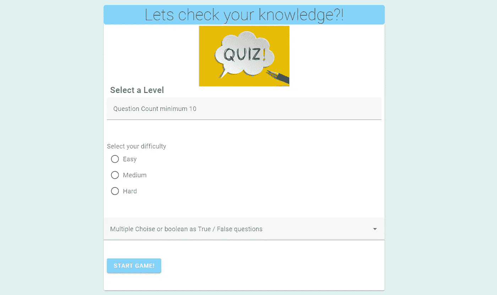

# 用 Vue 第 1 部分构建一个问答游戏

> 原文：<https://medium.com/geekculture/build-a-quiz-game-with-vue-part-1-8cfa8029e2ab?source=collection_archive---------9----------------------->

在本文中，我将指导您创建一个包含以下工具/依赖项的问答游戏:

*   带`vue-router`的 Vue.js
*   vuex
*   作为用户界面库
*   [axios](https://github.com/mzabriskie/axios)

*让我们开始吧！*

关于指南的 **YouTube** 视频，请查看以下内容